# The Bazaar — Architecture

Diagram-first companion to [`SPEC.md`](SPEC.md). SPEC.md is the source of truth for how the system behaves; this file shows how the pieces fit. Where they disagree, SPEC.md wins — then fix this file. Schedule and tasks: [`PLAN.md`](PLAN.md). Demo: [`DEMO.md`](DEMO.md).

**Naming used everywhere:** three applications are the centre of the repo — `apps/storefront` (the Trailhead Shopify theme with the shopper chat and offer card), `apps/server` (the one Node server) and `apps/web` (the Console, the owner's page). The packages serve them. The ChatGPT app is a **planned surface — not built on main**; wherever it appears below it is drawn dashed and labelled so.

Contents: [1 Context](#1-system-context) · [2 Containers](#2-containers-and-components) · [3 Trust boundary](#3-trust-boundary--who-sees-what) · [4 Sequences](#4-sequence-diagrams) · [5 State machines](#5-state-machines) · [6 Engine](#6-the-engine-as-a-flowchart) · [7 Guardrails](#7-guardrail-layers) · [8 Data](#8-data-model) · [9 Deployment](#9-deployment--demo-day-topology) · [10 Failures](#10-failure-and-fallback-map) · [11 API](#11-api-surface) · [12 Build order](#12-build-order-as-a-dependency-graph) · [13 Gym](#13-the-gym--the-price-race) · [14 Decisions](#14-decisions-settled)

---

## 1. System context

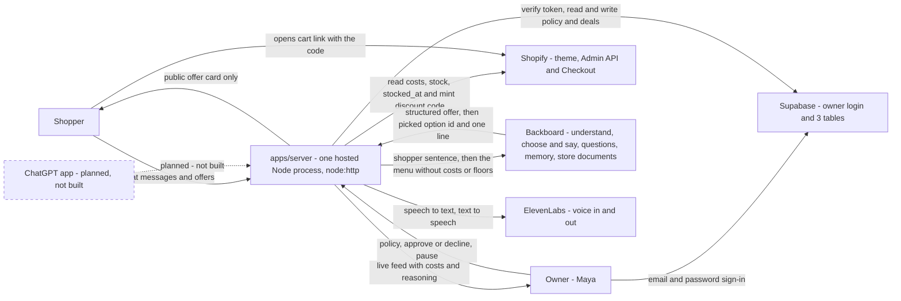

Who talks to whom, and what crosses each line. The thing to notice: every arrow touches our server except two — the owner signing in to Supabase, and the shopper opening Shopify Checkout. Money data (costs, floors) only ever flows between Shopify, our server and the owner. Every LLM call goes through Backboard; there is no other model client and no other model key.

---

## 2. Containers and components

### 2.1 The applications and the server's modules

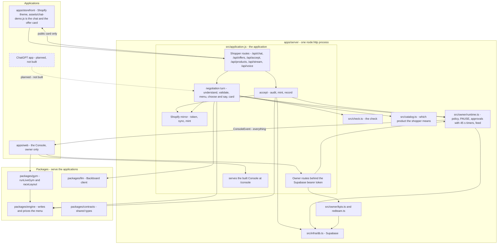

The storefront and the Console are the two things people touch; the server sits between them and owns every figure. Notice the two outputs with two different types: the shopper's reply carries the public card, the owner's stream carries `ConsoleEvent` — that split is rule 11 made physical. The theme never makes a dollar figure: it renders the cards the server sends.

### 2.2 Monorepo package graph

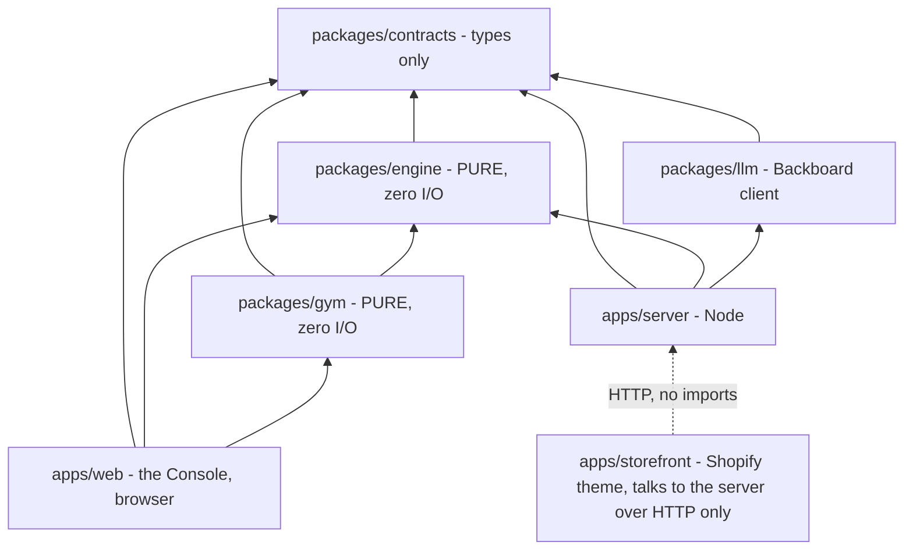

A solid arrow means "imports", always by package name (`@bazaar/engine`, `@bazaar/gym`) — never a deep relative path into a package. The thing to notice: `engine` and `gym` have no network, no clock, no database — time, seed and data arrive as arguments — which is why the Console can run **the same engine** in the browser for the Gym (300 shoppers, no network) and why property tests are trivial. `tests/purity.test.ts` guards that. The storefront imports nothing: it is theme code that calls the server and draws what comes back, so it can never receive costs.

---

## 3. Trust boundary — who sees what

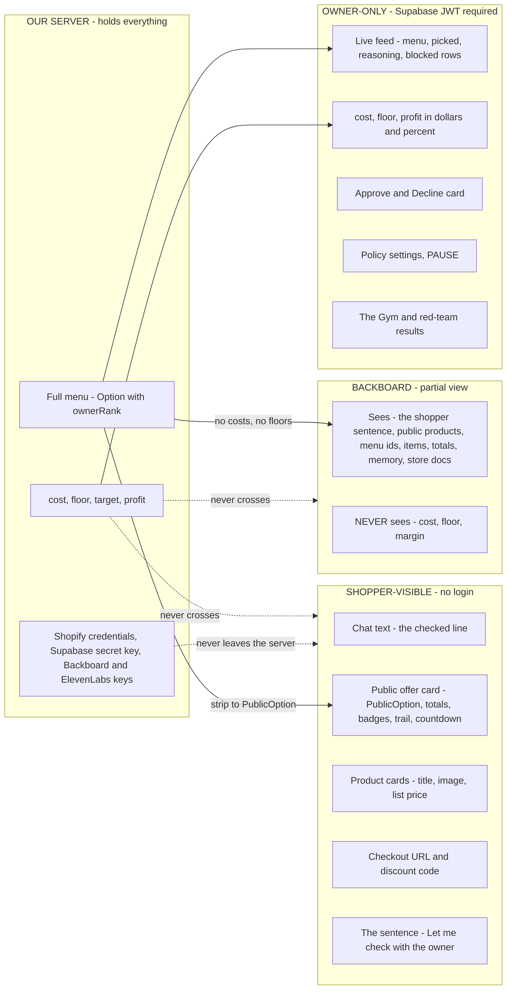

Three different views of the same negotiation. The shopper gets one picked option with no ranking, cost or floor; the LLM gets the whole menu but no costs or floors, so it cannot leak what it never saw; only the owner sees everything. Each shopper gets their own cloned Backboard assistant, so one shopper's memory never reaches another.

**Auth boundary**

| Boundary | Mechanism |
|---|---|
| Shopper endpoints (`/api/products`, `/api/chat`, `/api/offers`, `/api/accept`, `/api/stream`, `/api/voice/*`, `/api/public-config`) | No login. Return public types only. An offer can be read or accepted only with the shopper id and negotiation id it was issued to. |
| Owner endpoints (`/api/console/*`, `/api/policy`, `/api/approvals/:id`, `/api/pause`) | `Authorization: Bearer <Supabase access token>`; the server verifies the token with Supabase and checks the user owns the merchant. Anything else is 401 — it fails closed, and cookies are ignored. |
| Browser to Supabase | The publishable (anon) key, served by `/api/public-config` and used only to sign in. **RLS is ON for all three tables with no public policies**, so that key can read nothing. |
| Server to Supabase | `SUPABASE_SECRET_KEY`, server-side environment variable only. Never shipped to a browser. |
| Server to Shopify / Backboard / ElevenLabs | Keys in environment variables only. Never in the database, never in a bundle. |
| Compile-time guard | `PublicOption` marks `ownerRank` and `facts` as `never`, so handing a full `Option` to a shopper shape is a type error. |

---

## 4. Sequence diagrams

### 4a. A storefront shopper turn

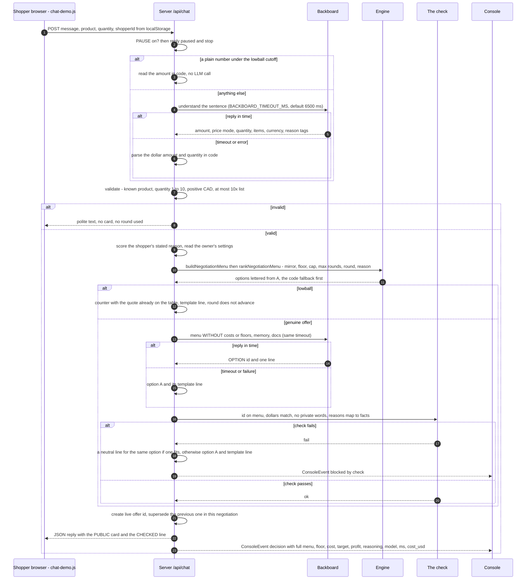

One turn, at most two LLM calls, each with a timeout and a code fallback. Notice the order at the end: the line reaches the shopper only **after** the check passes, so an invented price is never shown. `/api/chat` answers with JSON; `GET /api/stream` is a separate SSE channel. A message with no offer in it is a question: it is answered from a code template or by Backboard from the store documents, and uses no round.

### 4b. The same turn from ChatGPT — planned, not built on main

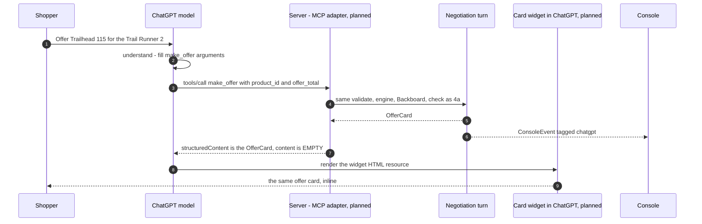

**Nothing in this diagram exists on main**: there is no MCP route and no widget. It records the intended shape so the contracts stay ready for it (`surface: "storefront" | "chatgpt"` is already in the types and the `deals` table). The intended differences from 4a: ChatGPT does the *understand* step, the card travels as `structuredContent` with empty `content` so the model has no price text to paraphrase, and there is no ask-the-owner on that surface.

### 4c. Deal and settle

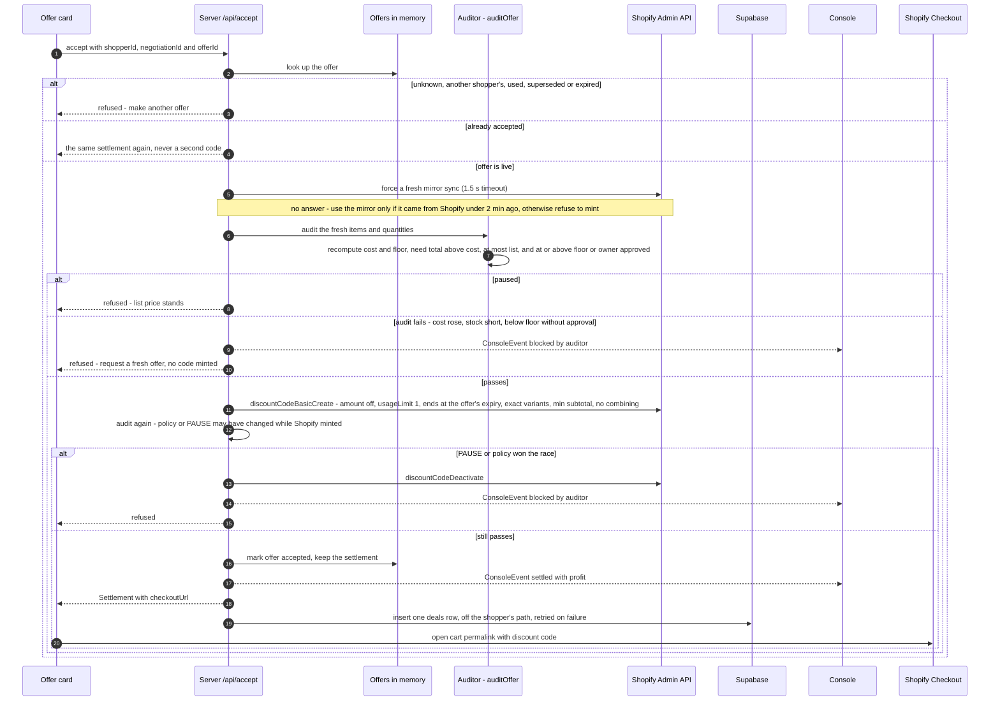

Nothing becomes a code until the Auditor has re-checked the price against fresh Shopify cost and stock. Notice the one Supabase write happens off the shopper's critical path — if it fails, the deal still stands and the write is retried (250 ms, 1 s, 5 s, 15 s, 30 s). An offer accepted at list price needs no code: the settlement is a plain cart link. Offers priced from the seed fallback mirror are never minted.

### 4d. Ask the owner

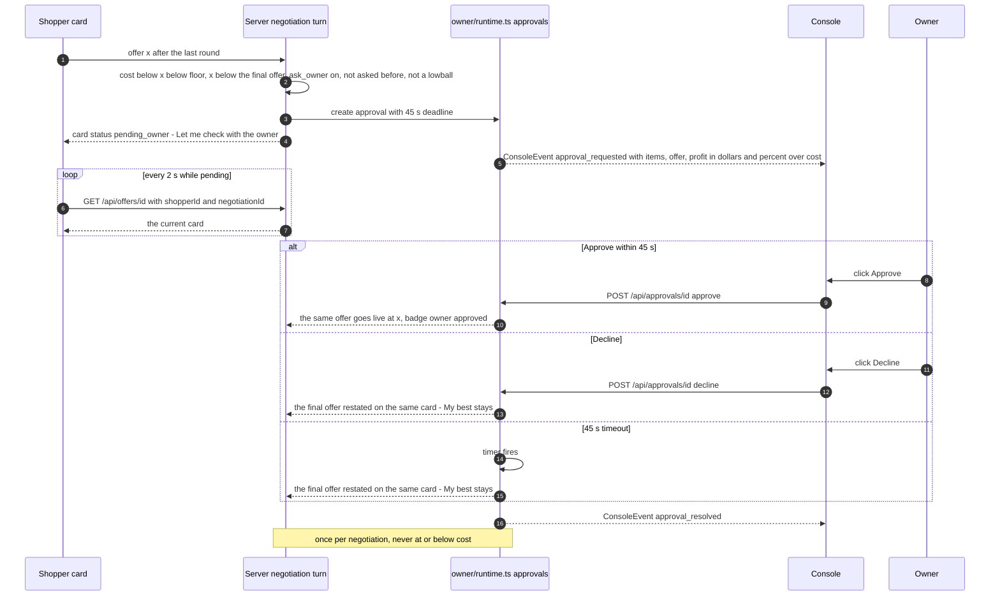

The owner's decision is the only human-in-the-loop step, and it cannot hang: the timer resolves it as a decline. Notice the shopper never sees profit or the floor — only the sentence and then the updated card, which the theme picks up by polling — and that a decline restates the shopkeeper's own final offer rather than dropping to the floor, so asking the owner is never a cheaper route than haggling. Either way the card gets a fresh 15 minutes.

### 4e. Owner login and a policy change

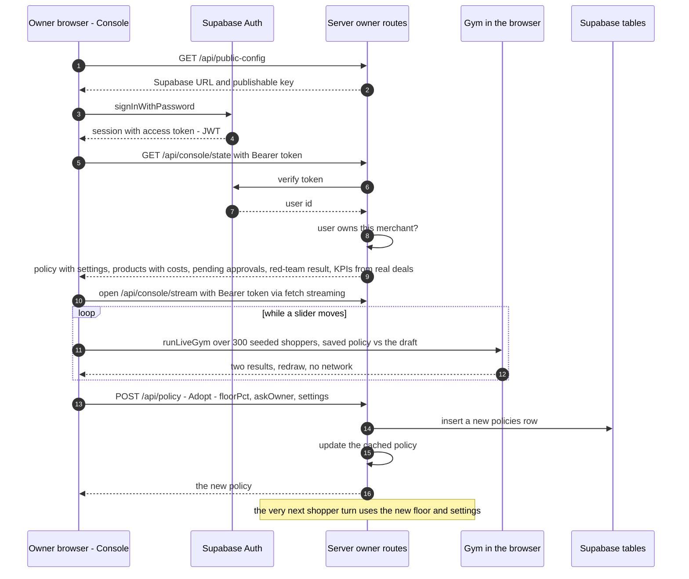

The Gym never calls the server while a slider moves — it runs the real engine locally on the product costs fetched once at load. Notice the browser's native `EventSource` cannot send a Bearer header, so the Console reads its SSE stream with `fetch`; the server ends each stream after 60 s and the Console reconnects with `Last-Event-ID`, so only unseen events replay.

### 4f. Shopify sync and the 24-hour token

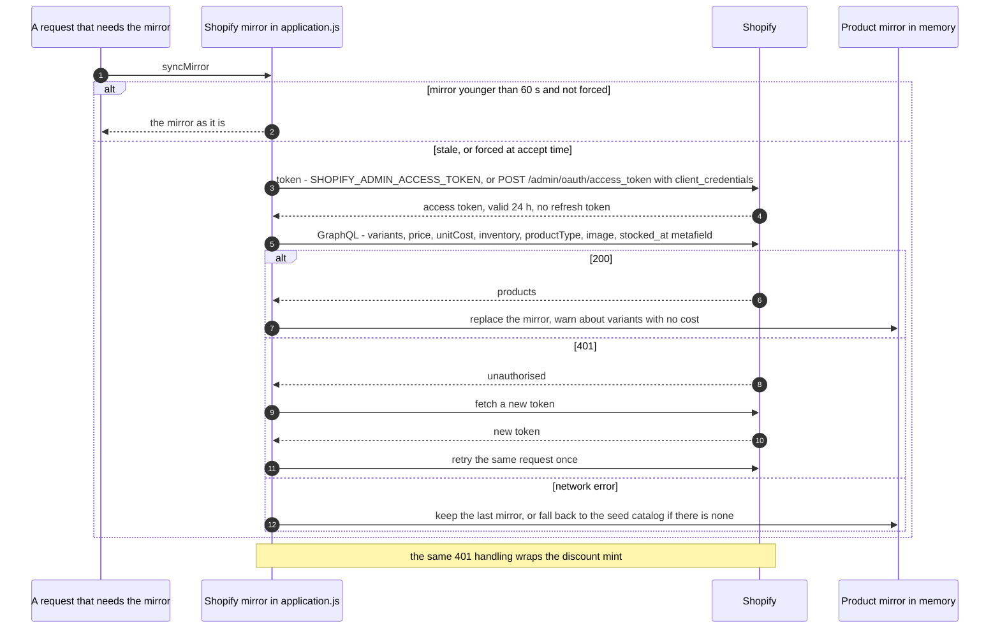

The mirror refreshes on demand, at most once every 60 s, and is forced fresh at accept time. The token dies after 24 hours and our window is 32, so every Shopify call goes through one wrapper that re-fetches on 401. A seed-fallback mirror can quote but never mint.

---

## 5. State machines

### 5.1 Negotiation

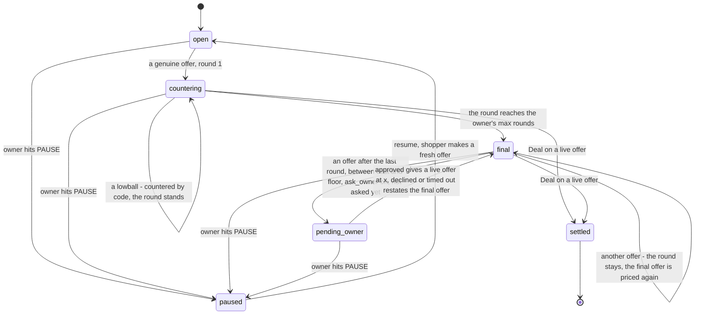

A haggle runs for the owner's **max rounds** — 2 to 6, default 4 — with one optional detour to the owner. `OfferCard.maxRounds` carries the number; nothing hard-codes four. A lowball makes no LLM call and does not advance the round, so forty lowballs cost nothing and earn nothing. Notice PAUSE can be entered from every live state and wins instantly; it also declines any pending approval. A negotiation belongs to one shopper id, one product variant and one quantity; a different product starts its own negotiation.

### 5.2 Offer

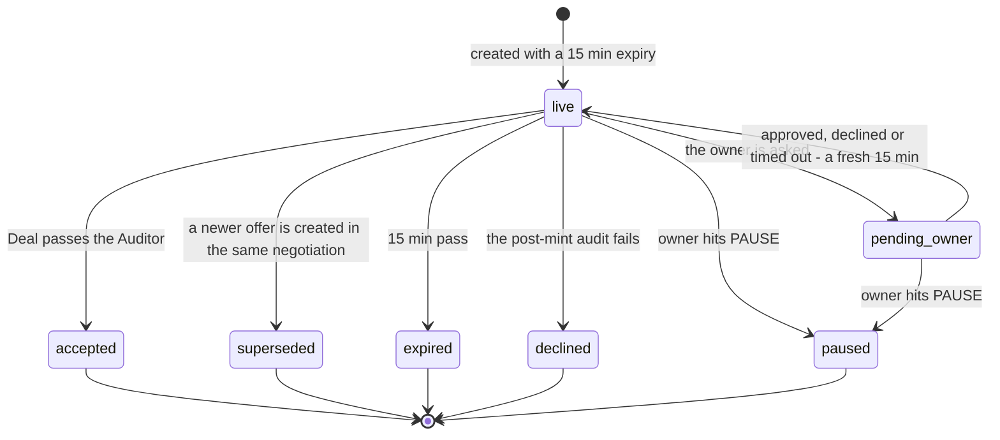

Only one offer per negotiation is `live` at any time, and only a `live` offer can be accepted — that is what defeats "you already offered me $80" and replay attacks. A paused card does not come back to life on resume. Accepting an already-accepted offer returns the same settlement, never a second code.

### 5.3 Approval

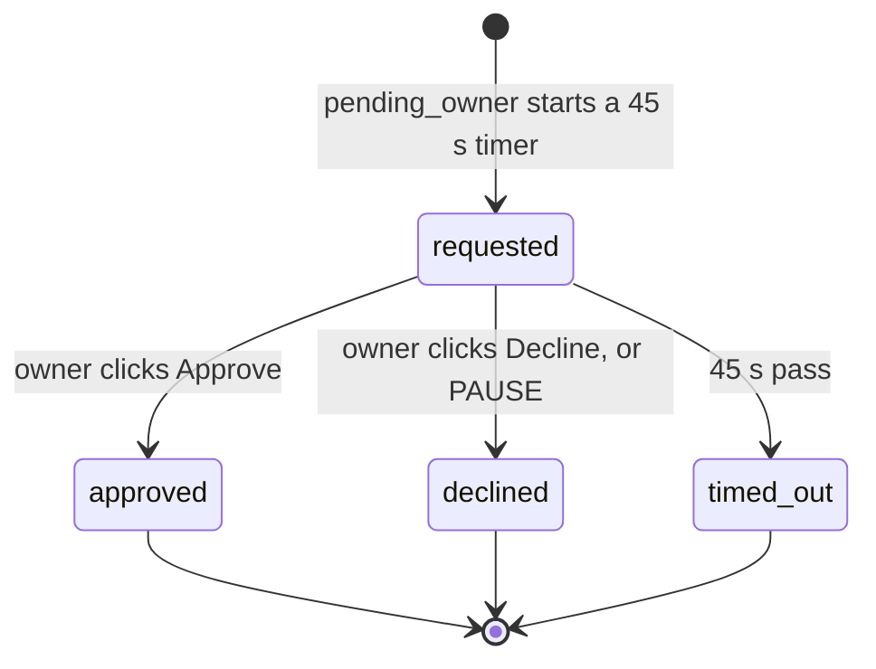

At most one approval per negotiation. `timed_out` behaves exactly like `declined`. A resolved approval cannot be resolved twice.

---

## 6. The engine as a flowchart

One engine: `packages/engine`. `buildNegotiationMenu` writes the menu, every option on it is priced by `priceOffer`, `rankNegotiationMenu` puts the code fallback first as option A, and `auditOffer` is the settlement check. The server and the Gym both call it through the package index.

### 6.1 The three price zones

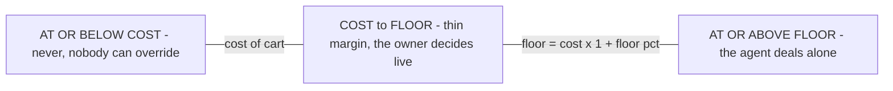

Every price the system handles falls in exactly one zone. Example (Trail Runner 2, cost $78, floor 25%): never at or below $78 · owner decides above $78 and below $97.50 · agent alone from $97.50.

### 6.2 From an incoming offer to a menu

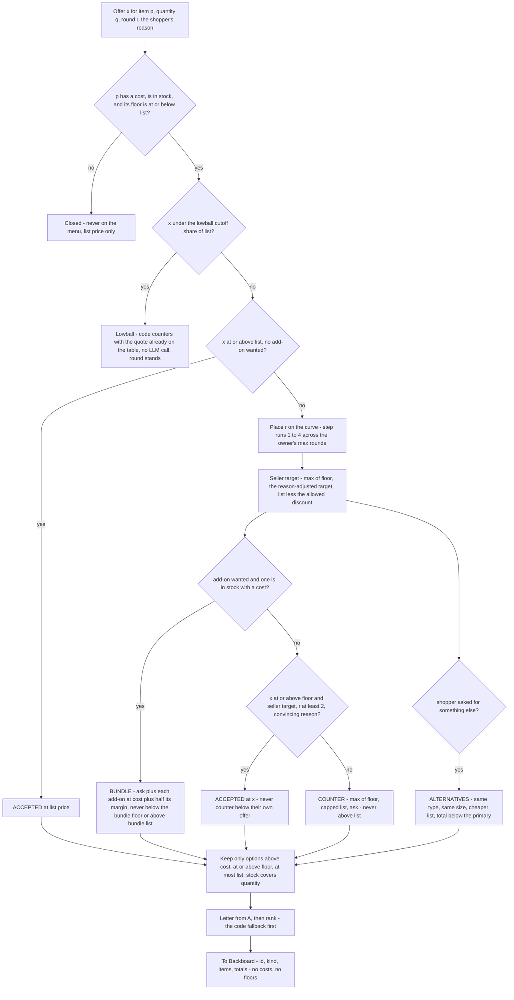

The engine is a pure function: same inputs, same menu. Notice there is no path that puts a total below the floor on the menu — the only route below the floor is the owner's approval, which lives in the server, not the engine — and no path at all to a total at or below cost. The lowball test is one function, `isLowball`, shared by the server and the Gym; the server applies it before the LLM is ever called.

Formulas (`packages/engine/src/negotiate.ts`): `cost = sum of unitCost x qty` · `floor = max(cost + 1, ceil(cost x (1 + floor%)))`, floor% 0–60 · `urgency = clamp((days since stocked_at - 60) / 60, 0, 1)` · `base target = list - urgency x (list - floor)` · `step = min(4, 1 + (r - 1) x 3 / (maxRounds - 1))`, so the last round always lands where round 4 of 4 does · `ask = list - ((step - 1)/3)^(1/(1 + urgency)) x (list - seller target)` · single-item price `>= max(floor, ceil(list x (1 - cap%)))`, cap 0–40, default 22.

Three things move a price: **stock age** (urgency), **the round**, and **the shopper's stated reason**. `analyzeBuyerReason` scores the message 0–4 from budget, quantity intent, add-on intent, repeat shopper, market comparison, real use case and ready to buy. The score sets how far the target moves from list toward the base target, and how much discount is allowed at each step; the owner's discount cap bounds that allowance, and the floor bounds everything.

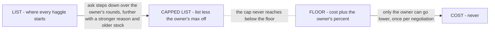

With no reason given, the shopkeeper holds list for the first half of the curve and gives only a small move at the end. New stock (urgency 0) holds list unless the shopper brings a convincing reason (score 2 or more); then it bends by the allowed discount only.

Worked example (seed data, floor 25%, default settings, Trail Runner 2 at 94 days, offer $115): with no reason the four rounds ask $149 → $149 → $149 → $148; with "I am buying today" (score 1) $149 → $147 → $146 → $144; with "it is last season and I am buying today" (score 3) $149 → $142 → $137 → $133. With max rounds set to 2 the same shopper sees $149 → $133. With the cap at 2% the last round cannot go below $147. Trail Runner 3, 12 days old, stays at $169 for scores 0 and 1. The engine works in cents; `toShopper` rounds every shopper-facing total **up** to a whole dollar, so rounding can never dip below the floor. A product with no `stocked_at` counts as new stock; one with no cost is not open to offers.

Properties: `packages/engine/src/properties.test.ts` runs 8 properties × 1,000 seeded runs (seed 42) against `buildNegotiationMenu` through the package index — above cost, at or above floor, at most list; passes the settlement audit; the discount cap; closed items never on the menu; deterministic and lettered from A; a later round never asks more; the lowball rule; and a guard that the generated inputs are not vacuous. `pnpm test:props` runs them.

---

## 7. Guardrail layers

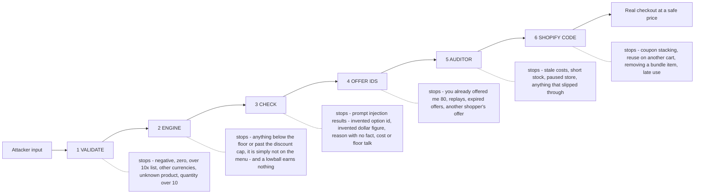

Left to right is the order an attack meets the layers. The thing to notice: layers 1–2 and 4–6 are plain code the LLM cannot influence; only layer 3 exists because an LLM is in the loop, and its failure mode is "fall back to option A", never "pass it through".

One set of layer names everywhere (feed tags, types, the red-team result). Console `blockedBy` values map to layers like this: `validate` = layer 1 · `engine` = layer 2 · `check` = layer 3 · `auditor` = layers 4 and 5. The red-team result adds `shopify_code` for layer 6.

---

## 8. Data model

### 8.1 Supabase — what survives a restart

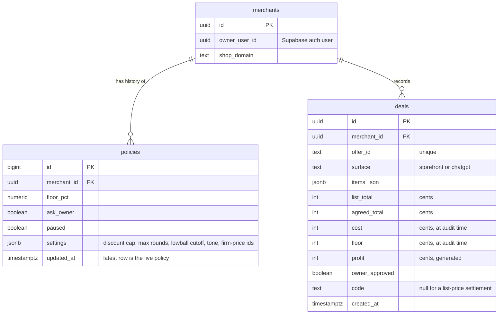

Three tables, append-only (`infra/schema.sql`, plus `infra/migrations/`). A new `policies` row is inserted on every Adopt and every PAUSE toggle, so the latest row is the live policy and the rest is history. `deals` stores cost and floor **as they were when the Auditor ran**, and the table itself checks `agreed_total > cost` and `agreed_total >= floor or owner_approved` — invariant 2 enforced by the database. The Console's Kept band is computed from these rows: real settled deals only.

### 8.2 Server memory — what does not survive a restart

| Structure | Key | Holds | Written by | Lifetime |
|---|---|---|---|---|
| Product mirror | `variantId` | price, unitCost, inventory, productType, image, stockedAt, source | Shopify mirror | Refreshed on demand, at most every 60 s; forced at accept. Rebuilt in one query. |
| Cached policy | — | floorPct, askOwner, paused, settings | `owner/runtime.ts` | Loaded from Supabase on startup. **Survives** via the `policies` table. |
| Negotiations | `negotiationId` | shopperId, productId, variantId, quantity, round, approvalUsed | negotiation turn | **Lost on restart.** |
| Shopper contexts | `shopperId` | the item, quantity, reason and requested add-ons the shopper was last on | negotiation turn | **Lost on restart.** |
| Offers | `offerId` | negotiationId, shopperId, the priced offer, status, expiresAt, card, settlement | negotiation turn, accept | 15 min, then expired. **Lost on restart** — a lost offer simply reads as "make another". |
| Approvals | `approvalId` | negotiationId, offer, cost, profit, deadline, status, timer handle | `owner/runtime.ts` | 45 s. **Lost on restart.** |
| Console feed | ring buffer, last 500 | ConsoleEvent with an id | `owner/runtime.ts` | **Lost on restart.** Settled deals can be re-read from `deals`. |
| Red-team result | single value | RedTeamResult | `scripts/redteam.ts` (isolated run, dry-run discounts) | `infra/redteam-result.json`, committed to the repo and loaded at boot — the host's disk does not persist. **Survives.** |

**What a restart or a deploy costs:** in-flight haggles — so deploys freeze from Sun 08:00, and the host must run exactly one instance (two instances would each hold half the negotiations). **What it never costs:** the owner's policy, the record of deals, or an already-minted code (that lives in Shopify).

---

## 9. Deployment — demo-day topology

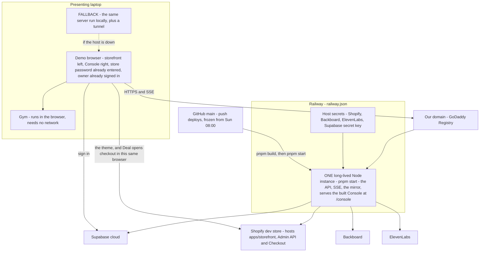

The server is deployed, so the storefront chat and the Console use one stable HTTPS URL. Railway builds the Console (`pnpm build`), starts the server (`pnpm start`, which builds the Console again if it is missing) and health-checks `/health`. The thing to notice: it must be **exactly one long-lived instance** — not serverless, no autoscaling, no sleep — because haggles live in that process's memory and the Console holds an SSE stream open to it.

| Rule | Why |
|---|---|
| One instance, always on | Negotiations, offers and approval timers are in-process `Map`s; SSE clients are connected to that process |
| SSE heartbeat comment every 15 s | Host proxies drop idle connections |
| Secrets in the host's settings; the browser gets only the Supabase URL and the publishable (anon) key | No Shopify, Backboard, ElevenLabs or Supabase secret key ever ships to a browser |
| `ALLOWED_ORIGINS` lists the storefront's origins | The theme calls the server cross-origin |
| Dev loop: run locally against the same Shopify store and Supabase project; push to `main` deploys | One environment to reason about |
| Freeze deploys from Sun 08:00 | A deploy is a restart, and a restart drops in-flight haggles |

Environment variables (`.env.example` is the list): `BACKBOARD_API_KEY`, `BACKBOARD_ASSISTANT_ID`, `BACKBOARD_MEMORY_MODE`, `BACKBOARD_MODEL_PROVIDER`, `BACKBOARD_MODEL_NAME`, `BACKBOARD_TIMEOUT_MS` · `ELEVENLABS_API_KEY`, `ELEVENLABS_VOICE_ID`, `ELEVENLABS_STT_MODEL`, `ELEVENLABS_TTS_MODEL` · `SHOPIFY_SHOP`, `SHOPIFY_CLIENT_ID`, `SHOPIFY_CLIENT_SECRET`, `SHOPIFY_ADMIN_ACCESS_TOKEN`, `SHOPIFY_API_VERSION` · `SUPABASE_URL`, `SUPABASE_SECRET_KEY`, `SUPABASE_PUBLISHABLE_KEY` · `ALLOWED_ORIGINS`, `PORT`. Console build: `VITE_CONSOLE_PORT`, `VITE_SUPABASE_URL`, `VITE_SUPABASE_ANON_KEY`.

### 9.1 The half we don't deploy — the agent on Backboard

**The shopkeeper agent is not deployed from this repo.** Railway carries the code that *calls* it; the agent itself — the assistant, its indexed documents, its memory — lives on Backboard and is provisioned there, in Backboard's own dashboard. A deploy ships `packages/llm/src/backboard.ts`, a key and an assistant id. It does not ship an agent.

| What | Where it is created | What a Railway deploy does to it |
|---|---|---|
| The base assistant (`BACKBOARD_ASSISTANT_ID`) | Once, by hand, in the Backboard dashboard | Nothing. A deploy never creates, updates or verifies it |
| Store documents — `store-notes.md`, `sizing-guide.md`, `policy.md` | Uploaded to the base assistant and indexed by Backboard | Nothing. They are committed in `infra/seed/` but a deploy does not upload them; upload by hand and wait for `indexed` |
| One cloned assistant per shopper | At runtime, by `resolveOrCloneShopperAssistant` (`packages/llm/src/backboard.ts`), on the first turn from any shopper id that isn't `anonymous-shopper` (`isolateMemoryByShopper: true`, memory `Auto`) | Nothing. The clones live on Backboard, not in process memory, so they **survive a restart** — unlike the haggles |
| Shopper memory | By Backboard, against the cloned assistant | Nothing. It survives a restart too |
| Which model answers | `BACKBOARD_MODEL_PROVIDER` / `BACKBOARD_MODEL_NAME` in the host's settings | A host env change swaps the model with no code change — and silently overrides the default in `apps/server/src/application.js` |

**What a green deploy does not prove.** `/health` reports `hasBackboardKey` and `backboardAssistantConfigured`, and both can be true while the agent is useless: the assistant id falls back to a committed default when the env var is absent, so `backboardAssistantConfigured` is *always* true; and nothing in the health check looks at whether the documents ever reached `indexed`. The two failure modes a deploy cannot fix are a base assistant whose documents were never uploaded — the shopkeeper then answers sizing and returns questions from nothing — and a host `BACKBOARD_MODEL_NAME` that differs from the model the docs and the latency measurements assume. Both are checked on Backboard, not on the host.

---

## 10. Failure and fallback map

| Dependency | What breaks | Automatic fallback | What the presenter says |
|---|---|---|---|
| Backboard (understand) | Slow or down | `BACKBOARD_TIMEOUT_MS` (default 6500 ms), then code parses the dollar amount and quantity | Nothing — invisible |
| Backboard (choose + say) | Slow, failed run, no end event | Same timeout, then option A + its template line | "Backboard's down, so you're seeing the engine with template lines — same prices, same floor." |
| Backboard (questions) | Slow or down | A code template answer | Nothing |
| The check fails | LLM invented a number or reason | A neutral line for the same option, or option A + template; red `blocked: check` row | "That red row is the check throwing away what the model made up." |
| Shopify Admin API at accept | The fresh sync does not answer within 1.5 s | Use the mirror if it came from Shopify under 2 min ago; otherwise no code minted, card says try again | "It refuses to mint a code it can't verify." |
| Cloud host | Down, asleep, or a bad deploy | Run the same server on the laptop behind a tunnel. Deploys frozen from Sun 08:00 | "Same code, running here." |
| Host scaled to two instances, or restarted | Haggles vanish or split between processes; SSE drops | Pin to one instance; clients reconnect; old cards read as expired | "Make me another offer." |
| Shopify token (24 h) | 401 on any call | Re-fetch token, retry once | Nothing — invisible |
| Shopify sync | Network error | Keep the last mirror; with no mirror at all, the seed catalog (the Console shows "Seed fallback"); seed offers never mint | Nothing |
| Discount code mint | Shopify rejects it | No settlement; the shopper is told the offer cannot be accepted and can make another | "No code without Shopify's yes." |
| Supabase | Slow or unreachable | Off the hot path: policy cached in memory; the deal write and a PAUSE write are retried in the background; the Console shows that PAUSE is active but still saving | Nothing — invisible |
| Supabase not configured | No owner policy | `/health` reports 503 and the chat answers that the shopkeeper is unavailable — no offers without a policy | — |
| Supabase Auth | Cannot sign in | Be signed in before judges arrive | Nothing |
| Owner doesn't answer | Approval hangs | 45 s timer resolves as decline; the final offer is restated | Nothing |
| Server restart | In-flight haggles lost | Policy reloads from Supabase, mirror re-syncs in one query; old cards read as expired | "Make me another offer." |
| ElevenLabs | Voice fails or no key | `/api/voice/config` reports it disabled; the chat is typed | Nothing |
| Store password | Cart link shows a password page | Entered once in the demo browser before judging | Nothing |

---

## 11. API surface

### 11.1 HTTP endpoints

| Method | Path | Auth | Request | Response | Used by |
|---|---|---|---|---|---|
| GET | `/api/products` | none | `?sync=1` forces a fresh mirror | `{ items, loadedAt, source, warnings }` — public product cards | Storefront |
| POST | `/api/chat` | none | `{ shopperId, negotiationId?, product, quantity?, message }` | JSON `{ reply, card?, negotiationId?, products? }`, or `{ paused: true, reply }` | Storefront |
| POST | `/api/session/reset` | none | `{ shopperId }` | `{ ok: true }` — the theme calls it once per page load when the URL carries `?shopper=`. Drops that shopper's carried product, the round it implies and the Backboard thread; leaves offers on the table and the shopper's memory alone | |
| POST | `/api/offers` | none | the same shape, always treated as an offer | the same JSON | Storefront |
| GET | `/api/offers/:id` | none | `?shopperId=&negotiationId=` — must match the offer | `{ card }` — the current card, polled while `pending_owner` | Storefront card |
| POST | `/api/accept` | none | `{ shopperId, negotiationId, offerId }` | `{ settlement, reply }`, or a 400 with a reply on refusal | Storefront card |
| GET | `/api/stream` | none | — | SSE: a hello event and a heartbeat every 15 s | Storefront |
| GET | `/api/public-config` | none | — | the Supabase URL and publishable key, for sign-in only | Console |
| GET | `/api/voice/config` | none | — | `{ enabled, provider, ttsModel, sttModel }` | Storefront |
| POST | `/api/voice/speak` | none | `{ text }` (at most 600 characters) | audio | Storefront |
| POST | `/api/voice/transcribe` | none | audio body (at most 5 MB) | `{ text }` | Storefront |
| GET | `/health` | none | — | service, model, mirror source, warnings; 503 when no owner policy is configured | Railway |
| GET | `/api/console/state` | owner | — | `{ policy, pausePersistence, products: OwnerProduct[], pendingApprovals: Approval[], redteam: RedTeamResult, catalog, kpis, kpisByProduct }` | Console on load; feeds the Gym |
| GET | `/api/console/stream` | owner | `Last-Event-ID` optional | SSE stream of `ConsoleEvent` (read with `fetch`, not `EventSource`) | Console feed |
| POST | `/api/policy` | owner | `{ floorPct, askOwner, settings? }` | `Policy` with the resolved settings | Console — Adopt |
| POST | `/api/approvals/:id` | owner | `{ decision: "approve" or "decline" }` | `Approval` | Console — approval card |
| POST | `/api/pause` | owner | `{ paused: boolean }` | `{ policy, persistence }` | Console — PAUSE |
| GET | `/console`, `/assets/*`, `/fonts/*` | none | — | the built Console (`apps/web/dist`); its data still needs the owner token | Owner browser |

There is **no Gym endpoint**: the Gym runs in the browser. The red team is a script (`scripts/redteam.ts`) run before the demo; its saved result is served inside `/api/console/state`. `settings` in `/api/policy` is optional: omitted keeps the saved settings; given, each value is stored resolved, and anything out of range falls back to its default so a bad value can never loosen a price.

### 11.2 MCP tools — planned, not built on main

There is no MCP route on main. The intended tools, kept here so the shape is agreed before anyone builds it:

| Tool | Input | `structuredContent` | `content` |
|---|---|---|---|
| `find_products` | `{ query, budget?, size? }` | `{ products: ProductCard[] }` | empty |
| `make_offer` | `{ product_id, offer_total, size?, quantity?, message?, negotiation_id? }` | `OfferCard` (includes `negotiationId`) | empty |
| `accept_offer` | `{ negotiation_id, offer_id }` | `{ checkout_url, agreed_total, expires_at }` | empty |

The intent: every tool result is shown in a card with empty `content`, so the model has no price text to state, estimate or predict.

---

## 12. Build order as a dependency graph

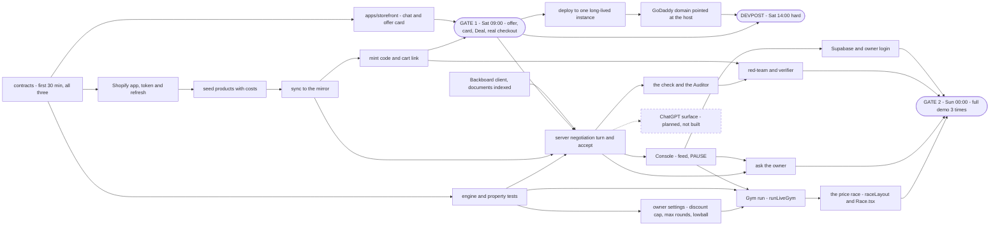

The critical path to gate 1 is **token → seed → sync → mint** joined with **the storefront chat and card**; the engine is *not* on it. Notice the ChatGPT surface hangs off the finished negotiation turn and blocks nothing: it is planned, not built, and no gate depends on it.

| Gate | When (EDT) | Must be true |
|---|---|---|
| Gate 1 | Sat 09:00 | Storefront: offer → card → Deal → real code → real Shopify checkout at that price |
| Devpost | Sat 14:00, hard | Submitted with team, badge IDs, public repo, and the sponsor tracks selected |
| Gate 2 | Sun 00:00 | Full demo 3× untouched; backup video; 30-min attack session |
| Final submit | Sun 08:00 | Devpost final edit; deploys frozen |

The full task table, hour-by-hour schedule and cut order are in [`PLAN.md`](PLAN.md).

---

## 13. The Gym — the price race

Owner-only (rule 11): nothing here is reachable from a shopper-facing surface. The Console is three things: the **Kept band** (KPIs from real settled deals), **the price race** (this section), and the **live rail** (the feed, with an approval card first only while one is pending). "More settings" holds the policy panel, other figures and the red-team summary.

### 13.1 One run drives everything

```mermaid
flowchart LR
  ST["GET /api/console/state - product costs and the saved policy, fetched once"]
  PA["Saved policy and settings"]
  PB["Draft - what the sliders say now"]
  RUN["runLiveGym - seed 42, 300 rule-based shoppers, the SAME engine as the server, no network"]
  RES["LiveGymResult - totals, lowballs, one GymShopper record per shopper"]
  LAY["raceLayout - where every dot is at the end of a round"]
  DOTS["Race.tsx - one dot per shopper, coloured by OUTCOME"]
  TIP["Point at a dot - persona, would pay, offer and ask per round, what happened"]
  FIG["Figures - customers saved, profit, vs no shopkeeper, vs a 20 percent banner, each with its change from the saved policy"]
  RTJ["Saved RedTeamResult from the server"]
  SUM["RedTeamSummary under More settings"]

  ST --> PA
  ST --> RUN
  PA --> RUN
  PB --> RUN
  RUN --> RES
  RES --> LAY
  LAY --> DOTS
  RES --> TIP
  RES --> FIG
  ST --> RTJ
  RTJ --> SUM
```

The dots, the hover line and the figures all read the same run, so nothing is drawn that did not happen in the simulation. `raceLayout` is pure: every position comes from the Gym run, so the picture can never disagree with the figures. The Gym prices every ask with `buildNegotiationMenu` and takes the ranked option A — no LLM calls are simulated. The red-team summary is the only part that comes from the server: it shows the saved result and never re-runs attacks in the browser.

### 13.2 What happens to one dot

```mermaid
stateDiagram-v2
  [*] --> deciding : waits above the axis at what this shopper would pay
  deciding --> deciding : a lowball - countered, the round stands
  deciding --> bought : the engine's price is within what they would pay, a bundle adds allowance
  deciding --> owner : out of rounds, last offer between cost and floor, ask_owner on
  deciding --> walked : patience or the owner's max rounds runs out
  bought --> [*] : rests in its price stack - paid list, saved by your shopkeeper, or bought a bundle
  owner --> [*] : yellow - would ask you
  walked --> [*] : ring only - a deal missed if they would have paid the floor
```

Each of the 300 dots resolves in the round its negotiation ended, not before. The thing to notice: "a deal missed" is a first-class outcome — it is how the Gym tells the owner her floor is too high, and the comparison lines turn red when haggling earns less than no shopkeeper or a 20% banner. Personas (bargain, budgeted, impatient, loyal, lowballer) are pinned in `packages/gym/src/personas.ts` and are never tuned to hide that. "Customers saved" counts only shoppers who bought the item for less than list.

### 13.3 Interaction rules

| Owner does | The view does |
|---|---|
| Picks a pill — **Floor / Max off / Rounds / Lowball** | Shows that setting's one slider, its value label and one sentence on what it does. A changed pill carries a dot. |
| Moves the slider | No animation. Re-runs instantly so the dots and figures track the finger, with the change from the saved policy beside each figure. Reads "Preview · not adopted". Nothing is live yet. |
| Releases the slider, or presses **Play** | Plays the rounds one step at a time; the red line shows the round's typical (median) ask. Skipped under reduced motion. |
| Points at a dot | One line: persona, what they would pay, offer and ask per round, and what happened. |
| Chooses a product | The race re-runs on that product. Oldest stock is offered first: it has the most room to bend. |
| Clicks **Adopt** | `POST /api/policy` with the floor and settings → new `policies` row → server cache → governs the next shopper turn. The draft becomes the saved policy. |

Always on screen: "Try it on 300 shoppers · Simulated on *product* · never added to your real figures." Rendering is SVG circles; no chart library. A product needs a cost in Shopify and stock on hand to be simulated.

---

## 14. Decisions settled

These were open during the audit; the team has decided. Recorded here so nobody re-opens them.

| # | Question | Decision |
|---|---|---|
| 1 | When does the card appear? | After the check, as **one** card in the JSON reply. At the Backboard timeout: option A + template line. |
| 2 | When is "something else" offered? | When the shopper asks for it (an alternative, something cheaper, a recommendation). Same type, same size, cheaper than the item they are on. |
| 3 | The line vs the check | The line is checked whole before it is sent; the shopper only ever sees checked text. |
| 4 | Gym endpoint | None. Owner-only `GET /api/console/state` returns costs once; the Gym runs in the browser. |
| 5 | Red-team side effects | An isolated run with dry-run discounts; `deals` carries `floor` and `offer_id` so the verifier can recount. |
| 6 | Removing a bundle item at checkout | Every code carries a minimum subtotal equal to the cart's list total. |
| 7 | Ask-the-owner | Storefront only, once per negotiation, after the last round. |
| 8 | Storefront shopper identity | `localStorage` id, `?shopper=demo` override for the seeded shopper. |
| 9 | Auditor when Shopify is unreachable | 1.5 s timeout → mirror if it came from Shopify under 2 min ago → otherwise refuse to mint. |
| 10 | The feed's "reasoning" | Composed in code; never the LLM explaining itself. |
| 11 | Hosting | One long-lived Railway instance; laptop + tunnel is the fallback. |
| 12 | After the owner declines | The shopkeeper restates its own final offer; it does not drop to the floor. |
| 13 | Every LLM call | Through Backboard — understand, choose + say, questions. Default provider `openai`, model from `BACKBOARD_MODEL_NAME`. One cloned assistant per shopper. |
| 14 | Rounds | Owner-set, 2–6, default 4. The curve stretches so the last round lands where round 4 of 4 does. |
| 15 | Lowballs | Below the owner's cutoff share of list (default 40%, 0 = off): countered by code, no LLM call, the round does not advance. |
| 16 | ChatGPT surface | Planned — not built on main. |

---
