# The Bazaar — Architecture

Diagram-first companion to [`SPEC.md`](SPEC.md). SPEC.md is the source of truth for how the system behaves; this file shows how the pieces fit. Where they disagree, SPEC.md wins — then fix this file. Schedule and tasks: [`PLAN.md`](PLAN.md). Demo: [`DEMO.md`](DEMO.md).

**Naming used everywhere:** Surface A = the Trailhead storefront (leads the build and the demo). Surface B = the ChatGPT app (the finale). The Console is the owner's page.

Contents: [1 Context](#1-system-context) · [2 Containers](#2-containers-and-components) · [3 Trust boundary](#3-trust-boundary--who-sees-what) · [4 Sequences](#4-sequence-diagrams) · [5 State machines](#5-state-machines) · [6 Engine](#6-the-engine-as-a-flowchart) · [7 Guardrails](#7-guardrail-layers) · [8 Data](#8-data-model) · [9 Deployment](#9-deployment--demo-day-topology) · [10 Failures](#10-failure-and-fallback-map) · [11 API](#11-api-surface) · [12 Build order](#12-build-order-as-a-dependency-graph) · [13 Gym swarm](#13-the-gym-swarm-view) · [14 Decisions](#14-decisions-settled)

---

## 1. System context

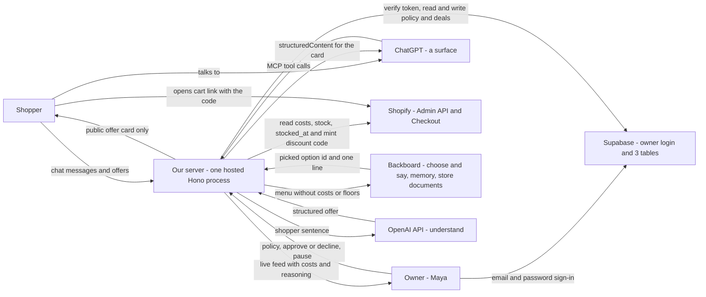

Who talks to whom, and what crosses each line. The thing to notice: every arrow touches our server except two — the owner signing in to Supabase, and the shopper opening Shopify Checkout. Money data (costs, floors) only ever flows between Shopify, our server and the owner.

---

## 2. Containers and components

### 2.1 Surfaces and the server's modules

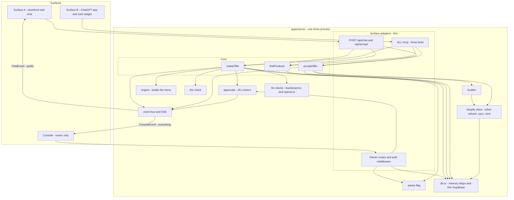

Both surfaces call the same three core functions; an adapter only translates a request in and a card out. Notice the event bus has two outputs with two different types — that split is rule 11 made physical.

### 2.2 Monorepo package graph

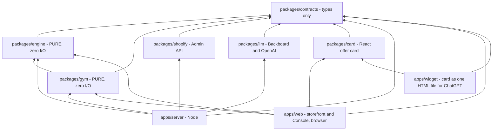

An arrow means "imports". The thing to notice: `engine` and `gym` import nothing but types, so they have no network, no clock, no database — which is why the Console can run **the same engine** in the browser for the Gym (300 shoppers in under 50 ms) and why property tests are trivial. The server imports `gym` only for the red-team script. `card` never imports `engine`: the shopper's bundle must not contain pricing code inputs it doesn't need, and never receives costs.

---

## 3. Trust boundary — who sees what

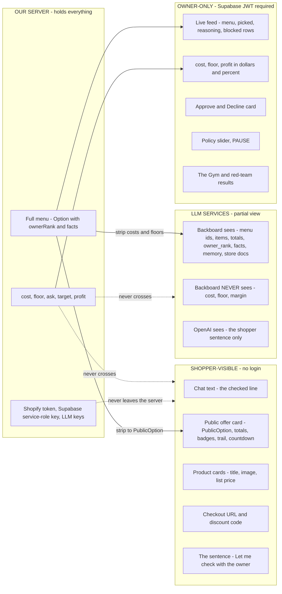

Three different views of the same negotiation. The shopper gets one picked option with no ranking, facts, cost or floor; the LLM gets the whole menu but no costs or floors, so it cannot leak what it never saw; only the owner sees everything.

**Auth boundary**

| Boundary | Mechanism |
|---|---|
| Shopper endpoints (`/api/products`, `/api/chat`, `/api/accept`, `/mcp`) | No login. Can only ever return `ChatEvent` / public types. |
| Owner endpoints (`/api/console/*`, `/api/policy`, `/api/approvals/:id`, `/api/pause`) | `Authorization: Bearer <Supabase access token>`; Hono middleware calls `supabase.auth.getUser(token)` and checks the user owns the merchant. |
| Browser to Supabase | Anon key, used only to sign in. **RLS is ON for all three tables with no public policies**, so the anon key can read nothing. |
| Server to Supabase | Service-role key, server-side environment variable only. Never shipped to a browser. |
| Server to Shopify / Backboard / OpenAI | Keys in environment variables only. Never in the database, never in a bundle. |
| Compile-time guard | `ChatEvent` is built only from `PublicOption`; `ConsoleEvent` may carry `Option`. A shopper route that tries to send an `Option` is a type error. |

---

## 4. Sequence diagrams

### 4a. A storefront shopper turn

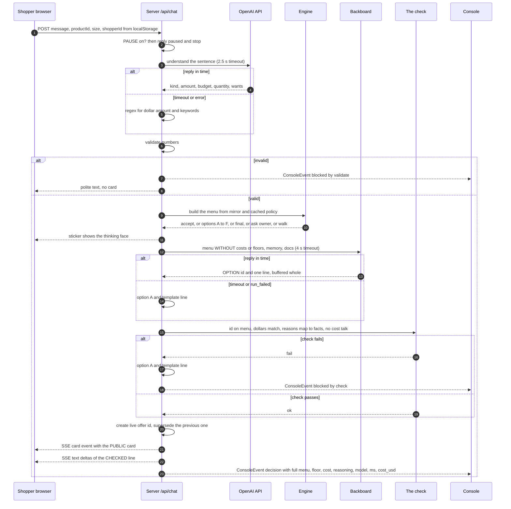

One turn, six steps, two LLM calls, each with a timeout and a code fallback. Notice the order at the end: the line is sent to the shopper only **after** the check passes, so an invented price is never shown — the "typing" effect is played from checked text.

### 4b. The same turn from ChatGPT

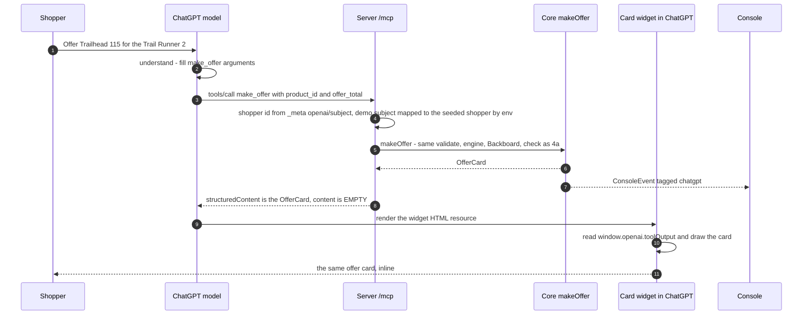

The only differences from 4a: ChatGPT does the *understand* step, the card travels as `structuredContent`, and there is no ask-the-owner on this surface (a refused final offer walks). Notice `content` is empty, so the model has no price text to paraphrase. A ChatGPT negotiation is separate from any storefront negotiation, even for the same shopper; the Console shows both in one feed.

### 4c. Deal and settle

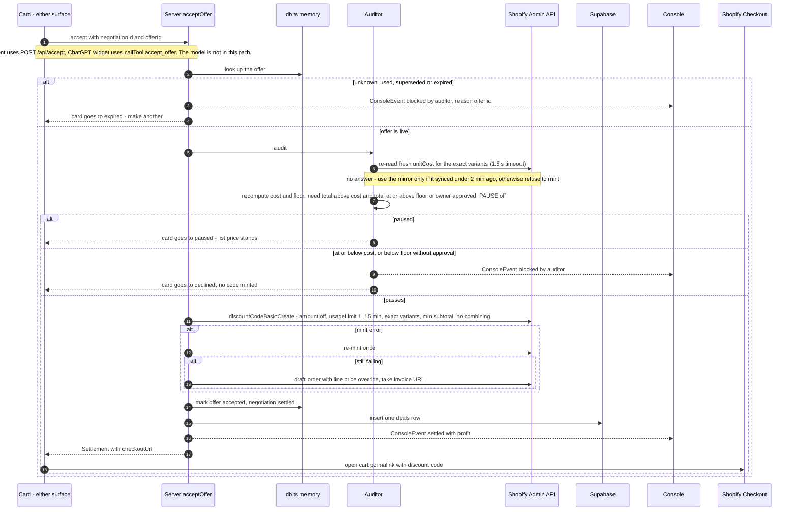

Nothing becomes a code until the Auditor has re-checked the price against fresh Shopify cost data. Notice the one Supabase write happens after the mint, off the shopper's critical path — if it fails, the deal still stands and the write is retried.

### 4d. Ask the owner

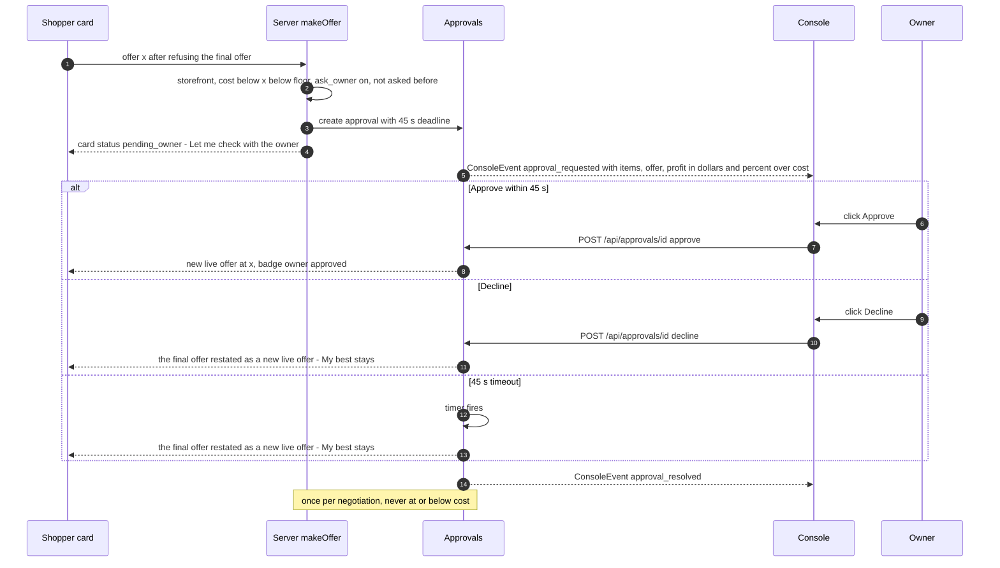

The owner's decision is the only human-in-the-loop step, and it cannot hang: the timer resolves it as a decline. Notice the shopper never sees profit or the floor — only the sentence and then a new card — and that a decline restates the shopkeeper's own final offer rather than dropping to the floor, so asking the owner is never a cheaper route than haggling. Storefront only: the card inside ChatGPT has no live stream to update itself.

### 4e. Owner login and a policy change

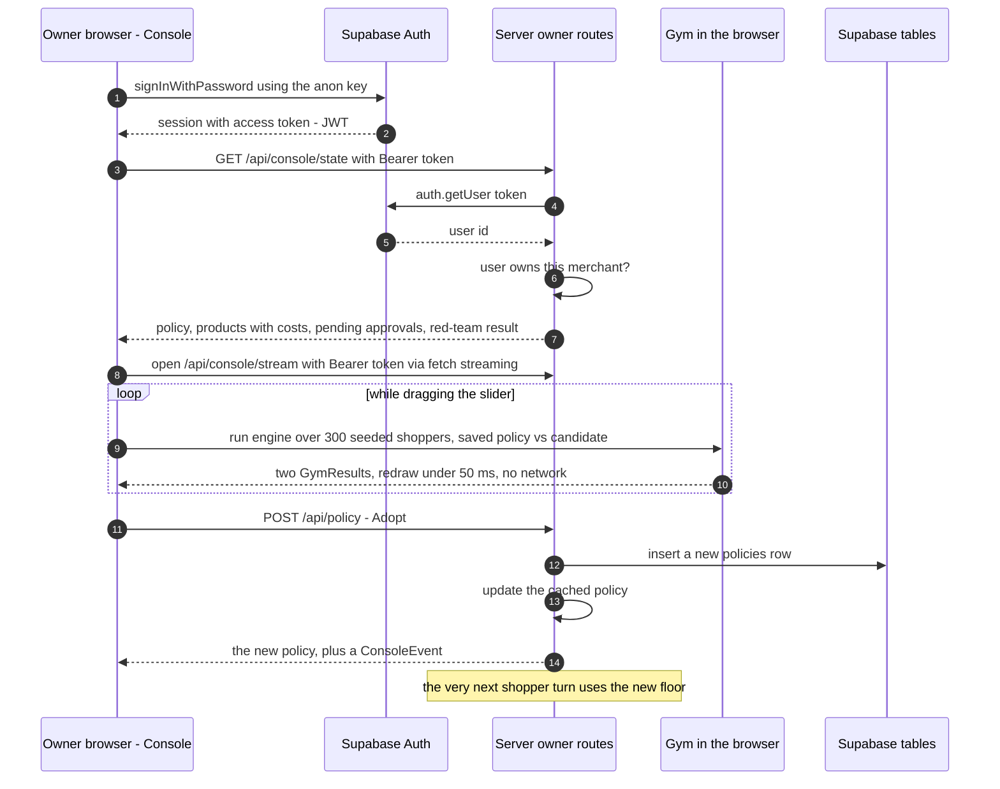

The Gym never calls the server while the slider moves — it runs the real engine locally on the product costs fetched once at load. Notice the browser's native `EventSource` cannot send a Bearer header, so the Console reads its SSE stream with `fetch`.

### 4f. Shopify sync and the 24-hour token

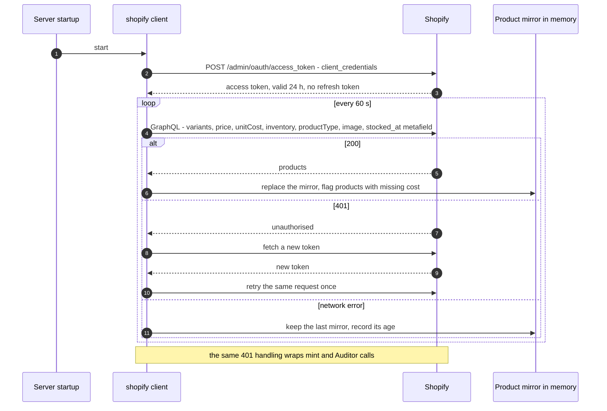

The token dies after 24 hours and our window is 32, so every Shopify call goes through one wrapper that re-fetches on 401. Test this Saturday night by deliberately corrupting the token in memory.

---

## 5. State machines

### 5.1 Negotiation

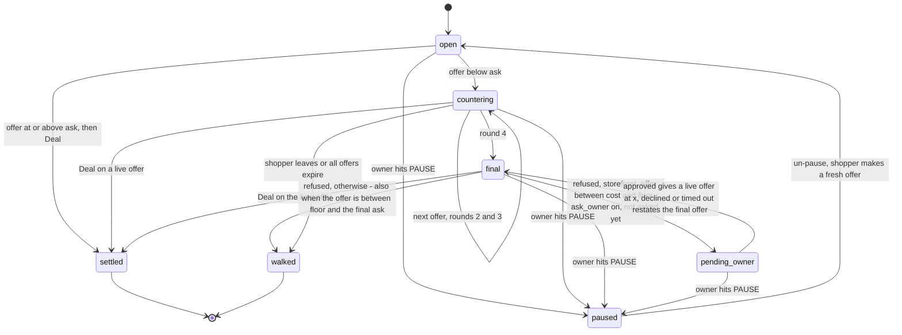

A haggle is at most four offers, with one optional detour to the owner (storefront only). Notice PAUSE can be entered from every live state and wins instantly. There is no "last call": a shopper who refuses the final offer walks even if their offer was above the floor — the Gym counts that as a deal missed. A negotiation belongs to one surface and one shopper id.

### 5.2 Offer

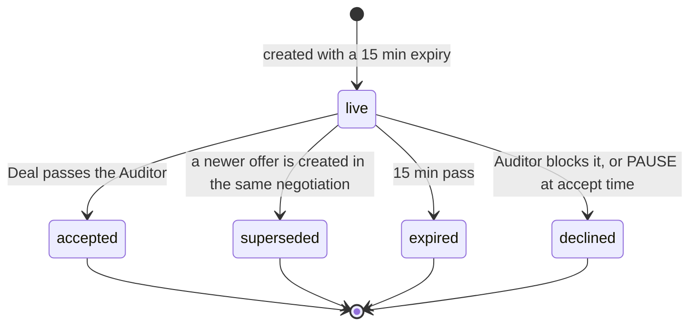

Only one offer per negotiation is `live` at any time, and only a `live` offer can be accepted — that is what defeats "you already offered me $80" and replay attacks. On `expired`, the server also calls `discountCodeDeactivate` if a code was minted.

### 5.3 Approval

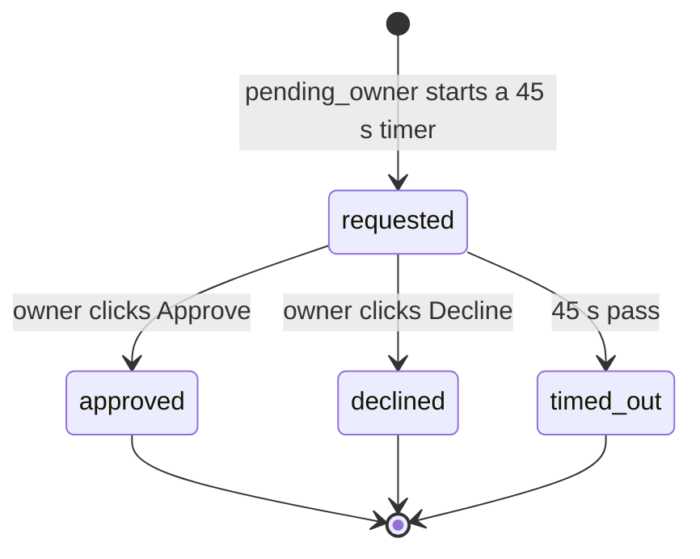

At most one approval per negotiation. `timed_out` behaves exactly like `declined`.

---

## 6. The engine as a flowchart

### 6.1 The three price zones

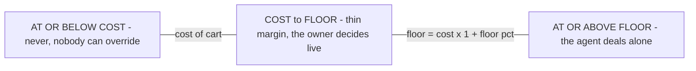

Every price the system handles falls in exactly one zone. Example (Trail Runner 2 + socks, cost $84, floor 25%): never at or below $84 · owner decides $84–$105 · agent alone from $105.

### 6.2 From an incoming offer to an outcome

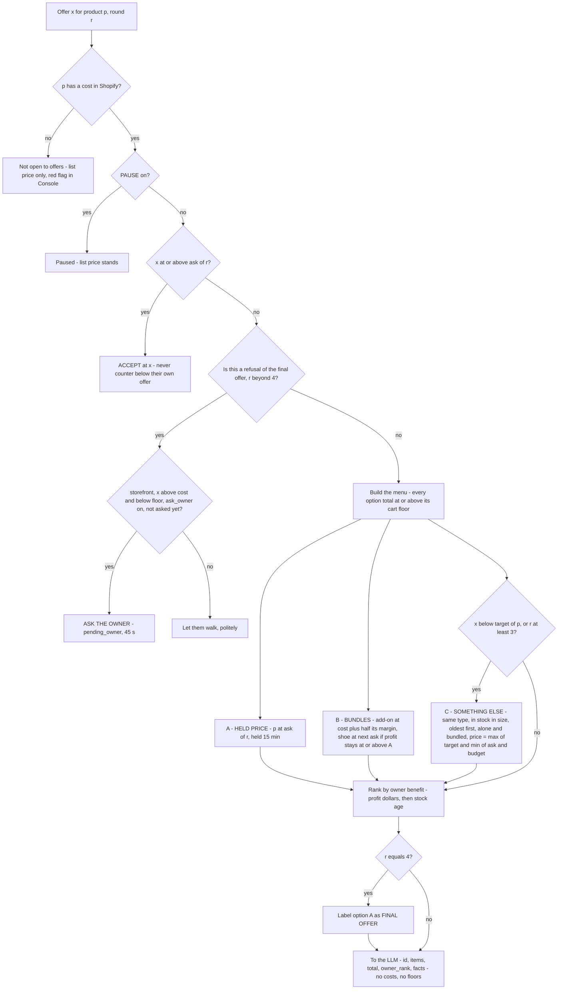

The engine is a pure function: same inputs, same menu. Notice there is no path that produces a total below the floor except through ASK THE OWNER, and no path at all to a total at or below cost.

Formulas (from SPEC §6): `cost = sum of unitCost x qty` · `floor = cost x (1 + floor%)` · `urgency = clamp((days since stocked_at - 60) / 60, 0, 1)`, and a bundle takes its main product's urgency · `target = list - urgency x (list - floor)` · `ask(r) = list - ((r-1)/3)^(1/(1+urgency)) x (list - target)`, so `ask(4) = target`. There is no fixed "max bend": stock age alone decides how far toward the floor a haggle may end.

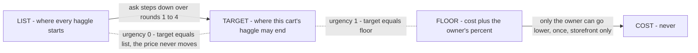

Where the target sits between list and floor depends only on stock age. New stock (urgency 0) has target = list, so any offer below list is "below anything this product could ever reach" and the shopkeeper recommends something else in round 1 — that is the demo's *"those just landed…"* line.

Worked example (seed data, floor 25%): Trail Runner 3, 12 days old → urgency 0 → target $169 = list. Trail Runner 2, 94 days old → urgency 0.57, floor $97.50 → target about $120. A shopper with "about $120" on the TR3 is offered the TR2 at `max(120, min(149, 120))` = $120 alone, or $144 with gaiters (that cart's own target). The TR2's asks run $149 → $135 → $127 → $120: round 1 holds at list by design, and the trades do the work. The engine works in cents; every shopper-facing total is a whole dollar rounded **up**, so rounding can never dip below the floor. A product with no `stocked_at` counts as new stock (amber in the Console); one with no cost is not open to offers (red). Full arithmetic in SPEC §6; figures illustrative until Saturday night.

---

## 7. Guardrail layers

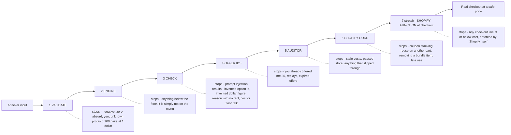

Left to right is the order an attack meets the layers. The thing to notice: layers 1–2 and 4–6 are plain code the LLM cannot influence; only layer 3 exists because an LLM is in the loop, and its failure mode is "fall back to option A", never "pass it through".

One set of layer names everywhere (feed tags, types, the Gym's red-team wall). Console `blockedBy` values map to layers like this: `validate` = layer 1 · `engine` = layer 2 · `check` = layer 3 · `auditor` = layers 4 and 5.

---

## 8. Data model

### 8.1 Supabase — what survives a restart

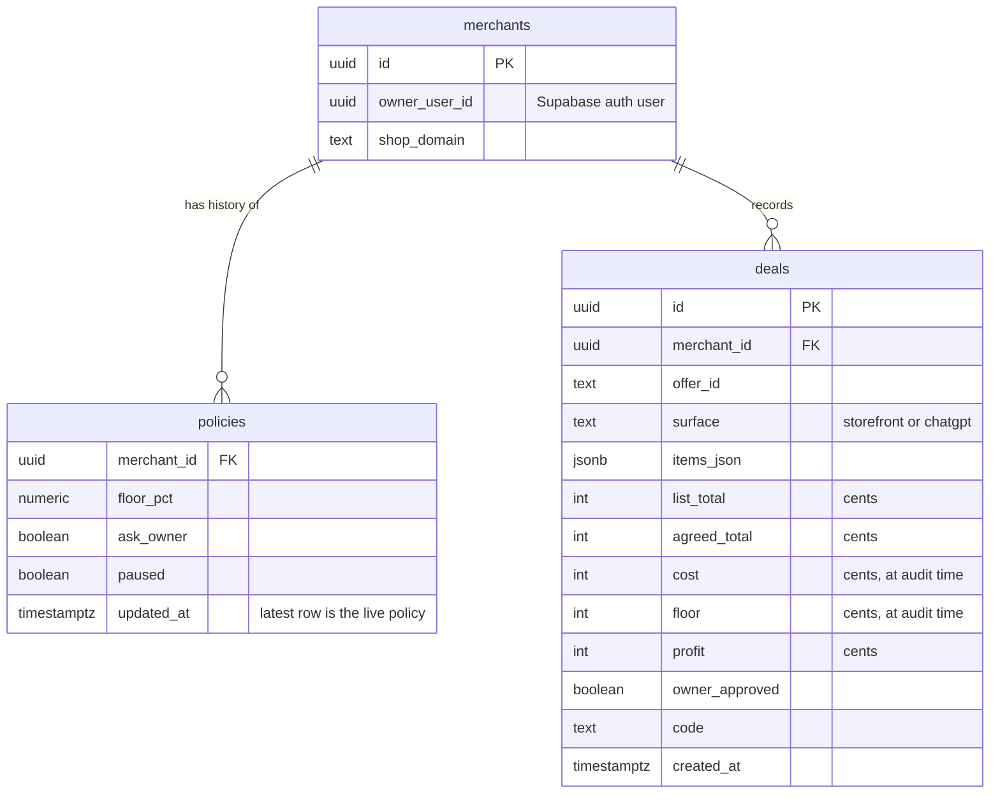

Three tables, append-only. A new `policies` row is inserted on every Adopt and every PAUSE toggle, so the latest row is the live policy and the rest is history. `deals` stores cost and floor **as they were when the Auditor ran**, so the red-team verifier can recount breaches without trusting the pipeline.

### 8.2 Server memory — what does not survive a restart

| Structure | Key | Holds | Written by | Lifetime |
|---|---|---|---|---|
| Product mirror | `variantId` | price, unitCost, inventory, productType, image, stockedAt, missingCost | shopify sync | Replaced every 60 s. Rebuilt on startup in one query. |
| Cached policy | `merchantId` | floorPct, askOwner, paused | owner routes | Loaded from Supabase on startup. **Survives** via the `policies` table. |
| Negotiations | `negotiationId` | surface, shopperId, productId, round, state, askedOwner, Backboard threadId, trail | core | Until settled or walked. **Lost on restart.** |
| Offers | `offerId` | negotiationId, Option, state, expiresAt, code | core | 15 min, then expired. **Lost on restart** — a lost offer simply reads as "expired, make another". |
| Approvals | `approvalId` | negotiationId, offer, cost, profit, deadline, state, timer handle | approvals | 45 s. **Lost on restart.** |
| Console feed | ring buffer, last 200 | ConsoleEvent | event bus | **Lost on restart.** Settled deals can be re-read from `deals`. |
| Red-team result | single value | RedTeamResult | red-team script (dry-run minter, in-memory deals) | `infra/redteam-result.json`, committed to the repo and loaded at boot — the host's disk does not persist. **Survives.** |

All of these sit behind the same `db.ts` interface as the Supabase queries, so the fallback "skip Supabase, policy in memory" is a one-file change. **What a restart or a deploy costs:** in-flight haggles — so deploys freeze from Sun 08:00, and the host must run exactly one instance (two instances would each hold half the negotiations). **What it never costs:** the owner's policy, the record of deals, or an already-minted code (that lives in Shopify).

---

## 9. Deployment — demo-day topology

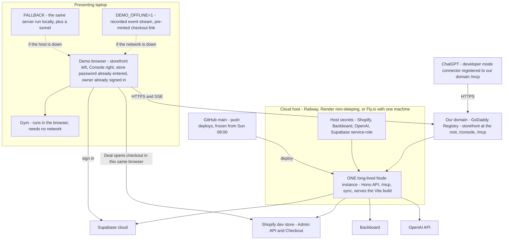

The server is deployed, so ChatGPT, the storefront and the Console all use one stable HTTPS URL on our own domain. The thing to notice: it must be **exactly one long-lived instance** — not serverless, no autoscaling, no sleep — because haggles live in that process's memory and the chat and Console hold SSE streams open to it. The laptop keeps two safety nets: the same server run locally behind a tunnel, and a fully offline replay.

| Rule | Why |
|---|---|
| One instance, always on | Negotiations, offers and approval timers are in-process `Map`s; SSE clients are connected to that process |
| SSE heartbeat comment every 15 s | Host proxies drop idle connections |
| Secrets in the host's settings; the web bundle gets only `SUPABASE_URL` and the anon key | No Shopify, Backboard, OpenAI or service-role key ever ships to a browser |
| Dev loop: run locally against the same Shopify store and Supabase project; push to `main` deploys | One environment to reason about |
| Freeze deploys from Sun 08:00 | A deploy is a restart, and a restart drops in-flight haggles |
| Register the ChatGPT connector against the domain, not the host's default URL | Switching to the laptop fallback is then a DNS or connector change, not a rebuild |

---

## 10. Failure and fallback map

| Dependency | What breaks | Automatic fallback | What the presenter says |
|---|---|---|---|
| OpenAI API (understand) | Slow or down | 2.5 s timeout, then regex for `$amount` + keywords | Nothing — invisible |
| Backboard (choose + say) | Slow, `run_failed`, no `run_ended` | 4 s timeout, then option A + template line | "Backboard's down, so you're seeing the engine with template lines — same prices, same floor." |
| The check fails | LLM invented a number or reason | Option A + template, red `blocked: check` row | "That red row is the check throwing away what the model made up." |
| Shopify Admin API at accept | Auditor cannot re-read cost within 1.5 s | Use the mirror if it synced under 2 min ago; otherwise no code minted, card says try again | "It refuses to mint a code it can't verify." |
| Cloud host | Down, asleep, or a bad deploy | Run the same server on the laptop behind a tunnel; re-point the ChatGPT connector (or skip the finale). Deploys frozen from Sun 08:00 | "Same code, running here." |
| Host scaled to two instances, or restarted | Haggles vanish or split between processes; SSE drops | Pin to one instance before Saturday night; clients reconnect; old cards read as expired | "Make me another offer." |
| Shopify token (24 h) | 401 on any call | Re-fetch token, retry once | Nothing — invisible |
| Shopify sync | Network error | Keep the last mirror, show its age in the Console | Nothing |
| Discount code mint | Error, or total doesn't match | Re-mint once, then draft order with price override, then pre-minted backup link | "Same price, Shopify's other route to a negotiated checkout." |
| Supabase | Slow or unreachable | Off the hot path: policy cached in memory; the deal write is retried in the background | Nothing — invisible |
| Supabase Auth | Cannot sign in | Be signed in before judges arrive; the env-var password build is the plan B | Nothing |
| ChatGPT / developer mode | Card won't render or the connector fails | Run everything on the storefront; finale becomes one sentence | "The same core also speaks MCP — here's the tool list." |
| Owner doesn't answer | Approval hangs | 45 s timer resolves as decline, offer at the floor | Nothing |
| Server restart | In-flight haggles lost | Policy reloads from Supabase, mirror re-syncs in one query; old cards read as expired | "Make me another offer." |
| Wi-Fi | Everything external | `DEMO_OFFLINE=1` replays a recorded event stream; checkout from a pre-minted link; Gym is local | "Cached run, same code path." |
| Store password | Cart link shows a password page | Entered once in the demo browser before judging | Nothing |

---

## 11. API surface

### 11.1 HTTP endpoints

| Method | Path | Auth | Request | Response | Used by |
|---|---|---|---|---|---|
| GET | `/api/products` | none | — | `ProductCard[]` | Storefront |
| POST | `/api/chat` | none | `{ shopperId, negotiationId?, productId, size?, message }` | SSE stream of `ChatEvent` | Storefront |
| POST | `/api/accept` | none | `{ negotiationId, offerId }` | `Settlement`, or an updated `OfferCard` on refusal | Storefront card |
| GET | `/api/console/state` | owner | — | `{ policy, products: OwnerProduct[], pendingApprovals: Approval[], redteam: RedTeamResult }` | Console on load; feeds the Gym |
| GET | `/api/console/stream` | owner | — | SSE stream of `ConsoleEvent` (read with `fetch`, not `EventSource`) | Console feed |
| POST | `/api/policy` | owner | `{ floorPct, askOwner }` | `Policy` | Console — Adopt |
| POST | `/api/approvals/:id` | owner | `{ decision: "approve" or "decline" }` | `Approval` | Console — yellow card |
| POST | `/api/pause` | owner | `{ paused: boolean }` | `Policy` | Console — PAUSE |
| ALL | `/mcp` | none | MCP Streamable HTTP | MCP | ChatGPT |

There is **no Gym endpoint**: the Gym runs in the browser. The red-team is a server-side script run before the demo; its cached result is served inside `/api/console/state`.

### 11.2 MCP tools

| Tool | Input | `structuredContent` | `content` | Annotations |
|---|---|---|---|---|
| `find_products` | `{ query, budget?, size? }` | `{ products: ProductCard[] }` | empty | `readOnlyHint: true`, `destructiveHint: false`, `openWorldHint: false` |
| `make_offer` | `{ product_id, offer_total, size?, quantity?, message?, negotiation_id? }` | `OfferCard` (includes `negotiationId`) | empty | `destructiveHint: false`, `openWorldHint: false` |
| `accept_offer` | `{ negotiation_id, offer_id }` | `{ checkout_url, agreed_total, expires_at }` | empty | `destructiveHint: false`, `openWorldHint: false` |

Every tool description ends: *"The result is shown to the user in a card. Never state, estimate or predict a price in text."* The card resource sets both `_meta.ui.resourceUri` and `openai/outputTemplate`. Shopper identity comes from `_meta["openai/subject"]`. `accept_offer` is called by the card's button through `window.openai.callTool`, not by the model.

---

## 12. Build order as a dependency graph

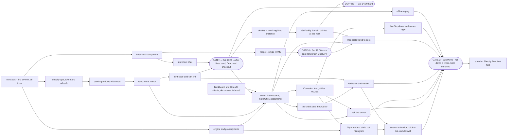

The critical path to gate 1 is **token → seed → sync → mint** (Rails) joined with **card → storefront chat** (Stage); the engine is *not* on it — gate 1 uses a fixed counter card. Notice gate 0 depends only on the card and the widget, so one person can run it without blocking anyone, and the `/mcp` tools need both gate 0 and the core.

| Gate | When (EDT) | Must be true |
|---|---|---|
| Gate 1 | Sat 09:00 | Storefront: offer → fixed counter card → Deal → real code → real Shopify checkout at that price |
| Gate 0 | Sat 12:00 | A hello-world tool of ours renders a custom card in ChatGPT (one person, 90 min) |
| Devpost | Sat 14:00, hard | Submitted with team, badge IDs, public repo, and Shopify + Backboard + OpenAI + GoDaddy Registry selected |
| Supabase decision | Sat 18:00 | If Rails is behind: env-var password and in-memory policy instead |
| Gate 2 | Sun 00:00 | Full demo 3× untouched on both surfaces; backup video; 30-min attack session |
| Final submit | Sun 08:00 | Devpost final edit; deploys frozen |

The full task table, hour-by-hour schedule and cut order are in [`PLAN.md`](PLAN.md).

---

## 13. The Gym swarm view

Owner-only (rule 11): nothing here is reachable from a shopper-facing surface.

### 13.1 One run drives everything

```mermaid
flowchart LR
  ST["GET /api/console/state - product costs and the saved policy, fetched once"]
  PA["Policy A - saved"]
  PB["Policy B - under the slider"]
  RUN["gym.run - seed 42, 300 rule-based shoppers, the SAME engine as the server, under 50 ms, no network"]
  RES["GymResult - totals plus one GymShopper record per shopper"]
  DOTS["Dot histogram - one dot per shopper, coloured by persona"]
  ANI["Round animation - R1 to R4, about 3 s"]
  TR["Click a dot - mini transcript"]
  MC["Metric cards - bought, average price, profit vs 20 percent banner, deals missed, would have asked you"]
  RTJ["Cached RedTeamResult from the server"]
  WALL["Red-dot wall - 20 attacks bounce off the cost line"]

  ST --> PA
  ST --> RUN
  PA --> RUN
  PB --> RUN
  RUN --> RES
  RES --> DOTS
  RES --> ANI
  RES --> TR
  RES --> MC
  ST --> RTJ
  RTJ --> WALL
```

The chart, the animation, the transcripts and the metric cards all read the same `GymResult`, so nothing is drawn that did not happen in the simulation. Notice the red-dot wall is the only part that comes from the server: it replays the cached red-team result and never re-runs attacks in the browser.

### 13.2 What happens to one dot

```mermaid
stateDiagram-v2
  [*] --> opening : placed at its opening offer on the price axis
  opening --> haggling : round 1
  haggling --> haggling : steps toward its willingness while the ask line steps down
  haggling --> settled : meets the ask, or takes a bundle or held price
  haggling --> thin_margin : ends between cost and floor
  haggling --> walked : patience runs out, or refuses the final offer
  settled --> [*] : drops into its price bin, keeps its persona colour
  thin_margin --> [*] : turns yellow - would have asked you, counted as not closed
  walked --> [*] : fades into the walked pile, labelled deal missed if willingness was at or above the floor
```

Each of the 300 dots lives this life during the ~3-second animation. The thing to notice: "deals missed" is a first-class outcome — it is how the Gym tells the owner her floor is too high, and the headline card turns **red** when haggling loses to a 20% banner. Personas are never tuned to hide that.

### 13.3 Interaction rules

| Owner does | The view does |
|---|---|
| Drags the floor slider | No animation. Re-runs and re-settles instantly so the dots track the finger. Policy A stays as a grey outline histogram behind. |
| Releases the slider, or presses **Run the Gym** | Plays rounds 1 → 4 over about 3 s. Round scrubber (R1–R4) and **Replay**. |
| Hovers or clicks a dot | Mini-transcript: persona, willingness-to-pay, offer and ask per round, which trade closed it, outcome. |
| Clicks a persona in the legend | Filters the dots to that persona; counts shown in the legend. |
| Clicks **Adopt** | `POST /api/policy` → new `policies` row → server cache → governs the next shopper turn. B becomes the new A. |

Always on screen: *"300 synthetic shoppers — rule-based, seeded (seed 42), results might differ from actual buyer behaviour."* Rendering is Canvas 2D or SVG circles; no chart library. **Cut order if behind:** the round animation first (keep the static dot histogram and click-a-dot), then the red-dot wall animation (keep the card). The stretch "Gym voices" adds about 20 LLM-driven shoppers as larger dots with speech bubbles.

---

## 14. Decisions settled

These were open during the audit; the team has decided. Recorded here so nobody re-opens them.

| # | Question | Decision |
|---|---|---|
| 1 | When does the card appear? | Thinking face for at most 4 s, then **one** card. At the timeout: option A + template line. |
| 2 | When is "something else" offered? | When `x < target(p)` (covers new stock) or `r ≥ 3`. Priced at `max(target, min(ask, budget))`. |
| 3 | Streaming vs the check | Buffer the line, check it, then play the typing effect from checked text. |
| 4 | Gym endpoint | None. Owner-only `GET /api/console/state` returns costs once; the Gym runs in the browser. |
| 5 | Red-team side effects | Dry-run minter and in-memory deals; `deals` gains `floor` and `offer_id` so the verifier can recount. |
| 6 | Removing a bundle item at checkout | Every code carries a minimum subtotal equal to the cart's list total. Verify Saturday. |
| 7 | Ask-the-owner in ChatGPT | Storefront only. |
| 8 | Storefront shopper identity | `localStorage` id, `?shopper=demo` override; the demo ChatGPT subject maps to the same seeded shopper by env. |
| 9 | Auditor when Shopify is unreachable | 1.5 s timeout → mirror if under 2 min old → otherwise refuse to mint. |
| 10 | The feed's "reasoning" | Composed in code from engine facts, the pick and recalled memory. |
| 11 | Hosting | One long-lived cloud instance on our own domain; laptop + tunnel is the fallback. |
| 12 | Shopify scopes | Six, including `write_products` for the stretch Function. App scaffolded with `shopify app init`. |
| 13 | After the owner declines | The shopkeeper restates its own final offer; it does not drop to the floor. |
| 14 | Negotiations across surfaces | Not shared. One negotiation = one surface + one shopper id; one Console feed shows both. |
| 15 | Choose + say model | An OpenAI model routed through Backboard; measure latency Saturday morning. |

---

