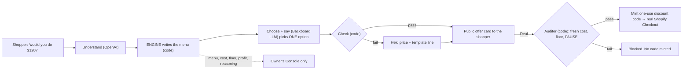

# The Bazaar — how it works

The plain-language explainer. Read this first if you are new, a judge, or about to pitch. It uses the glossary words from [`PRODUCT.md`](PRODUCT.md) §15; behaviour is defined in [`SPEC.md`](SPEC.md), and if this file ever disagrees with SPEC, SPEC wins.

## In one paragraph

A shopper names a price on a Shopify store — *"would you do $120?"* — and an AI **shopkeeper** haggles back. It never gives a discount for free: it holds the price, throws in an add-on, or steers the shopper to older stock they can afford. The shopper goes home with something instead of nothing; the owner makes a profit on every deal; and the deal settles into a **real Shopify Checkout** at the agreed price. The shopkeeper *cannot* lose the owner money, because the AI never decides a price — it only picks from a menu of deals that plain code has already proven profitable.

## The four pieces

| Piece | What it is | Who sees it |
|---|---|---|
| **The shopkeeper** | The thing the shopper talks to. An AI that does the *talking* wrapped around an engine that does the *pricing*. | Shopper |
| **The engine** | Pure maths, no AI. Turns cost, stock age and the owner's floor into a **menu** of deals, every one above the floor. | Nobody — it has no voice |
| **The Console** | The owner's control room: watch every haggle live, set the floor, approve thin-margin deals, PAUSE everything. | Owner only |
| **The Gym** | A simulator inside the Console. The owner tests a pricing policy on 300 synthetic hagglers — and sees a red-team fail to rob her — before a real customer arrives. | Owner only |

## 1. The shopkeeper = an AI that talks + an engine that prices

People call the whole thing "the agent". It is really four parts, and the split between them is the point of the project:

| Step | Job | Done by |
|---|---|---|
| **Understand** | Turn *"uhh i could maybe do like 115 if socks are in?"* into `{ amount: 115, wants: socks }` | OpenAI (Structured Outputs) |
| **Build the menu** | List every deal that clears the floor, with exact prices | **The engine — code, no AI** |
| **Choose + say** | Pick ONE option from the menu and word it, using store knowledge and what it remembers about this shopper | Backboard (LLM + memory + store documents) |
| **Check, then Audit** | Verify the AI picked a real option, quoted only that option's numbers, and leaked nothing; re-verify cost and floor from fresh data before minting the discount code | Code |

> **The LLM picks from the menu; code writes the menu.**
> The engine never talks to anyone. The AI never decides a dollar figure.

That is the answer to *"what if the AI gives away the store?"* It can't. A jailbreak can at worst make it pick a different deal from a list where every deal is already profitable — and if it invents a price anyway, the check throws the reply away and sends the held price with a template line instead. Every LLM call also has a timeout with that same fallback, so the shop keeps working if a model is slow or down.

## 2. The engine — how a price is allowed to move

All in `packages/engine`. Pure TypeScript: no I/O, no clock, no randomness, so the same code runs on the server and in the browser (that is what lets the Gym run client-side).

- **Cost** comes from Shopify. No cost recorded → the product is **not open to offers**.
- **Floor** = cost × (1 + the owner's floor %). The lowest the shopkeeper may go on its own.
- **Urgency** = how old the stock is: 0 up to 60 days, rising to 1 at 120 days.
- **Target** = where a haggle on this cart may *end*. New stock: target = list, so **the price never moves**. Old stock: target slides toward the floor.
- **Ask** = the shopkeeper's price this round. Four rounds, stepping from list down to target, with shrinking steps.

There is no "max discount %" setting. **Stock age alone decides how far a price bends** — which is why the shopkeeper says *"those just landed, I can't move on them — but last season's…"* without anyone scripting it.

### It always trades, never discounts for free

| Option on the menu | What the shopper gives | What they get |
|---|---|---|
| **Held price** (A) | Buys within 15 minutes | This round's ask, held |
| **Bundle** (B…) | A bigger cart | The product plus an add-on priced at cost + half its margin |
| **Something else** (C…) | Takes older stock | A similar product that fits their budget — alone or as a bundle |

### Three zones

| The offer is… | What happens |
|---|---|
| **At or above the floor** | The shopkeeper deals on its own. |
| **Between cost and floor** (thin margin) | Only the owner can say yes — *"let me check with the owner"*, a 45-second Approve / Decline card, once per haggle. A decline restates the final offer; it never drops to the floor. |
| **At or below cost** | Never. No override exists. |

**Worked example** — a shopper offers $120 on the Trail Runner 3 (new stock, list $169). The price can't move. The menu comes back with last season's **Trail Runner 2 at $120**, and **Trail Runner 2 + gaiters at $144** (list $184). The shopper leaves with shoes; the owner clears aged stock at a profit.

### How we know the engine is safe

**Property tests** (fast-check): 11 properties, 1,000 random cases each, in under a second — *no option is ever at or below cost · nothing below the floor without an approval · asks never increase · never counters below the shopper's own offer on that product · missing cost ⇒ no menu.* Writing them surfaced two real engine bugs and four contradictions in our own spec, all fixed. This is what *strengthens* the engine — not the Gym.

## 3. The Console — the owner's control room

One page, behind a login. Nothing on it is reachable from a shopper surface.

| Region | What it's for |
|---|---|
| **Live feed** | One row per haggle, on either surface (storefront or ChatGPT): the offer, the floor, the menu the engine wrote, which option the AI picked and why, the memory it recalled, the model, milliseconds and cost. The reasoning is composed by code from engine facts — the AI is never asked to explain itself. **Blocked attempts show in red**, naming the layer that stopped them. |
| **Policy panel** | The floor slider (cost + 0–60%), the "ask me about thin-margin deals" switch, and products flagged as missing a cost or a stock date. **Adopt** makes the slider's policy the live one. |
| **Approve / Decline card** | The yellow card for a thin-margin offer: items, the shopper's offer, profit in $ and as "% over cost" — the same basis as the slider. 45 seconds. |
| **PAUSE** | One red button, always in frame. The next message on every surface gets the paused line; accepts are blocked. |
| **The Gym** | Below. |

Red means only two things — PAUSE and blocked. Yellow means only one — the owner must decide.

## 4. The Gym — a flight simulator for the owner's pricing policy

**What it is:** a simulation that shows the owner what her floor setting does to her profit, before any real customer meets it.

**What it is not:** it does not train, tune or strengthen the engine. The engine behaves identically before and after a run. The Gym tests **her policy**, not our code.

### Why it exists

A shop with twelve visitors a day can never A/B test a price floor — it would take months and cost real money while it ran. Shopify's SimGym solves the same problem for *themes* with synthetic shoppers. The Gym borrows that method and points it at *pricing*: named personas, a seed, A vs B, one headline metric against a counterfactual, and an honest label.

### How it works

- **300 synthetic shoppers**, five personas: bargain hunter 30% · budgeted runner 35% · impatient 15% · loyal 10% · lowballer 10%. Each has a secret willingness-to-pay, an opening offer, a patience limit, and a chance of being tempted by a bundle.
- **They are rule-based, not LLM agents** — on purpose. Rule-based shoppers are instant (300 in ~2 ms), free, and reproducible: the same seed gives the same run, which is what makes A vs B meaningful. The persona numbers were pinned before the first run and are never tuned to flatter the result.
- **They haggle against the real engine** — every ask comes from the same `buildMenu` a real shopper hits. No second pricing path.
- **A vs B:** policy A is the owner's saved policy; policy B is whatever the slider says now. Drag the slider → all 300 replay instantly. **Adopt** → B governs the very next real shopper.
- **One run drives everything on screen** — the chart, the animation and the per-shopper transcripts all read the same record. Nothing is drawn that didn't happen.

### What the owner reads off it

| Card | The question it answers |
|---|---|
| **Profit vs a 20%-off banner** (the headline) | *Is haggling worth it, or should I just run a sale?* **It is allowed to say no** — the card goes red when haggling loses. With our seed data it wins by about $2,091 at a 25% floor and starts losing at 42%. |
| % who bought · average agreed price | How much am I selling, and for how much? |
| Order-value uplift from bundles | Are the add-ons pulling their weight? |
| **Deals missed** | Shoppers who walked but *would* have paid at or above my floor — the limit is my floor or my stock age, not the shopkeeper. |
| **"Would have asked you"** | Deals that landed in the thin-margin zone — how often would I be pulled in to approve? |

**The view:** a dot histogram — one dot per shopper, coloured by persona, stacked by agreed price; the saved policy as a grey outline behind; reference lines for list, floor and the banner price; the thin-margin band shaded. Click a dot for that shopper's round-by-round transcript. **Run the Gym** plays rounds 1 → 4 as a swarm: dots step toward what they'd pay while the ask line steps down, settling into exactly that histogram.

### The red-team — the second job in the same panel

The simulation answers *"is my policy profitable?"* The red-team answers *"is it safe?"* — 20 scripted attacks (invented prices, prompt injection, replayed and expired offers, stale costs…) run against the full stack, each blocked by a named layer: `validate · engine · check · auditor`. A separate verifier recounts the breaches from the deal rows alone. The card reads **20 attacks · 0 breaches**.

## 5. What each side sees

| | Shopper (storefront, ChatGPT) | Owner (Console) |
|---|---|---|
| The picked offer: items, totals, the line, countdown | ✅ | ✅ |
| The rest of the menu | ❌ | ✅ |
| Cost, floor, target, profit | ❌ | ✅ |
| Why the AI picked it; recalled memory | ❌ | ✅ |
| The Gym, the personas, the red-team | ❌ | ✅ |

This is enforced in the types (a shopper event *cannot hold* an owner-side option — it is a compile error) and proven by a test that walks every shopper-bound event looking for owner-side fields.

## 6. Say it right — common mix-ups

| Don't say | Say | Why it matters |
|---|---|---|
| "The engine is the AI agent" | "The shopkeeper is an AI that talks and an engine that prices" | The split *is* the safety story. |
| "The Gym trains / strengthens the engine" | "The Gym tests the owner's pricing policy; property tests prove the engine" | Nothing learns. Claiming it does invites questions we can't answer. |
| "A swarm of AI agents negotiates" | "300 synthetic hagglers — rule-based, seeded" | It's true, it's what makes the A/B valid, and the label on screen says so. |
| "The AI negotiates the price" | "The AI picks from prices the code already approved" | Same. |
| "It gives discounts" | "It trades — bigger cart, buy now, or older stock" | No free discounts is a product rule. |
| "Deals go to a checkout page" | "Deals settle into Shopify Checkout" | It is the real one, at the real price. |

## 7. The one-liner for judges

> The shopkeeper is an AI that talks and a deterministic engine that prices — the AI can only pick from deals the engine has already proven profitable. The Console is where the owner watches and steers it, and the Gym lets her test a pricing policy on 300 synthetic hagglers, and watch a red-team fail to rob her, before a real customer ever sees it. Try to make it lose money.
