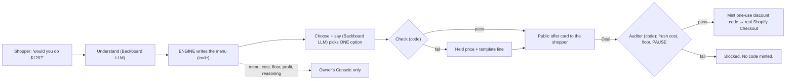

# The Bazaar — how it works

The plain-language explainer. Read this first if you are new, a judge, or about to pitch. It uses the glossary words from [`PRODUCT.md`](PRODUCT.md) §15; behaviour is defined in [`SPEC.md`](SPEC.md), and if this file ever disagrees with SPEC, SPEC wins.

## In one paragraph

A shopper names a price on a Shopify store — *"would you do $120?"* — and an AI **shopkeeper** haggles back. It never gives a discount for free: it holds the price, throws in an add-on, or steers the shopper to older stock they can afford. The shopper goes home with something instead of nothing; the owner makes a profit on every deal; and the deal settles into a **real Shopify Checkout** at the agreed price. The shopkeeper *cannot* lose the owner money, because the AI never decides a price — it only picks from a menu of deals that plain code has already proven profitable.

## The four pieces

| Piece | What it is | Who sees it |
|---|---|---|
| **The shopkeeper** | The thing the shopper talks to. An AI that does the *talking* wrapped around an engine that does the *pricing*. | Shopper |
| **The engine** | Pure maths, no AI. Turns cost, stock age, the round, the shopper's stated reason and the owner's settings into a **menu** of deals, every one at or above the floor. | Nobody — it has no voice |
| **The Console** | The owner's control room: watch every haggle live, set the floor, the discount cap, the rounds and the lowball cutoff, approve thin-margin deals, PAUSE everything. | Owner only |
| **The Gym** | A simulator inside the Console. The owner tests a pricing policy on 300 synthetic hagglers — and sees a red-team fail to rob her — before a real customer arrives. | Owner only |

## 1. The shopkeeper = an AI that talks + an engine that prices

People call the whole thing "the agent". It is really four parts, and the split between them is the point of the project:

| Step | Job | Done by |
|---|---|---|
| **Understand** | Turn *"uhh i could maybe do like 115 if socks are in?"* into a structured offer: $115, socks wanted | Backboard (LLM). A plain-number lowball is read by code alone. |
| **Build the menu** | List every deal that clears the floor, with exact prices | **The engine — code, no AI** |
| **Choose + say** | Pick ONE option from the menu and word it, using store knowledge and what it remembers about this shopper | Backboard (LLM + memory + store documents) |
| **Check, then Audit** | Verify the AI picked a real option, quoted only that option's numbers, and leaked nothing; re-verify cost and floor from fresh data before minting the discount code | Code |

> **The LLM picks from the menu; code writes the menu.**
> The engine never talks to anyone. The AI never decides a dollar figure.

That is the answer to *"what if the AI gives away the store?"* It can't. A jailbreak can at worst make it pick a different deal from a list where every deal is already profitable — and if it invents a price anyway, the check throws the reply away and sends the held price with a template line instead. Every LLM call goes through Backboard and has a timeout (6.5 s by default) with a code fallback, so the shop keeps working if a model is slow or down.

## 2. The engine — how a price is allowed to move

All in `packages/engine`. Pure TypeScript: no I/O, no clock, no randomness, so the same code runs on the server and in the browser (that is what lets the Gym run client-side).

- **Cost** comes from Shopify. No cost recorded → the product is **not open to offers**.
- **Floor** = cost × (1 + the owner's floor %), and always above cost. The lowest the shopkeeper may go on its own.
- **Urgency** = how old the stock is: 0 up to 60 days, rising to 1 at 120 days.
- **Target** = how far stock age lets the price move. New stock: target = list. Old stock: target slides toward the floor.
- **Buyer reason** = what the shopper says to justify the offer, scored 0–4 by code (budget, quantity, add-on, repeat shopper, market comparison, a real use, ready to buy). A stronger reason opens more room; with no reason the early rounds hold at list.
- **Ask** = the shopkeeper's price this round. It steps down from list over the owner's **max rounds** (2–6, four by default); a later round never asks more.
- **Discount cap** = the most the owner lets the shopkeeper take off list (0–40%, 22% by default). The cap never reaches below the floor.
- **Lowball** = an offer under the owner's cutoff (a share of list, 40% by default; 0 turns it off). Code counters it with the quote already on the table — no LLM call, and the round does not advance.

**Stock age, the round and the shopper's stated reason move the price — always inside the floor and the discount cap.** New stock with no convincing reason doesn't bend, which is why the shopkeeper can say *"those just landed, I can't move on them — but last season's…"*.

### It always trades, never discounts for free

Options are lettered from A. Option A is the code fallback.

| Option on the menu | What the shopper gives | What they get |
|---|---|---|
| **Held price** | Buys within 15 minutes | This round's ask, held |
| **Bundle** | A bigger cart | The product at this round's ask plus each add-on at cost + half its margin |
| **Something else** | Takes a cheaper product | A cheaper product of the same type, in their size — on the menu when they ask for an alternative |

### Three zones

| The offer is… | What happens |
|---|---|
| **At or above the floor** | The shopkeeper deals on its own. |
| **Between cost and floor** (thin margin) | Only the owner can say yes — *"let me check with the owner"*, a 45-second Approve / Decline card, once per haggle, after the last round. A decline restates the final offer; it never drops to the floor. |
| **At or below cost** | Never. No override exists. |

**Worked example** — a shopper on the Trail Runner 3 page (new stock) says they only have about $120 and asks what else there is. The new shoe has little room to move. The menu comes back with the Trail Runner 3 held at its ask and last season's cheaper **Trail Runner 2** in the same size; had they asked for gaiters, a bundle would be on it too. Every figure on every option is the engine's. The shopper leaves with shoes; the owner sells at a profit.

### How we know the engine is safe

**Property tests** (fast-check): 8 properties × 1,000 seeded cases on the menu every shopper is priced from — `pnpm test:props`. *Every option is above cost, at or above the floor and never above list · every option passes the settlement audit without an approval · a single-item option never goes below the discount cap · an item with no cost, out of stock, or with a floor above list never reaches the menu · the menu is deterministic and lettered from A · a later round never asks more · the lowball rule is off at zero and otherwise a strict share of list* — plus a guard that the generated cases are not vacuous. The whole suite is 262 tests in 36 files (`pnpm test`). This is what *strengthens* the engine — not the Gym.

## 3. The Console — the owner's control room

One page, behind a login. Nothing on it is reachable from a shopper surface.

| Region | What it's for |
|---|---|
| **Kept band** | Across the top, from real settled deals only: what she kept (profit recovered minus agent cost), customers saved, revenue recovered, and the comparison with a 20% banner. |
| **The price race** | The Gym's view — below. One pill strip, **Floor · Max off · Rounds · Lowball**, one slider at a time. **Adopt** makes the previewed policy the live one. |
| **Live feed** | One row per decision, tagged with its surface: the offer, the floor, the menu the engine wrote, which option the AI picked, the memory it recalled, the model, milliseconds and cost. The reasoning is composed by code from engine facts — the AI is never asked to explain itself. **Blocked attempts show in red**, naming the layer that stopped them. |
| **Approve / Decline card** | The yellow card for a thin-margin offer: items, the shopper's offer, profit in $ and as "% over cost" — the same basis as the floor slider. 45 seconds. It goes first in the rail only while one is pending. |
| **PAUSE** | One button in the top bar, always in frame. The next message gets the paused line; accepts are blocked. |
| **More settings** | The "ask me about thin-margin deals" switch, products flagged as missing a cost or a stock date, other figures, and the red-team summary. |

## 4. The Gym — a flight simulator for the owner's pricing policy

**What it is:** a simulation that shows the owner what her settings — floor, discount cap, rounds, lowball cutoff — do to her profit, before any real customer meets it.

**What it is not:** it does not train, tune or strengthen the engine. The engine behaves identically before and after a run. The Gym tests **her policy**, not our code.

### Why it exists

A shop with twelve visitors a day can never A/B test a price floor — it would take months and cost real money while it ran. Shopify's SimGym solves the same problem for *themes* with synthetic shoppers. The Gym borrows that method and points it at *pricing*: named personas, a seed, A vs B, one headline metric against a counterfactual, and an honest label.

### How it works

- **300 synthetic shoppers**, five personas: bargain hunter 30% · budgeted runner 35% · impatient 15% · loyal 10% · lowballer 10%. Each has a secret willingness-to-pay, an opening offer, a patience limit, and a chance of being tempted by a bundle.
- **They are rule-based, not LLM agents** — on purpose. Rule-based shoppers are instant, free, and reproducible: the same seed gives the same run, which is what makes A vs B meaningful. The persona numbers were pinned before the first run and are never tuned to flatter the result.
- **They haggle against the real engine** — every ask comes from the same `buildNegotiationMenu` a real shopper is priced from. No second pricing path.
- **A vs B:** policy A is the owner's saved policy; policy B is whatever the sliders say now. Drag a slider → all 300 are re-run and the race replays. **Adopt** → B governs the very next real shopper.
- **One run drives everything on screen** — the dots, the ask line and the per-shopper detail all read the same record. Nothing is drawn that didn't happen.

### What the owner reads off it

| On screen | The question it answers |
|---|---|
| **Customers saved** and **profit**, each with its change against the saved policy | What does this setting do, compared with what I run today? |
| **More or less than no shopkeeper** | Is haggling better than list prices alone? |
| **More or less than a 20% banner** | *Is haggling worth it, or should I just run a sale?* **It is allowed to say no** — the figure goes red when haggling loses. |
| Hollow dots with a dark ring — **a deal missed** | Shoppers who walked but *would* have paid at or above my floor. |
| Yellow dots — **"would ask you"** | Deals that landed in the thin-margin zone — how often would I be pulled in to approve? |

**The view:** the price race — one dot per shopper, coloured by outcome. Dots wait along the top at what each shopper would pay; labels mark cost, floor and list, and the thin-margin band is shaded. **▶ Play** runs the rounds one at a time: the ask line steps down from list, and shoppers who agree drop into stacks at the price they paid. Point at a dot for that shopper's persona, willingness to pay, and offer and ask per round.

### The red-team — the second job

The simulation answers *"is my policy profitable?"* The red-team answers *"is it safe?"* — 20 scripted attacks (invented prices, prompt injection, replayed and expired offers, stale costs…) run against the server path, with test doubles for Backboard, Shopify and the database. Each must end safely; where a guardrail layer stopped one, the layer is named. A separate verifier recounts the breaches from the deal rows alone. The summary reads **20 attacks · 0 economic breaches**. It is a recorded, isolated run — not live Shopify checkout enforcement — and the summary says so.

## 5. What each side sees

| | Shopper (storefront; the ChatGPT app is planned — not built on main) | Owner (Console) |
|---|---|---|
| The picked offer: items, totals, the line, countdown | ✅ | ✅ |
| The rest of the menu | ❌ | ✅ |
| Cost, floor, target, profit | ❌ | ✅ |
| Why the AI picked it; recalled memory | ❌ | ✅ |
| The kept band, the Gym, the personas, the red-team | ❌ | ✅ |

This is enforced in the types (a shopper event *cannot hold* an owner-side option — it is a compile error) and proven by a test that walks every shopper-bound event looking for owner-side fields.

## 6. Say it right — common mix-ups

| Don't say | Say | Why it matters |
|---|---|---|
| "The engine is the AI agent" | "The shopkeeper is an AI that talks and an engine that prices" | The split *is* the safety story. |
| "The Gym trains / strengthens the engine" | "The Gym tests the owner's pricing policy; property tests prove the engine" | Nothing learns. Claiming it does invites questions we can't answer. |
| "A swarm of AI agents negotiates" | "300 synthetic hagglers — rule-based, seeded" | It's true, it's what makes the A/B valid, and the screen labels the run as simulated. |
| "The AI negotiates the price" | "The AI picks from prices the code already approved" | Same. |
| "It gives discounts" | "It trades — bigger cart, buy now, or older stock" | No free discounts is a product rule. |
| "Deals go to a checkout page" | "Deals settle into Shopify Checkout" | It is the real one, at the real price. |

## 7. The one-liner for judges

> The shopkeeper is an AI that talks and a deterministic engine that prices — the AI can only pick from deals the engine has already proven profitable. The Console is where the owner watches and steers it, and the Gym lets her test a pricing policy on 300 synthetic hagglers, and watch a red-team fail to rob her, before a real customer ever sees it. Try to make it lose money.
