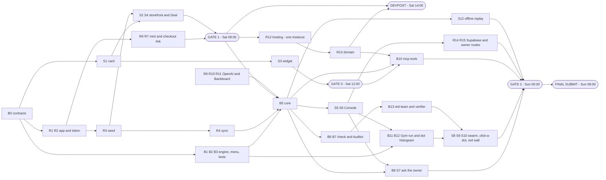

# The Bazaar — The Plan (and the tracker)

**Hack the North 2026 · team of 3 · code window Sat 19 Sep 00:00 → Sun 20 Sep 08:00 EDT (32 h)**

## STATUS BOARD

**Last updated:** Sat 19 Sep 17:10 EDT — live haggling policy now protects margin like a store negotiator: round count alone no longer walks to the floor, weak reasons get firm holds, and only stronger intent/bundles/credible comparisons earn sharper counters (Codex/Ritvik)

| Gate | Time (EDT) | Done when | Status |
|---|---|---|---|
| **Gate 1** | Sat 09:00 | Storefront: offer → fixed counter card → **Deal** → real code → **real Shopify Checkout at that price** | ☐ **code path LIVE** — R2/R4/R5/R6 ticked, `BAZAAR-2180U` minted on Railway 11:50. Open only on one browser click-through + the three store settings under R7 |
| **Gate 0** | Sat 12:00 | A hello-world tool of ours shows a custom card in ChatGPT — or a clear "no", decided and closed | ☐ **due now, S3 not started** — write the outcome here and close it |
| **Devpost** | Sat 14:00 **hard** | Submitted: team, badge IDs, public repo, **Shopify + Backboard + OpenAI + GoDaddy Registry** selected | ☐ **~2 h left, S13 not started** — the live checkout now exists, so nothing is blocking it |
| **Gate 2** | Sun 00:00 | Full demo 3× untouched on both surfaces, on the hosted URL; backup video; 30-min attack session | ☐ |
| **Final submit** | Sun 08:00 | Final Devpost edit; code freeze; **deploy freeze** | ☐ |

**Now / Next / Blocked** — overwrite these lines as you go. This block is the handoff.

| Part | Owner | Now | Next | Blocked by |
|---|---|---|---|---|
| 🛍️ A. Storefront + Shopify store | Ritvik | Trailhead logo/name is wired into the live theme, and chat haggling now asks for stronger buyer reasons before sharper discounts | **① S13 Devpost assets ② S3 gate-0 decision ③** browser click-through to confirm the checkout total, screenshots while the path is warm | Shopify admin store name may still need manual rename for Checkout branding |
| ⚙️ B. Engine, core, Gym + Console | Bryan | Part B backbone COMPLETE — B1 B2 B3 B4 B5 B6 B11 ticked and merged. **R2/R6/R7 were briefly reassigned to Bryan at 11:55 and handed straight back** — Platform had already shipped them; `codex-prompt-settlement.txt` is obsolete, do not run it | S5 Console shell (fixtures exist, no R5 dependency) → S6 policy panel → B12 dot histogram | — |
| 🔌 C. Platform | Ricardo | R2 token wrapper, R4 product mirror, `/api/products`, `/api/stream`, offer cards, `discountCodeBasicCreate` and cart permalinks are **live on Railway deploy `6f1032c6`** | Manual checkout-total / free-shipping / tax verification; then R16 remove-bundle-item test; then R12 pin + R13 domain before 13:00 | Store checkout settings / manual checkout verification |
| 🤖 D. Agents + guardrails | **STILL UNOWNED — name someone at the 14:00 Devpost check** | Gemini answers basic shopper Q&A. The official OpenAI and Backboard paths are not started, and B5/B6 have been finished and unconsumed since 11:00 | R9 *understand* (the OpenAI track is judged on a direct OpenAI call) → R10/R11 Backboard. **Three of the four sponsor tracks live in this part** | an owner |

### Next work decision — Sat 11:55 EDT (supersedes the 11:03 note below)

**Gate 1's code path is done.** Platform shipped R2, R4, R5 and R6 and minted `BAZAAR-2180U` live from Railway at 11:50. A brief reassignment of R2/R6/R7 to Bryan at 11:55 was made on stale information and is **cancelled** — `codex-prompt-settlement.txt` is obsolete and must not be run. Bryan returns to S5 → S6 → B12.

What gate 1 still needs is **not code**: one browser click-through of Deal → Checkout, and the three store settings under R7 (rename "My Store" → "Trailhead Co.", tax off, free shipping rate). Until (b) and (c) are set the total cannot match to the cent.

Three things with hard clocks and no owner: **S13 Devpost (14:00, hard, unstarted)** — nothing blocks it now; **gate 0 (12:00)** — 90-minute box, then write card / text-only / what's-next here and stop discussing it; and **Part D, which is still unowned and holds three of the four sponsor tracks** (R9 OpenAI, R10/R11 Backboard, B13 red-team). Track selection locks at the same 14:00 Devpost deadline.

### Earlier work decision — Sat 11:03 EDT

The fastest path to a real Shopify demo is **not more chatbot polish**. The live AI chat works; the prize-critical path is now deploy + verification of the money-safe offer/checkout chain:

1. **Manual R7:** open the live storefront, ask for a deal, click Deal, and confirm checkout total equals the agreed total with tax/shipping settings.
2. **Manual R16:** remove the bundle item at checkout and confirm the minimum-subtotal code drops.
3. Capture screenshots/video for Devpost while the live path is warm.
4. Start the remaining visual/demo polish only after the checkout total is verified.

Lead with the real checkout now, but do not claim Gate 1 fully passed until the browser checkout total and remove-item behavior are manually verified.

### How to use this tracker

There are no tickets. **This file is the tracker.**

- **Tick the box in the same commit as the work.** `- [ ]` → `- [x]`.
- **When you start a task, put your initials after the id:** `**B3 (RM)**`.
- **If a task is cut, strike it through and say why:** `- [ ] ~~**S11** Deal trail~~ — cut Sat 18:00, behind on Console`. **Never delete lines.**
- **Before you sleep, update Now / Next / Blocked** and the "Last updated" line. That block is the handoff.
- When a gate passes, change its ☐ to ☑ on the status board.
- Ids are stable and **don't renumber**. The letters (B / R / S / E) are left over from the old lane split and no longer say who owns a task — **the section it sits in does** (§4).

*What and why:* [`PRODUCT.md`](PRODUCT.md) · *How it behaves:* [`SPEC.md`](SPEC.md) · *Diagrams:* [`ARCHITECTURE.md`](ARCHITECTURE.md) · *The demo:* [`DEMO.md`](DEMO.md). If this file disagrees with SPEC.md about behaviour, SPEC.md wins; about **who, when or in what order**, this file wins.

---

## 1. Goals — what winning each prize takes

| Track | What the judges look for | Our win condition | Must be visible in the demo |
|---|---|---|---|
| **Shopify — "Hack Shopping with AI"** (primary, one winner) | Technical Excellence ("sophisticated, *appropriate* use of AI"), Impact Potential, Innovation Factor; "take inspo from SimGym" | The LLM does language and judgement, code does money. Real Admin API costs in → real discount code → **real Shopify Checkout** at the haggled price. A Gym that borrows SimGym's *method*: personas, seed, A vs B, a counterfactual metric, a synthetic label. | The real checkout · the owner's Approve card · the swarm settling into the dot histogram · the headline card flipping red → teal |
| **Backboard** | Ambition; how much of the stack is used | Assistants + threads, documents/RAG, memory with citations, model routing (an OpenAI model through Backboard), `cost_usd`; stretch: tool calling, voice, Gym voices | Feed row: recalled memory + citation, the document behind "gaiters for mud", model, ms, cost |
| **OpenAI** | "What you built with the OpenAI API" + "how Codex helped"; **one concrete Codex example in the demo** | Structured-Outputs *understand* step · the haggle as an app inside ChatGPT · [`codex-log.md`](codex-log.md) from hour 0 | The structured output for a messy sentence · the card inside ChatGPT · one log entry read aloud |
| **HTN finalist** | A demo judges can touch | "Try to make it lose money" → they can't → real checkout | Hand over the keyboard early |
| **GoDaddy Registry (MLH)** | A registered domain in use | Domain registered through the MLH offer, pointing at the hosted app, storefront at the root | The URL bar |

**Track selection locks at Devpost, Sat 14:00.** Prizes added later "will not be counted".

---

## 2. Team — four parts, three people

| Part | Owner | Owns |
|---|---|---|
| 🛍️ **A. Storefront + Shopify store** | **Ritvik** | The offer card, storefront + chat, Deal flow, deal trail, faces, sparkles; product seed + sync; the ChatGPT widget (gate 0) and `/mcp`; demo script, offline replay, Devpost page, video |
| ⚙️ **B. Engine, core, Gym + Owner Console** | **Bryan** | `contracts`, engine + property tests, offers, core functions, the check; Gym run, dot histogram, swarm animation, click-a-dot, red-dot wall; Console UI (`/console`): feed, policy panel, Approve card |
| 🔌 **C. Platform** | **Ricardo** | Shopify app, token + refresh, server shell, `db.ts`, SSE, mint, checkout link, store settings, Supabase + auth middleware, owner routes, hosting, the domain |
| 🤖 **D. Agents + guardrails** | ______________ | OpenAI client (*understand*), Backboard client (memory, documents, *choose + say*), the Auditor, PAUSE, approvals, event bus, red-team + verifier |

The storefront and the Console are one web app (`apps/web`: `/` and `/console`) — two owners, two routes, one shared card component. **Gate 1 is a two-person chain:** Ritvik's Deal button (S4) on top of Platform's mint + checkout link (R6, R7).

**Rule zero — shared contracts first.** The first 30 minutes, all three together, write `packages/contracts` (SPEC Appendix C) and merge it. After that every part codes against those types and nobody changes them without saying so out loud. The split that matters most: `ChatEvent` carries public data only; `ConsoleEvent` may carry everything (SPEC rule 11).

---

## 3. Stack and repo layout

**Stack:** Node 22 · pnpm workspaces · TypeScript · Hono · Supabase (Postgres + Auth, `@supabase/supabase-js`) · Vite + React · Tailwind + shadcn/ui · Canvas 2D or SVG for the Gym dots (no chart library) · `@modelcontextprotocol/sdk` (+ its Hono adapter) · `backboard-sdk` · OpenAI SDK · vitest + fast-check · Shopify CLI (`shopify app init`) · **hosting: one long-lived Node instance** (Railway, Render non-sleeping plan, or Fly.io with exactly one machine — never serverless, never autoscaled) · a GoDaddy Registry domain · ngrok or Cloudflare Tunnel for the laptop fallback only.

```
bazaar/
├── README.md · AGENTS.md · CLAUDE.md
├── docs/        PRODUCT · USE-CASES · SPEC · ARCHITECTURE · PLAN · DEMO · codex-log
├── packages/    contracts · engine · gym · shopify · llm (backboard.ts, openai.ts) · card (the React offer card)
├── apps/        server (Hono: core, /api, /mcp, sync; serves the web build)
│                web (Vite: "/" storefront, "/console")
│                widget (card → single HTML file for ChatGPT)
├── infra/       seed (products.json, store-notes.md, sizing-guide.md, policy.md) · schema.sql · redteam-result.json
└── mockups/
```

**Dev loop:** run the server locally against the same Shopify dev store and Supabase project; push to `main` deploys to the host. Secrets live in the host's settings and in a git-ignored `.env` — never in the repo, never in a browser bundle (the web build gets only `SUPABASE_URL` and the anon key). **Deploys freeze at Sun 08:00** — a deploy is a restart and a restart drops in-flight haggles.

---

## 4. The tracker — work breakdown, by part

Four parts plus a shared strip. **Each part is one person's to-do list, top to bottom** — work down your own section; the **Handoffs** line under it says what you wait on and who waits on you. Estimates are focused hours. **Done when** is the acceptance check — if you can't show it, it isn't done. SPEC section in square brackets.

### 🤝 0. Everyone — do first, together

The contracts are the seam between all four parts. Nothing else starts until B0 is merged.

- [ ] **B0** `packages/contracts` — all shared types [App. C] · _needs nothing · all three together_ · ~0.5 h · **Done when:** merged; all four parts import from it; a `ChatEvent` cannot hold an `Option` (type error)
- [ ] **E1** [`codex-log.md`](codex-log.md) from hour 0 · _needs nothing_ · ongoing · **Done when:** ≥ 3 concrete entries exist and one is chosen for the demo sentence

**Before gate 2 / Saturday night**

- [ ] **E2** 30-minute attack session on our own build · _needs gate 2_ · ~0.5 h · **Done when:** every breach found is fixed or has a failing test
- [ ] **E3** Latency and numbers pass: replace every illustrative figure in DEMO.md · _needs B11, R11_ · ~0.5 h · **Done when:** no "illustrative" marker remains on a number we say out loud

### 🛍️ A. Storefront + Shopify store — **Ritvik**

Everything a shopper sees, plus the store's products behind it: the offer card, storefront and chat, the Deal button, the product seed and sync, and the same card inside ChatGPT.

**Before gate 1 (now → Sat 09:00)** — for gate 1, build only the **counter** state of S1; finish the other six states after 09:00. Until R4 lands, the storefront reads products from `infra/seed/products.json` plus the variant ids R3 wrote back.

- [ ] **S1** The offer card — a pure component from `OfferCard`; all seven states; countdown; honesty footer [§4.1] · _needs B0_ · ~3 h · **Done when:** one page shows every state side by side and it reads in light and dark

  _Sat 11:34 Codex note:_ the Shopify theme chat now renders a server-generated offer card with round label, live countdown, badges, trail, honesty footer, and Deal action. This completes the storefront/live-card path needed for Gate 1, but S1 remains open as written because the pure shared component and seven-state side-by-side review page are not built yet.
- [x] **R3** Seed ~8 products with **cost per item**, size variants, `bazaar.stocked_at` metafield [§10, App. A] · _needs R2_ · ~1.5 h · **Done when:** products show in admin with costs; TR3 stocked 12 d ago, TR2 94 d ago

  _Sat 10:26 Codex note:_ CSV import verified through Admin GraphQL: 8 `bazaar-seed` products are active, 17 variants have unit cost, inventory tracking is on, and `bazaar.stocked_at` is present for the five planned dated products. Add-ons intentionally leave stocked-at blank.
- [ ] **S2** Storefront: grid, product page, sticker, chat panel, `localStorage` shopper id, `?shopper=demo`, typing effect from checked text [§4.2] · _needs S1, R5_ · ~3 h · **Done when:** opening the TR3 page greets by product and a card appears in the chat

  _Sat 09:52 Codex note:_ the standalone `shopify-theme/` preview now has a storefront product grid and a bottom-right scripted shopkeeper chat that reads public Online Store product titles/prices from Liquid. Product pages pass the current product into the chat, `localStorage` stores a shopper id, and `?shopper=demo` triggers the seeded greeting. It can render a **non-binding preview** offer card. This is useful for demo feel, but it does **not** complete S2: the real server-generated offer card, checked text, private costs, and checkout flow still require the planned app/server path.

  _Sat 10:30 Codex note:_ the chat launcher now uses a dedicated Bazaar chat/spark icon and exposes a theme setting for a backend chat endpoint. If the endpoint is blank, the scripted demo remains active. If set, the browser posts message, shopper id, page URL, current product, and public product cards to the server and displays `{ reply }` from that server. Gemini keys must stay in the server/proxy environment, never in Shopify theme code.

  _Sat 11:03 Codex note:_ the live theme is now `Bazaar coded storefront` (`#161251000517`) at `https://b8wzw0-h3.myshopify.com/`, and its chat widget is pointed at `https://bazaar-chat-production.up.railway.app/api/chat`. Railway `/health` reports `hasGeminiKey: true`, and a deployed `/api/chat` smoke test returned a Gemini-generated product recommendation. S2 remains open because the real server-generated `OfferCard`, checked text, and checkout handoff are still not wired.

  _Sat 11:34 Codex note:_ locally, the storefront chat endpoint returns `{ reply, card }` for a shopper offer and the widget renders that card. Liquid product context now includes handle, list price, and selected variant id so the server can match Shopify Admin products. S2 can be checked after these changes are deployed and the live storefront smoke test passes.

  _Sat 11:45 Codex note:_ the updated theme was pushed to live theme `#161251000517`. The updated Railway server is deployed as `6f1032c6`, but live `/health` reports `shopifyConfigured: false`, so it is using seed fallback until Shopify env vars are added to Railway.

  _Sat 11:50 Codex note:_ after Railway env vars were added, live `/health` reports `shopifyConfigured: true`, `mirrorSource: shopify-admin`, 9 products, and no warnings. Live `/api/products?sync=1` returns real Shopify products and variants.

  _Sat 15:05 Codex note:_ the chat now adds a compact product card to every assistant turn when public products are available, removes the shopper-facing “could not reach the live endpoint” fallback wording, accepts either a base endpoint or full `/api/chat` endpoint, and links offer-card “View item” to the product named in the offer instead of blindly using the current page product.

  _Sat 16:45 Codex note:_ Trailhead wordmark asset added to the theme header, visible theme copy/metadata switched from My Store/Bazaar to Trailhead, and the chat now tells shoppers to include a reason. The live offer engine scores buyer reasons (bundle intent, repeat shopper, budget, market/last-season, race/trip/gift, ready-to-buy) and gives firmer counters when the shopper just asks for a lower price without a convincing reason.

  _Sat 17:00 Codex note:_ after reading the live chat transcript, fixed the “give me a bundle deal” path so the server asks for a concrete number instead of inventing an implicit $48 offer. Strong-reason first turns now start with an opening counter and “one more move” rather than jumping straight to the sharper bundle/final price.

  _Sat 17:10 Codex note:_ the live server haggling policy now behaves more like a profit-protecting store negotiator than a scripted concession ladder. Multiple rounds by themselves do not reach the floor; weak/no-reason asks can be held firm, stronger intent is scored cumulatively, and bundle-specific value is offered only when the buyer actually signals bundle intent.
- [ ] **S4** Deal flow on the storefront: accept → checkout opens; sparkles [§4.1] · _needs S1, R6, R7_ · ~1 h · **Done when:** **gate 1 passes**

  _Sat 09:52 Codex note:_ the preview card deliberately disables Deal and says the API is required. S4 remains blocked on R6/R7 so the first real Deal button mints a constrained Shopify discount and opens checkout.

  _Sat 11:34 Codex note:_ locally, clicking the Deal path through `/api/accept` minted a real Shopify code (`BAZAAR-K3N63`) and returned `https://b8wzw0-h3.myshopify.com/cart/46970815578309:1,46970815905989:1?discount=BAZAAR-K3N63`. S4 is unblocked in code; check it after Railway + theme deploy.

  _Sat 11:50 Codex note:_ live Railway smoke test created offer `offer_mu8k8auy_j3nzng` for Trail Runner 3 + Merino Socks at $181, minted code `BAZAAR-2180U`, and returned `https://b8wzw0-h3.myshopify.com/cart/46970815578309:1,46970815905989:1?discount=BAZAAR-2180U`. S4 still needs one browser click-through from the live theme, but the live server settlement path works.

**Gate 1 → Devpost (Sat 09:00 → 14:00)**

- [x] **R4** Sync every 60 s → in-memory mirror; flag missing cost [§10] · _needs R3_ · ~1.5 h · **Done when:** the mirror has price, unitCost, inventory, type, image, stockedAt — and we know whether `read_inventory` alone reads `unitCost`

  _Sat 11:34 Codex note:_ `/api/products?sync=1` returned 9 active Shopify products from Admin GraphQL with prices, images, product type, inventory, `bazaar.stocked_at`/seed fallback, and unit costs. No missing-cost warnings. The server caches for 60 s and exposes public product cards only.
- [ ] **S3** **Gate 0:** widget → single HTML file; a hello-world tool of ours renders a custom card in ChatGPT [§4.1] · _needs S1 · **time-box 90 min**_ · **Done when:** the card is visible in ChatGPT developer mode — or a clear "no" is written on the status board and the discussion is closed
- [ ] **S13** Devpost page, screenshots, ≤ 2-min video [DEMO §10] · _needs gate 1_ · ~2 h · **Done when:** submitted by Sat 14:00 with all four sponsor tracks selected

**Devpost → gate 2 (Sat 14:00 → Sun 00:00)**

- [ ] **B10** `/mcp` — three tools wired to the core, empty `content`, annotations, subject → shopper id [§4.3] · _needs B5, S3 passed, R13_ · ~2 h · **Done when:** from ChatGPT: find → offer → card → Deal → checkout, the feed row is tagged `chatgpt`, and ask-the-owner never fires
- [ ] **S12** Offline replay: `DEMO_OFFLINE=1`, recorded event stream, pre-minted link [DEMO §7] · _needs B14_ · ~1.5 h · **Done when:** with Wi-Fi off the whole demo still runs
- [ ] **R16** Verify the minimum-subtotal code on a real bundle [§10] · _needs R6, B2_ · ~0.5 h · **Done when:** removing one bundle item at checkout drops the code, and the amount spreads across the cart rather than per item
- [ ] **R8** Draft-order backup settlement [§10] · _needs R2_ · ~1 h · **Done when:** an invoice URL opens at the agreed price in the demo browser (behind the store password)
- [ ] **S11** Deal trail, five faces, cream-paper styling [§12] · _needs S1_ · ~2 h · **Done when:** the trail forks when another product is recommended and never shows the floor

**After gate 2 (Sun 00:00 → 08:00) — stretch is optional, see §8**

- [ ] **S14** Demo script with real numbers; rehearse 5× [DEMO] · _needs gate 2_ · ~1.5 h · **Done when:** three clean runs in a row
- [ ] **R18** *(stretch 3)* The same `/mcp` as a custom connector in Claude · _needs B10_ · ~1 h · **Done when:** an offer made in Claude shows up in the Console feed
- [ ] **S-opt** *(optional · deferred — **planned, not being built now**)* **UI prototype / design reference:** update `../mockups/index.html` to the final engine formulas and add the swarm Gym view · _needs nothing_ · ~2–3 h · **Done when:** its numbers match SPEC §6

> **About `mockups/index.html`:** it is a **visual reference only**. It was built against the earlier engine formulas, its update was stopped part-way, and **its numbers are not authoritative** — take look and layout from it; take every formula and figure from SPEC §6. The swarm Gym view itself **is** in the product plan: it is built in the real app (B11–B12, S8–S10), not in the mockup.

**Handoffs:** needs **R2** (token wrapper) from Platform before R3 · needs **R5, R6, R7** from Platform before S2 / S4 · needs **R6** and Bryan's **B2** before R16 · needs **B5** from Bryan before B10 · gives **R4** (the product mirror) to Bryan's B5 and the Auditor B7.

### ⚙️ B. Engine, core, Gym + Owner Console — **Bryan**

The maths that writes every price, the three core functions on top of it, the Gym that replays it 300 times, and the owner's Console page (`/console`) where the Gym and the agent swarm live.

**Before gate 1 (now → Sat 09:00)** — not on the gate-1 path; build in parallel.

- [x] **B1 (BM)** Engine formulas: cost, floor, urgency, target, ask [§6] · _needs B0_ · ~1.5 h · **Done when:** `target = list − urgency × (list − floor)`, `ask(4) = target`, and unit tests reproduce the worked example in ARCHITECTURE §6 (TR3 target = $169; TR2 asks $149 → $135 → $127 → $120); maths in cents, shopper-facing totals rounded **up** to whole dollars; no `stocked_at` ⇒ urgency 0
- [x] **B2 (BM)** Menu builder — held, bundles (add-on at cost + ½ margin; shoe at `ask(r+1)` if profit holds), something else (`x < target(p)` or `r ≥ 3`; priced `max(target, min(ask, budget))`), ranking, final label [§6] · _needs B1_ · ~3 h · **Done when:** "$120 on the TR3, round 1" returns a TR2 option at $120 and a TR2 + gaiters option, and every option ≥ `floor(cart)`
- [x] **B3 (BM)** Property tests (fast-check) [§6.2] · _needs B2_ · ~1.5 h · **Done when:** every property in SPEC §6.2 passes on 1,000 runs and the suite runs live for a judge in under 10 s
- [x] **B4 (BM)** Offers: ids, 15-min expiry, supersede, single use [rule 7] · _needs B0_ · ~1 h · **Done when:** accept rejects unknown / expired / used / superseded ids (four tests)

**B1 / B4 verified — Sat 19 Sep 03:25 EDT (Codex):** `pnpm install`, `pnpm test` (29 tests, including 1,000 seeded pricing cases), and `pnpm typecheck` all pass. The protected worked example is unchanged; unknown, expired, used and superseded offers each drove a red/green step. Standards and spec reviews found no actionable defects. B2 is next; B3 remains open for the full menu invariants.

**B2 verified — Sat 19 Sep (Codex):** `pnpm test` 43 passed (200 ms), `pnpm typecheck` green; worked menu, bundle, filtering, rounding and facts regressions pass; standards/spec review completed.

**B3 verified — Sat 19 Sep (Codex):** 11 properties × 1,000 seeded runs pass in `pnpm test:props` (0.51 s wall); 54 tests (299 ms) and typecheck green; owner clarified raw concession steps and bundle shoe targets; property counterexamples drove two code fixes.

**B11 verified — Sat 19 Sep (Codex):** 67 tests (349 ms) and typecheck green; 300 shoppers in 2.43 ms, deterministic seed 42, crossover 42%; regenerated fixture passes gymResultProblems; layout properties and reviews pass.

**B5 verified — Sat 19 Sep (Codex):** 17 core tests; `pnpm test` 84 passed (351 ms), typecheck green; two-turn settlement, fallback/time budget, privacy, size validation, round cap and single-use concurrency verified; standards/spec reviews completed.

**B6 verified — Sat 19 Sep (Codex):** 10 checker tests; `pnpm test` 94 passed (376 ms), typecheck green; all four attacks fall back to A with one blocked check row, clean facts pass untouched; properties 11 × 1,000 in 0.51 s, Gym 300 in 2.23 ms; standards/spec reviews clear.

**Gate 1 → Devpost (Sat 09:00 → 14:00)**

- [x] **B5 (BM)** Core: `findProducts · makeOffer · acceptOffer` over `db.ts` [§5] · _needs B2, B4, R5_ · ~3 h · **Done when:** both adapters call only these three, and a full turn works end to end with the LLM stubbed
- [x] **B6 (BM)** The check [§5.1 step 5] · _needs B5_ · ~1.5 h · **Done when:** an invented option id, an invented `$`, a reason with no fact, and a cost/floor word each produce option A + template + a `blocked: check` row

**Devpost → gate 2 (Sat 14:00 → Sun 00:00)** — **this block is ~15 h of work in a 10 h window, so it is ordered keep-first:** everything down to S9 is never cut; S7, S8, S10 are on the cut order (§7) and come last. Ritvik is the helper for S9 / S10 once B10 is done.

- [ ] **S5** Console shell: login, top bar + PAUSE, live feed with red blocked rows, SSE over `fetch` [§4.4] · _needs R5 (R15 for real data)_ · ~2.5 h · **Done when:** a haggle on the left produces feed rows on the right in < 1 s
- [ ] **S6** Console policy panel: floor slider, ask-me switch, missing-cost list, **Adopt** [§4.4] · _needs S5_ · ~1.5 h · **Done when:** Adopt changes the floor used by the very next shopper turn
- [x] **B11 (BM)** Gym run: personas, seeded, per-shopper records, A vs B, deals missed, would-ask-owner, profit vs banner [§9.1] · _needs B2_ · ~2.5 h · **Done when:** 300 shoppers run in < 50 ms in the browser, the same seed gives an identical `GymResult`, and `profitVsBanner` goes negative at some floor
- [ ] **B12** Functional static dot histogram + metric cards [§9.2] · _needs B11, S6_ · ~2 h · **Done when:** one dot per shopper coloured by persona, grey outline for policy A, reference lines, shaded cost → floor band, and the headline card turns red when haggling loses
- [ ] **S9** Click-a-dot mini-transcript + persona legend as a filter [§9.2] · _needs B12_ · ~1.5 h · **Done when:** any dot shows persona, willingness, offers and asks per round, the trade, the outcome
- [ ] **S7** Approve / Decline card with profit $ and %, 45 s bar [§4.4] · _needs S5, B8_ · ~1 h · **Done when:** both buttons and the timeout each resolve the shopper's pending card
- [ ] **S8** Swarm round animation R1 → R4 (~3 s): ask line stepping down, settle-and-drop, walked pile / deals missed, yellow thin-margin dots, scrubber + Replay; **no animation while dragging** [§9.2] · _needs B12_ · ~3 h · **Done when:** pressing Run settles into exactly the static histogram from B12
- [ ] **S10** Red-dot wall animation + "20 attacks · 0 breaches" card [§9.2] · _needs B13_ · ~1.5 h · **Done when:** each dot bounces off the labelled layer that blocked it and the card matches the JSON

**After gate 2 (Sun 00:00 → 08:00) — stretch is optional, see §8**

- [ ] **B15** *(stretch 2)* Quantity haggle · _needs gate 2_ · ~3 h · **Done when:** "ten for $50 each?" returns two quantity options, both above the bulk floor
- [ ] **B16** *(stretch 4)* Deal Meter from the Gym distribution · _needs B11_ · ~1 h · **Done when:** the card shows "better than N% of deals today" from the real run
- [ ] **S15** *(stretch 6)* Gym voices — ~20 LLM-driven shoppers as larger dots with speech bubbles · _needs S8, R11_ · ~2 h · **Done when:** they are visibly labelled as a different kind of shopper

**Handoffs:** needs **R5** (server + `db.ts`) and **R4** (mirror) before B5 · needs **B14** (event bus) and **R15** (owner routes) from the Agents / Platform owner for a live Console feed · needs **B8** before S7 and **B13** before S10 · gives **B2** to R11 and **B5 / B6** to everything in part D.

### 🔌 C. Platform — **Ricardo**

What the app runs on: the Shopify app and token, the server, the discount-code mint and checkout link, the database, hosting and the domain. **The mint (R6) and checkout link (R7) are the gate-1 critical path.**

> **Reassigned Sat 11:55:** **R2, R6 and R7 are Bryan's (BM)** — Part B's backlog was empty and gate 1 was 2h45m overdue. Ricardo keeps R1, R4, R5, R12, R13, R14, R15. **Ricardo's first action is sending Bryan `SHOPIFY_CLIENT_ID` and `SHOPIFY_CLIENT_SECRET`** — there is no `.env` on Bryan's machine, so nothing here can be verified against the real store without them.

**Before gate 1 (now → Sat 09:00)**

- [x] **R1** Shopify app via **`shopify app init`**; six scopes incl. `write_products`; install on the dev store [§10] · _needs nothing_ · ~1 h · **Done when:** client id + secret are in `.env` and the app is installed. **20-minute rule:** if the CLI fights back, make a plain Dev Dashboard app and tick this anyway

  _Sat 10:10 Codex note:_ `.env` has the Shopify shop, API version, client id, client secret and scopes; `.env` is ignored by git. Client-credentials token fetch succeeded and Admin GraphQL returned products from `b8wzw0-h3`.

  _Sat 11:50 Bryan note (live probe, independent of Codex):_ token fetch returns 200, token lives **86,399 s (~24 h)** — one fetch covers the rest of the window, but the 401 self-heal still ships. Shop `b8wzw0-h3`, API version **2026-07**, currency **CAD**. **The granted scopes are not the six SPEC §10 lists** — we hold `write_price_rules, write_discounts, write_discounts_allocator_functions, write_draft_orders, write_inventory, write_inventory_shipments_received_items, write_orders, write_products`. That is functionally fine (`write_X` implies `read_X`) and a live products + `unitCost` read succeeded, so **do not reinstall to "fix" it** — a reinstall costs a new app version we don't have time for. **SPEC §14 unknown resolved:** `inventoryItem { unitCost { amount } }` reads fine (strictly via `write_inventory`, not `read_inventory` alone). Seed matches Appendix A exactly: TR3 169/95 stocked 2026-09-07, TR2 149/78 stocked 2026-06-17, Ridge Lite 99/52 stocked 2026-08-10.
- [x] **R2** Token: client-credentials fetch on startup, re-fetch on any 401, one wrapper for every call [§10] · _needs R1_ · ~1 h · **Done when:** corrupting the token in memory makes the next call self-heal

  _Sat 10:10 Codex note:_ manual token fetch is verified, but R2 remains open until the reusable server-side wrapper exists and the forced-401 self-heal test passes.

  _Sat 11:34 Codex note:_ `apps/server/src/index.js` now has a reusable Shopify Admin GraphQL wrapper. It exchanges client id/secret for a token, accepts `SHOPIFY_ADMIN_ACCESS_TOKEN` as an override, and retries once with a fresh token on 401 before surfacing an error. Local `/health` and `/api/products?sync=1` succeeded against `b8wzw0-h3`.
- [x] **R5** Server shell: Hono, routes, `db.ts` (memory `Map`s), SSE with a 15 s heartbeat [§5] · _needs B0_ · ~1.5 h · **Done when:** `/api/products` returns public cards and an SSE stream stays open 5 minutes

  _Sat 10:45 Codex note:_ a minimal Railway-ready Node server now exists at `apps/server/src/index.js` with `GET /health` and `POST /api/chat`. `/api/chat` reads `GEMINI_API_KEY` from server env, calls Gemini (`GEMINI_MODEL` override, default `gemini-3.6-flash`), and returns `{ reply }` to the Shopify theme. This is enough to connect the storefront chat to Gemini, but R5 remains open because `/api/products`, `db.ts`, and SSE heartbeat are not implemented yet.

  _Sat 11:03 Codex note:_ Railway is online at `https://bazaar-chat-production.up.railway.app`, public `/health` returns `ok: true`, and the live Shopify theme sends chat requests to this service. R5 is still open: the current server is a minimal Node HTTP server, not the planned Hono shell with `/api/products`, `db.ts`, and SSE.

  _Sat 11:34 Codex note:_ the deployed server shape remains a minimal Node server rather than Hono, but the R5 acceptance path is now present: `GET /api/products`, `GET /api/stream` with 15 s heartbeat, `POST /api/chat`, `POST /api/offers`, and `POST /api/accept`.
- [x] **R6** Mint: `discountCodeBasicCreate` — amount off, `usageLimit 1`, 15 min, exact variants, **minimum subtotal = list total**, no combining; re-mint once; deactivate on expiry [§10] · _needs R2_ · ~2 h · **Done when:** a code exists in admin with every constraint set

  _Sat 11:34 Codex note:_ local `/api/accept` minted real code `BAZAAR-K3N63` using `discountCodeBasicCreate` with amount-off, `usageLimit: 1`, 15-min expiry, exact product variants, minimum subtotal equal to list total, and no discount combining. Re-mint/deactivation cleanup remains polish; the Gate 1 mint path works.

  _Sat 11:45 Codex note:_ code is deployed to Railway, but production minting is blocked because Railway does not have the Shopify credentials/env vars. Codex attempted to set them from local `.env`, but the app correctly required explicit user approval before exporting local secrets to Railway.

  _Sat 11:50 Codex note:_ Railway env vars are now present. Live `/api/accept` minted real Shopify discount code `BAZAAR-2180U` from deploy `6f1032c6`.
- [ ] **R7** Checkout permalink + store settings: **tax off, free shipping rate** [§10] · _needs R6_ · ~0.5 h · **Done when:** the checkout page total equals the agreed total to the cent

  _Sat 11:34 Codex note:_ local accept returned a Shopify cart permalink with the real variant IDs and discount query parameter. R7 remains open until a human verifies the checkout total equals the agreed total with current tax/shipping settings.

  _Sat 11:50 Codex note:_ live accept returned a real cart permalink with variant IDs and code. R7 remains open only for visual checkout-total verification in Shopify Checkout.

  _Sat 11:53 Bryan note — what "visual verification" actually needs first:_ three human settings changes, none of them code, all of them visible to a judge on the checkout page. **(a) the store is still named "My Store" — rename it to "Trailhead Co."**, (b) turn tax off, (c) add a free shipping rate. Until (b) and (c) are set the total *cannot* match to the cent, so the verification will fail for a reason that isn't the code; without (a) the one real Shopify screen in the demo contradicts the pitch.

**Gate 1 → Devpost (Sat 09:00 → 14:00)** — domain live before 13:00.

- [ ] **R12** **Hosting: one long-lived instance** — secrets in the host, push-to-deploy, health check, instance count pinned to 1, no sleep [§5] · _needs R5, gate 1_ · ~1.5 h · **Done when:** the storefront loads from the host, SSE survives 5 minutes, and two browsers see the same PAUSE state

  _Sat 11:03 Codex note:_ `bazaar-chat` is deployed on Railway in `sfo`, has a public service domain, and has `GEMINI_API_KEY` set. R12 remains open because it is larger than the chat endpoint: the hosted app still does not serve the full storefront/Console, SSE has not been proven for 5 minutes, and PAUSE/shared state are not implemented.
- [ ] **R13** **GoDaddy Registry domain** via the MLH offer → pointed at the host; storefront at the root [§10] · _needs R12_ · ~0.5 h · **Done when:** `https://<domain>/` serves the storefront with a valid certificate — before 13:00, so it's on the Devpost page

**Devpost → gate 2 (Sat 14:00 → Sun 00:00)**

- [ ] **R14** Thin Supabase: `schema.sql` (3 tables, RLS on, no public policies), owner user, auth middleware, policy cache, one `deals` write per settlement [§5.2] · _needs R5, gate 1 · **start by 16:00**_ · ~1.5 h · **Done when:** a shopper route can't read owner data, Adopt inserts a row, and a restart reloads the policy

  **Supabase status: partially complete. R14 remains unchecked.**

  **Completed:** the Supabase project is healthy; `schema.sql` is applied; the three tables exist; RLS is enabled with no public policies; the merchant is seeded and bound to the owner; the live shop domain is `b8wzw0-h3.myshopify.com`; the pinned Supabase client, query adapter and smoke command are implemented; and a live service role read returned the seeded merchant and current 25% policy.

  **Not completed:** Supabase Auth middleware is not wired into the owner routes; anonymous and shopper access denial has not been proven through the application routes; policy updates and deal settlement writes are not connected; no live Adopt insert has been demonstrated; and restart recovery of the saved policy has not been proven. Do not check R14 until all of these pass.
- [ ] **R15** `GET /api/console/state` + owner routes (`policy`, `approvals/:id`, `pause`, `stream`) [§5.3] · _needs R5, B8_ · ~1 h · **Done when:** the Console loads policy + products with costs + pending approvals + red-team result in one call, and every owner route returns 401 without a token

**After gate 2 (Sun 00:00 → 08:00) — stretch is optional, see §8**

- [ ] **R17** *(stretch 1)* Shopify Function: refuse any checkout line at or below `bazaar.min_price` · _needs gate 2 · **time-box 3 h, drop without regret**_ · **Done when:** Shopify's own checkout refuses a below-cost line with our app switched off
- [ ] **R19** *(stretch 10)* `orders/create` webhook → a ledger row · _needs R14_ · ~1 h · **Done when:** a test order produces a row

**Handoffs:** gives **R2** to Ritvik's seed · gives **R5** to everyone · gives **R6 / R7** to Ritvik's Deal button (**gate 1**) · gives **R15** to Bryan's Console · needs **B8** (part D) before R15.

### 🤖 D. Agents + guardrails — **______________** (same owner as Platform unless you say otherwise)

The LLM steps and the layers that stop them losing money: OpenAI *understand*, Backboard memory and *choose + say*, the Auditor, PAUSE, ask-the-owner, the event bus and the red-team.

**Gate 1 → Devpost (Sat 09:00 → 14:00)**

- [ ] **R9** OpenAI *understand*: Responses API + Structured Outputs, 2.5 s timeout, regex fallback [§11] · _needs R5_ · ~1.5 h · **Done when:** "uhh i could maybe do like 115 if socks are in?" → `{ kind, amount: 115, wants: socks }` in < 1 s, and the fallback fires on a forced timeout
- [ ] **R10** Backboard: assistant per shopper, thread per negotiation, documents uploaded and `indexed` **first**, memory seeded for the demo shopper [§8] · _needs R5_ · ~2 h · **Done when:** "do these run small?" is answered from the sizing guide and the chat opens with "still a size 10?"
- [ ] **R11** Backboard choose + say: an OpenAI model routed through Backboard, `OPTION: X` + line, buffered, 4 s timeout, `run_failed` handling, `cost_usd` [§8] · _needs R10, B2_ · ~2 h · **Done when:** **latency is measured and written into §9 of this file**, and the fallback fires on a forced timeout

**Devpost → gate 2 (Sat 14:00 → Sun 00:00)** — B14 first (the Console feed waits on it), then B8 (R15 and the Approve card wait on it).

- [ ] **B14** Event bus: `ChatEvent` to the surface, `ConsoleEvent` to the Console, reasoning composed in code [§4.4] · _needs B5_ · ~1 h · **Done when:** a feed row shows offer, floor, menu, pick, memory, model, ms, cost — and a test proves none of it appears in `/api/chat` output
- [ ] **B8** Approvals: `pending_owner`, 45 s timer, Approve / Decline / timeout, once, storefront only; a decline **restates the final offer** [§6.1] · _needs B5_ · ~2 h · **Done when:** decline and timeout both produce "My best stays $…" at the final ask (never the floor), and a second ask in the same negotiation is refused
- [ ] **B7** The Auditor, incl. the Shopify-unreachable rule [§5.1] · _needs B5, R4_ · ~1.5 h · **Done when:** stale cost, paused store and below-floor-without-approval all block, and no code is minted on any block
- [ ] **B9** PAUSE [rule 8] · _needs B5_ · ~0.5 h · **Done when:** the next message on either surface returns the paused line and accept is blocked
- [ ] **B13** Red-team script (20 attacks, dry-run minter, in-memory deals) + separate verifier [§7] · _needs B6, B7_ · ~2.5 h · **Done when:** `infra/redteam-result.json` is committed and the verifier recounts **0 breaches** from the deal rows alone

**After gate 2 (Sun 00:00 → 08:00) — stretch is optional, see §8**

- [ ] **B17** *(stretch 5)* Backboard tool calling for choose + say · _needs R11_ · ~1.5 h · **Done when:** the pick arrives as a `present_offer` call and still passes the check

**Handoffs:** needs **B2** (menu) before R11 and **B5 / B6** (core, check) from Bryan before B7, B8, B9, B13, B14 · gives **B14** to the Console feed and S12 replay · gives **B8** to S7 and **B13** to S10.

---

## 5. Schedule (EDT)

| When | What must be true |
|---|---|
| First 30 min | B0 merged — all three, before anything else |
| Now → Sat 09:00 | **Ritvik:** S1 (counter state) → R3 → S2 → S4. **Bryan:** B1 → B2 → B3 → B4. **Platform:** R1 → R2 → R5 → R6 → R7 |
| **Sat 09:00 — GATE 1** | Real checkout from the storefront. **If not, all three stop and fix only this.** |
| Sat 09:00–12:00 | **Ritvik:** R4 → **S3 gate 0** → rest of S1. **Bryan:** B5 → B6. **Platform / Agents:** R9 → R10 → **R11 (measure latency)** → R12 |
| **Sat 12:00 — GATE 0** | ChatGPT card test. *One person, 90 min, blocks nobody.* Needs a paid ChatGPT plan with Developer mode (Settings → Apps & Connectors → Advanced). Pass → wire B10 in the evening. Card won't render → text-only finale. No developer mode → one "what's next" sentence. **Decide here and stop discussing it.** |
| Sat 12:00–14:00 | **Ritvik:** S13 Devpost. **Bryan:** B6 done → start S5. **Platform / Agents:** R12 → **R13 domain** → B14 |
| **Sat 14:00 — DEVPOST, hard** | Team, badge IDs, public repo, Shopify + Backboard + OpenAI + GoDaddy Registry selected |
| Sat 14:00–18:00 | **Ritvik:** sleep, then B10. **Bryan:** S5 → S6 → B11. **Platform / Agents:** B14 → **R14 (start by 16:00)** → B8 → R15 |
| **Sat 18:00 — checkpoint** | Devpost → gate 2 holds ~35 h of tasks for ~22 awake person-hours — **expect to cut.** Each section is ordered keep-first, so cut from the bottom. Apply the cut order (§7) **now**. Supabase not working → env-var password + policy in memory |
| Sat 18:00–24:00 | **Ritvik:** S12 → R16 → R8 → S11, then helps S9 / S10. **Bryan:** B12 → S9 → S7 → S8 → S10. **Platform / Agents:** B7 → B9 → B13, memory beat, host pinned. Then the Saturday-night checklist |
| **Sun 00:00 — GATE 2** | Full demo ×3 on both surfaces, hosted URL. Backup video. Attack session. ~20 offer phrasings rehearsed in ChatGPT |
| Sun 00:00–06:00 | Stretch (§8), strictly in order |
| Sun 06:00–08:00 | Final Devpost edit, README, real numbers, rehearse 5×, Sunday-morning checklist |
| **Sun 08:00 — FINAL SUBMIT** | Code freeze. **Deploy freeze.** |
| **Sun 09:45–11:45** | Sponsor judging |
| Sun after | HTN round 1 (5 min, top 2 per room) → round 2 at 12:00 (4 min + 1 min Q&A) |

**Sleep rotation:** one 4-hour block each between Sat 14:00 and Sun 04:00, **never two asleep at once.** Suggested: Ritvik 14:30–18:30 (after Devpost) · Platform / Agents 19:00–23:00 · Bryan 00:30–04:30 (after gate 2). Before you sleep: update Now / Next / Blocked.

### Gate checklists

**Gate 1 — Sat 09:00**
- [ ] A shopper types an offer on the storefront and gets a (fixed) counter card
- [ ] **Deal** mints a real code visible in Shopify admin
- [ ] The cart permalink opens a real Shopify Checkout
- [ ] The checkout total equals the agreed total to the cent (tax off, free shipping)
- [ ] The token was fetched by code, not pasted

**Gate 0 — Sat 12:00**
- [ ] A tool of ours is callable from ChatGPT developer mode
- [ ] Its result renders **our** HTML card inline (both `_meta.ui.resourceUri` and `openai/outputTemplate` set)
- [ ] The card reads in light and dark; fonts and images inlined
- [ ] Outcome written on the status board: **card** / **text-only** / **what's-next sentence**

**Devpost — Sat 14:00**
- [ ] Team members and badge IDs
- [ ] Public repo link
- [ ] Shopify · Backboard · OpenAI · GoDaddy Registry selected
- [ ] The domain is live, or the host's URL is listed and the domain follows

**Gate 2 — Sun 00:00**
- [ ] Full storefront demo, untouched, 3× in a row on the hosted URL
- [ ] ChatGPT finale, 3× in a row (or the agreed fallback)
- [ ] Ask-the-owner: Approve, Decline and timeout all seen working
- [ ] PAUSE stops both surfaces on the next message
- [ ] The Gym: Run → swarm → histogram; drag → red ↔ teal; Adopt governs the next turn
- [ ] Red-team: 0 breaches, recounted by the verifier
- [ ] Backup video recorded; offline replay works with Wi-Fi off

**Final submit — Sun 08:00**
- [ ] Devpost final edit saved
- [ ] README and docs match what was built
- [ ] Deploys frozen; host restarted once deliberately and left alone

---

## 6. Critical path



The path to gate 1 is **Platform (token → mint → checkout link) joined with Ritvik's part (seed, card → storefront → Deal)**; Bryan's engine runs in parallel and is not on it. After gate 1 everything funnels through the core. Gate 0 needs only the card and the widget, so it blocks nobody.

---

## 7. Cut order

**If behind at the Sat 18:00 checkpoint, cut in this order** (strike the task through in §4 and say why):

1. **Supabase** (R14) → one env-var password on the Console, policy in memory. Say: "in production, installing the Shopify app is the login."
2. **The live Approve card** (B8, S7) → the slider already goes down to cost.
3. **The swarm round animation** (S8) → keep the static dot histogram and click-a-dot. Then the red-dot wall animation (S10) → keep the card.
4. **The deal trail** (S11).
5. **The memory greeting.**
6. **The storefront product grid** → keep one product page.

**Never cut:** the menu · the check · the real checkout · the Gym dot histogram · PAUSE.

---

## 8. Stretch — strictly in order, only after gate 2

1. **Shopify itself enforces the one unbreakable rule** (R17). A Shopify Function (cart & checkout validation) that refuses any checkout where a line's discounted price is at or below a `bazaar.min_price` variant metafield our sync writes (= cost; needs `write_products`, already requested). Because the app was scaffolded with `shopify app init`, it is an add-on to the same app. **Time-box 3 h, drop it without regret.** Unverified: that a dev store can run a custom-app Function.
2. **Quantity haggle** (B15) — *"Ten for $50 each?"* → *"Ten at $92, or twelve at $88."*
3. **The same shopkeeper inside Claude** (R18).
4. **Deal Meter** (B16).
5. **Backboard tool calling** for choose + say (B17).
6. **Gym voices** (S15).
7. **Free shipping** as another thing to throw in.
8. **"Still deciding?" nudge.**
9. **Voice** via Backboard.
10. **`orders/create` webhook → a ledger row** (R19).
11. **Per-product lowest price as a Shopify metafield** edited in Shopify admin.

**Not building:** multiple stores · a buyer's AI agent · UCP extension · Shopify admin extension / embedded app · cross-platform memory · persona picker · Console tabs · multi-merchant onboarding (one seeded merchant only) · negotiations shared across surfaces · ask-the-owner inside ChatGPT · an issue tracker · Sentry / Vultr / ElevenLabs / Huawei / Rox.

---

## 9. Risk register

| Risk | Level | Mitigation |
|---|---|---|
| Token expires mid-judging (24 h) | **H** | Refresh on startup and on any 401 — tested Saturday night |
| LLM latency makes the haggle feel dead | H | Thinking face at once; 4 s cap → option A + template; warm threads. **Measured choose + say latency: ______ ms (R11 fills this in)** |
| Part B overloaded — engine, core, Console and the swarm are one person (~27 h) | H | Static dot histogram (B12) before any animation; S8 / S10 are cut #3; Ritvik helps S9 / S10 once B10 is done |
| One person owns both Platform and Agents (C + D) | H | Agents work starts only after gate 1; Ritvik takes the checkout checks (R8, R16); if C + D is behind at Sat 18:00, Supabase (R14) is cut #1 and Ritvik takes B9 |
| Host restarts, sleeps, or scales to two instances | M | One pinned instance, non-sleeping plan, deploy freeze Sun 08:00, health check; laptop + tunnel fallback |
| Host proxy drops SSE | M | 15 s heartbeat comment; clients auto-reconnect |
| Code doesn't apply / total doesn't match / minimum subtotal misbehaves | M | Tax off + free shipping; assert the total; re-mint once; draft-order backup; pre-minted link; R16 |
| `shopify app init` eats the morning | M | 20-minute rule → plain Dev Dashboard app |
| ChatGPT narrates prices around the card | M | Empty `content`, tool descriptions, the binding line; the break-it beat runs on the storefront |
| Looks like "a chatbot" | M | Screen time goes to the checkout, the Approve card, the swarm |
| Gym looks made up | M | Personas + seed on screen, synthetic label, A/B against her own saved policy, **the headline card is allowed to go red** |
| Haggling loses to the banner at the demo floor | M | That *is* the beat — find the floor where it wins on Saturday night and script the drag from red to teal |
| ChatGPT card won't render / no developer mode | L | It's the finale, not the foundation. Gate 0; failure costs 25 seconds |
| Supabase slow or unreachable | L | Off the hot path: cached policy, one write per deal; offline replay needs no database |
| Domain DNS not propagated by Devpost | L | Register by Sat 13:00; the host's default URL works meanwhile |
| Wi-Fi | — | Offline replay, pre-minted link, backup video, phone hotspot |

---

## 10. Checklists

### First hour

**⚙️ Bryan — engine**
- [ ] `contracts` merged (with everyone)
- [ ] Repo, pnpm workspaces, vitest + fast-check running
- [ ] Engine formulas started, with the worked example as the first test
- [ ] First Codex prompt logged in `codex-log.md`

**🔌 Platform / Agents**
- [x] `shopify app init` (20-minute rule)
- [x] Six scopes, installed, the token curl works
- [ ] Backboard + OpenAI keys in `.env`; **store documents uploaded now** so they're `indexed` by morning
- [x] Supabase project created; schema, owner binding and live server-key read verified
- [ ] Host account created
- [ ] MLH GoDaddy offer claimed

**🛍️ Ritvik — storefront**
- [x] Live Shopify theme published (`Bazaar coded storefront`)
- [ ] The real server-rendered `OfferCard`
- [ ] Palette, fonts, the five faces as SVG
- [ ] Someone has a paid ChatGPT plan with Developer mode for gate 0

### Saturday night (before gate 2)

- [ ] **Every illustrative number in `DEMO.md` replaced** with real engine and Gym output (E3)
- [ ] The floor where the headline card flips red → teal found, and that drag scripted
- [ ] **Token refresh tested** (corrupt it in memory)
- [ ] Minimum-subtotal code verified: remove a bundle item at checkout → the code drops (R16)
- [ ] Checkout total equals the agreed total to the cent
- [ ] Red-team run → `infra/redteam-result.json` committed → verifier says 0
- [ ] 30-minute attack session, two people (E2)
- [ ] Host pinned to one instance, non-sleeping; SSE survives 10 minutes
- [x] Railway chat endpoint is live and public; `/health` sees `GEMINI_API_KEY`
- [ ] ChatGPT connector registered against the **domain**
- [ ] ~20 phrasings of an offer rehearsed in ChatGPT
- [ ] Offline replay recorded; pre-minted link made
- [ ] Backup video recorded
- [ ] Codex entry chosen for the demo sentence

### Sunday morning (06:00 → 09:30)

- [ ] Final Devpost edit by 08:00
- [ ] **Deploy freeze**; host restarted once, deliberately, then left alone
- [ ] **Backboard threads warmed**
- [ ] **Store password typed into the demo browser**
- [ ] Owner already signed in to the Console
- [ ] Tabs in order: storefront TR3 page · Console · ChatGPT · Shopify admin (discounts) · `codex-log.md`
- [ ] PAUSE is off; the saved policy is the one the script expects
- [ ] **Offline toggle** within reach; the laptop fallback server started and idle
- [ ] A fresh pre-minted backup link (mint one with a long expiry for this purpose only)
- [ ] Phone hotspot ready
- [ ] Rehearsed 5×
