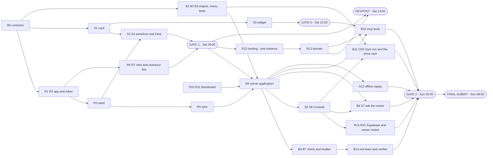

# The Bazaar — The Plan (and the tracker)

**Hack the North 2026 · team of 3 · code window Sat 19 Sep 00:00 → Sun 20 Sep 08:00 EDT (32 h)**

## STATUS BOARD

**Last updated:** Sat 19 Sep 22:45 EDT. **The repo was reorganised at 22:45** (branch `cleanup/one-engine-apps-central`): there is one engine, the dead modules are deleted (the first engine's `formulas` / `buildMenu` / `audit`, the three-function server core and its hooks, the first Gym run, the mockups and the old build plans), and the Shopify theme moved to `apps/storefront/`. 262 tests in 36 files pass and `pnpm typecheck` is clean. Backboard defaults to OpenAI `gpt-5.6-terra`. Hosted deployment acceptance remains open.

| Gate | Time (EDT) | Done when | Status |
|---|---|---|---|
| **Gate 1** | Sat 09:00 | Storefront: offer → fixed counter card → **Deal** → real code → **real Shopify Checkout at that price** | ☐ **code path LIVE** — R2/R4/R5/R6 ticked, `BAZAAR-2180U` minted on Railway 11:50. Open only on one browser click-through + the three store settings under R7 |
| **Gate 0** | Sat 12:00 | A hello-world tool of ours shows a custom card in ChatGPT — or a clear "no", decided and closed | ☐ **Overdue and undecided. The ChatGPT surface is not built on `main`:** no `/mcp` route, no widget, S3 not started. Write **card / text-only / what's-next sentence** here and close it; the honest default is the what's-next sentence |
| **Devpost** | Sat 14:00 **hard** | Submitted: team, badge IDs, public repo, **Shopify + Backboard + OpenAI + GoDaddy Registry** selected | ☐ **STATUS UNKNOWN at 18:00 — deadline passed 4 h ago.** Nothing in the repo or this board records a submission. **Whoever knows: write "submitted HH:MM, tracks: …" here now.** If it was not submitted, that outranks every task below |
| **Gate 2** | Sun 00:00 | Full demo 3× untouched on both surfaces, on the hosted URL; backup video; 30-min attack session | ☐ 1 h 15 away · 1 of 7 checklist items (red-team) · the rest need the hosted URL — see the progress block |
| **Final submit** | Sun 08:00 | Final Devpost edit; code freeze; **deploy freeze** | ☐ |

**Now / Next / Blocked** — overwrite these lines as you go. This block is the handoff.

| Part | Owner | Now | Next | Blocked by |
|---|---|---|---|---|
| 🛍️ A. Storefront + Shopify store | Ritvik | Trailhead logo/name wired into the live theme; chat haggling now asks for stronger buyer reasons before sharper discounts; live Railway minted `BAZAAR-2180U` | **① S13 DEVPOST — 14:00 HARD, still unstarted. Select all four tracks even if unbuilt; selection locks and cannot be added later ② S3 gate-0 decision, 100 min overdue ③** browser click-through of the checkout total | Shopify admin store rename for Checkout branding; remove-bundle-item check |
| ⚙️ B. Engine, Gym + Console | Bryan | **Repo reorganised Sat 22:45** on branch `cleanup/one-engine-apps-central`: one engine behind `@bazaar/engine`, dead modules deleted, theme at `apps/storefront/`; 262 tests and typecheck green. Console redesign CR0–CR3 and CR7 are built: real-deal KPIs, the price race with Floor / Max off / Rounds / Lowball pills, Adopt, the live rail. S8 / S10 were cut to pay for it. **Sun 00:50:** the negotiation UX plan ([`negotiation-ux-plan.md`](negotiation-ux-plan.md), tasks 4–8: Juniper, look A, shopper-language card, chips, Make an offer button, accessibility) is built — theme live, engine + server half uncommitted in the working tree, 301 tests green | **Commit and push the negotiation UX server half (redeploys Railway — before the 08:00 freeze), then edit the eight product descriptions in Shopify admin.** CR4 tone → CR5 firm price. Then: apply `infra/migrations/20260920_policy_settings.sql` (until then owner settings are lost on restart), publish the theme, verify Railway | Supabase keys missing from this machine's root `.env` (Console cannot sign in; Shopify mirror verified live, 9 products) · Shopify / Railway / Supabase dashboard access |
| 🔌 C. Platform | Ricardo | R2 token wrapper, R4 product mirror, `/api/products`, `/api/stream`, offer cards, `discountCodeBasicCreate` and cart permalinks are **live on Railway deploy `6f1032c6`** | Manual checkout-total / free-shipping / tax verification; then R16 remove-bundle-item test; then R12 pin + R13 domain before 13:00 | Store checkout settings / manual checkout verification |
| 🤖 D. Agents + guardrails | **Ricardo / Codex** (guardrails B14 · B8 · B7 · B9 · B13 are built) | Shopper Q&A and checked offer wording route through Backboard to OpenAI `gpt-5.6-terra`. Each identified shopper gets an isolated cloned Assistant with indexed documents and writable memory. The complete server-priced menu reaches Backboard, and explicit bundles cannot be silently reduced to one item. | Finish the proactive demo-shopper greeting for R10, then hosted R11 verification with latency re-measured on `gpt-5.6-terra` | Ricardo / Codex for R10/R11 |

### Progress — Sat 19 Sep 22:45 EDT (checked against the code on `cleanup/one-engine-apps-central`, not taken from ticks)

**Overall: 30 of 51 open-or-done tasks ticked** (stretch and cut tasks not counted). 1 h 15 to gate 2 · 9 h to final submit. Almost everything still open needs a human at a dashboard or a browser, not code.

| Part | Owner | Ticked | Done | Open |
|---|---|---|---|---|
| 🤝 0. Everyone | all | **1 / 4** | B0 | E1 (entries exist — only "one chosen for the demo sentence" is missing) · E2 · E3 |
| 🛍️ A. Storefront | Ritvik | **2 / 13** | R3 · R4 | S1 · S2 · S4 are live in the Shopify theme but unticked — each is one verification away (see their notes) · S13 · R16 · R8 · S11 · S12 · S14 · **S3 · B10: the ChatGPT surface is not built on `main`** |
| ⚙️ B. Engine, Gym + Console | Bryan | **16 / 18** | B1 · B2 · B3 · B4 · B5 · B6 · B11 · B12 · S5 · S6 · S7 · CR0 · CR1 · CR2 · CR3 · CR7 | CR4 tone · CR5 firm price (S8 · S10 cut) |
| 🔌 C. Platform | Ricardo | **6 / 9** | R1 · R2 · R5 · R6 · R14 · R15 | R7 (3 store settings + one click-through — **this alone holds gate 1 open**) · R12 (built; hosted check outstanding) · R13 domain |
| 🤖 D. Agents + guardrails | Ricardo / Codex | **5 / 7** | B14 · B8 · B7 · B9 · B13 | R10 (built; the proactive greeting and a hosted check outstanding) · R11 (built; latency not re-measured on `gpt-5.6-terra`) · R9 cut |

**What is verifiably built:**

- **One engine.** `priceOffer` prices every option and `buildNegotiationMenu` writes the menu (`packages/engine/src/negotiate.ts`, `negotiation-menu.ts`), reached only through `@bazaar/engine`. `apps/server/src/application.js` imports its pricing from `@bazaar/engine` and nowhere else, and the Gym (`runLiveGym`) prices with the same functions. **8 fast-check properties × 1,000 seeded runs** guard the live menu (`packages/engine/src/properties.test.ts`, `pnpm test:props`), plus two more on `priceOffer`.
- **The guardrails.** PAUSE, approvals (ask the owner: once per negotiation, above cost, 45 s, decline and timeout restate the final offer), the settlement audit on fresh Shopify costs before any mint, the wording check, the owner feed, and every owner route behind the Supabase bearer token — `apps/server/src/owner/runtime.ts`, `apps/server/src/check.ts`, `apps/server/src/application.js`.
- **The Console** (`apps/web/src/console/`): the kept band (KPIs from real settled deals, `owner/kpis.ts`), the price race (`Race.tsx` over `raceLayout` and `runLiveGym`) with one pill and slider each for Floor / Max off / Rounds / Lowball and Adopt, the live rail (feed; an approval card goes first only while one is pending), and More settings (policy panel, red-team result). Owner settings reach the engine through `POST /api/policy`.
- **Red-team result:** `infra/redteam-result.json` — 20 attacks, 20 passed, 0 breaches, recounted by the separate verifier (`scripts/redteam.ts`, `apps/server/src/owner/redteam.ts`). It runs over isolated HTTP with a dry-run minter; it does not prove live Shopify code reuse or bundle-removal enforcement (R16).
- **LLM:** every LLM call — understand, choose + say, questions — goes through Backboard (`packages/llm/src/backboard.ts`) to OpenAI `gpt-5.6-terra`, one isolated cloned Assistant per identified shopper, `BACKBOARD_TIMEOUT_MS` default 6,500 ms, fallback to option A plus a template line. There is no direct OpenAI call. Voice (ElevenLabs speech in and out) is built.
- **Deploy config:** `railway.json` builds the Console (`pnpm build`), starts with `pnpm start`, health check `/health`. **That is only half the deploy:** the shopkeeper agent is not deployed from this repo — the base assistant, its indexed store documents and every shopper's memory live on Backboard and are provisioned in Backboard's dashboard. A deploy ships the client, a key and an assistant id; it creates no assistant and uploads no document. See [`ARCHITECTURE.md`](ARCHITECTURE.md) §9.1 and [`SPEC.md`](SPEC.md) §8.

**Verified by hand, locally, against the real Shopify store, Backboard and Supabase (Sat 19 Sep; no paid order placed):**

- The Console loaded all nine real Shopify products and the saved policy; no owner cost field appeared in any public product or card payload.
- Moving the floor slider without Adopt left the live floor unchanged; after Adopt the very next shopper turn in the same Backboard thread used the new floor, and the Console showed the matching option and the real LLM trace. Offer runs took about 0.9–2.3 s.
- Ask the owner: a $90 offer produced an owner decision card (size 10, quantity 1, $78 cost, $12 profit). **Approve** updated the shopper's card without another message; **Decline** turned it into the $133 final offer with "My best stays $133", Deal enabled, countdown reset to 15 minutes.
- **Deal** opened real Shopify Checkout: Trail Runner 2, size 10, $149 list, $59 discount, $90 CAD subtotal. The Supabase deal row matched and had `owner_approved = true`. Shipping- and address-dependent totals were not tested.
- **PAUSE** disabled the existing Deal button and made the next message return the paused line, with a blocked row in the Console; Resume left the old card unavailable.
- Changing the size selector from 10 to 11 and saying "same shoes" produced a size-11 card and a fresh negotiation.
- The price race draws 300 synthetic, rule-based shoppers priced by the live engine; it makes no LLM call. On Trail Runner 2 (seed 42) **haggling stays behind the 20% banner across the whole floor sweep. Do not promise a red-to-teal flip, and do not change the population to make one appear.**

**Not verified:** anything on the hosted URL (Railway was serving an older server and returned 404 for `/console`), the published theme, tax and shipping totals, removing a bundle item at checkout (R16), the draft-order backup (R8), a completed paid order. Local evidence is not proof of the published storefront.

### Human steps outstanding

- [ ] **Apply `infra/migrations/20260920_policy_settings.sql` to the live Supabase database.** The live database has no `policies.settings` column. Until it does, owner settings (discount cap, max rounds, lowball cutoff, tone, firm-price products) live in server memory only and **are lost on every restart**; the server logs this at boot. The floor and PAUSE are unaffected.
- [ ] Apply `infra/migrations/20260919_allow_null_deal_code.sql` — a full-price checkout has no discount code, and its deal row cannot be written until the column allows null.
- [ ] Deploy the server and Console to Railway with the server secrets and the `VITE_*` build variables; confirm `/console` loads on the hosted URL.
- [ ] Publish the updated theme (`apps/storefront/`, chiefly `assets/chat-demo.js`). The published homepage shows eight of the nine products (Trail Runner 3 is missing); the fix is in the repo and unpublished.
- [ ] Store settings for R7: rename "My Store" → "Trailhead Co.", tax off, a free shipping rate. Then one browser click-through of Deal → Checkout.
- [ ] After the deploy, re-run two bugs reproduced on the published storefront (fixed and verified locally, never re-tested hosted): Merino Socks size L/XL × 2 settled as S/M, and a generic Trail Runner 2 request at $120 came back as a Race Vest × 2.
- [ ] Read the current live policy from the Console before the demo; do not assume floor 25%.
- [ ] Devpost: record "submitted HH:MM, tracks: …" on the status board.
- [ ] Decide gate 0 and write the outcome on the status board.

### Known limits

- Offers, approvals, the feed and the settlement retry queue are in memory and are lost on a restart, by design. Deal writes retry after a transient failure without issuing a second code. One instance only.
- A policy change after a mint triggers revocation of the code; if Shopify's revocation call fails, an orphan code can remain, and it is logged.

### How to use this tracker

There are no tickets. **This file is the tracker.**

- **Tick the box in the same commit as the work.** `- [ ]` → `- [x]`.
- **When you start a task, put your initials after the id:** `**B3 (RM)**`.
- **If a task is cut, strike it through and say why:** `- [ ] ~~**S11** Deal trail~~ — cut Sat 18:00, behind on Console`. **Never delete lines.**
- **Before you sleep, update Now / Next / Blocked** and the "Last updated" line. That block is the handoff.
- When a gate passes, change its ☐ to ☑ on the status board.
- Ids are stable and **don't renumber**. The letters (B / R / S / E) are left over from the old lane split and no longer say who owns a task — **the section it sits in does** (§4).

*What and why:* [`PRODUCT.md`](PRODUCT.md) · *How it behaves:* [`SPEC.md`](SPEC.md) · *Diagrams:* [`ARCHITECTURE.md`](ARCHITECTURE.md) · *The demo:* [`DEMO.md`](DEMO.md). If this file disagrees with SPEC.md about behaviour, SPEC.md wins; about **who, when or in what order**, this file wins.

---

## 1. Goals — what winning each prize takes

| Track | What the judges look for | Our win condition | Must be visible in the demo |
|---|---|---|---|
| **Shopify — "Hack Shopping with AI"** (primary, one winner) | Technical Excellence ("sophisticated, *appropriate* use of AI"), Impact Potential, Innovation Factor; "take inspo from SimGym" | The LLM does language and judgement, code does money. Real Admin API costs in → real discount code → **real Shopify Checkout** at the haggled price. A Gym that borrows SimGym's *method*: personas, seed, A vs B, a counterfactual metric, a synthetic label. | The real checkout · the owner's Approve card · the price race in the Console re-running as the owner drags a pill |
| **Backboard** | Ambition; how much of the stack is used | Assistants + threads, documents/RAG, memory with citations, model routing (an OpenAI model through Backboard), `cost_usd`; stretch: tool calling, voice, Gym voices | Feed row: recalled memory + citation, the document behind "gaiters for mud", model, ms, cost |
| **OpenAI** | "What you built with the OpenAI API" + "how Codex helped"; **one concrete Codex example in the demo** | The *understand* and *choose + say* steps run on an OpenAI model (`gpt-5.6-terra`) routed through Backboard — there is no direct OpenAI API call (R9 cut) · the haggle as an app inside ChatGPT (**planned — not built on `main`**) · [`codex-log.md`](codex-log.md) from hour 0 | The structured reading of a messy sentence · one log entry read aloud · the card inside ChatGPT only if gate 0 passes |
| **HTN finalist** | A demo judges can touch | "Try to make it lose money" → they can't → real checkout | Hand over the keyboard early |
| **GoDaddy Registry (MLH)** | A registered domain in use | Domain registered through the MLH offer, pointing at the hosted app, storefront at the root | The URL bar |

**Track selection locks at Devpost, Sat 14:00.** Prizes added later "will not be counted".

---

## 2. Team — four parts, three people

| Part | Owner | Owns |
|---|---|---|
| 🛍️ **A. Storefront + Shopify store** | **Ritvik** | The offer card, storefront + chat, Deal flow, deal trail, faces, sparkles; product seed + sync; the ChatGPT widget (gate 0) and `/mcp` (**planned — not built on `main`**); demo script, offline replay, Devpost page, video |
| ⚙️ **B. Engine, Gym + Owner Console** | **Bryan** | `contracts`, the engine + property tests, offers, the check; the Gym run and the price race; Console UI (`/console`): kept band, price race, feed, policy panel, Approve card |
| 🔌 **C. Platform** | **Ricardo** | Shopify app, token + refresh, server shell, `db.ts`, SSE, mint, checkout link, store settings, Supabase + auth middleware, owner routes, hosting, the domain |
| 🤖 **D. Agents + guardrails** | ______________ | Backboard client (*understand*, memory, documents, *choose + say*), the Auditor, PAUSE, approvals, event bus, red-team + verifier |

The storefront is the Shopify theme (`apps/storefront/`; its chat and offer card are `assets/chat-demo.js`, which renders server cards only). The Console is `apps/web`, built and served by the server at `/console`. **Gate 1 is a two-person chain:** Ritvik's Deal button (S4) on top of Platform's mint + checkout link (R6, R7).

**Rule zero — shared contracts first.** The first 30 minutes, all three together, write `packages/contracts` (SPEC Appendix C) and merge it. After that every part codes against those types and nobody changes them without saying so out loud. The split that matters most: `ChatEvent` carries public data only; `ConsoleEvent` may carry everything (SPEC rule 11).

---

## 3. Stack and repo layout

**Stack:** Node 22 · pnpm workspaces · TypeScript · a plain `node:http` server run with `node --experimental-strip-types` (no web framework) · Supabase (Postgres + Auth, `@supabase/supabase-js`) · Vite + React · Tailwind 4 · SVG for the price race (no chart library) · Backboard over REST (`packages/llm/src/backboard.ts`), routing to OpenAI `gpt-5.6-terra` · ElevenLabs for voice · a Shopify theme for the storefront · vitest + fast-check · **hosting: one long-lived Node instance on Railway** (`railway.json` — never serverless, never autoscaled) · a GoDaddy Registry domain · ngrok or Cloudflare Tunnel for the laptop fallback only. The ChatGPT surface (`/mcp`, a widget) is planned and has no code on `main`.

```
bazaar/
├── README.md · AGENTS.md · CLAUDE.md · railway.json
├── apps/
│   ├── server/      the Node server: src/index.js (env + listen) · src/application.js (routes, the negotiation turn,
│   │                accept + mint, Shopify mirror, voice) · src/check.ts · src/catalog.ts · src/public-config.ts
│   │                src/owner/ (runtime.ts = policy, PAUSE, approvals, feed · kpis.ts · redteam.ts) · src/infra/db.ts (Supabase)
│   ├── web/         the owner Console (React + Vite + Tailwind 4): src/console/ — Console, Race, KeptBand, Feed,
│   │                Approvals, PolicyPanel, RedTeamSummary, data/ (port.ts seam: httpPort + fixturePort)
│   └── storefront/  the Shopify theme; assets/chat-demo.js is the shopper chat + offer card
├── packages/        contracts (shared types) · engine (pure pricing) · gym (pure simulation) · llm (Backboard client)
├── infra/           schema.sql · migrations/ · seed/ · redteam-result.json
├── scripts/         redteam.ts · storefront-preview.mjs
├── tests/           purity.test.ts (invariant 4)
└── docs/            PRODUCT · USE-CASES · SPEC · ARCHITECTURE · PLAN · DEMO · HOW-IT-WORKS · codex-log · design/brand
```

Apps and the Gym import `@bazaar/engine` and `@bazaar/gym` by package name; nothing reaches into a package's files.

**Dev loop:** `pnpm install` · `pnpm test` · `pnpm test:props` · `pnpm typecheck` · `pnpm build` · `pnpm start` (serves the Console at `/console`) · Console dev: `pnpm --dir apps/web dev` (`VITE_CONSOLE_PORT=http` for the real server) · storefront preview: `node scripts/storefront-preview.mjs` · red team: `node --experimental-strip-types scripts/redteam.ts`. Run the server locally against the same Shopify dev store and Supabase project; push to `main` deploys to the host. Secrets live in the host's settings and in a git-ignored `.env` — never in the repo, never in a browser bundle (the web build gets only `SUPABASE_URL` and the anon key). **Deploys freeze at Sun 08:00** — a deploy is a restart and a restart drops in-flight haggles.

---

## 4. The tracker — work breakdown, by part

Four parts plus a shared strip. **Each part is one person's to-do list, top to bottom** — work down your own section; the **Handoffs** line under it says what you wait on and who waits on you. Estimates are focused hours. **Done when** is the acceptance check — if you can't show it, it isn't done. SPEC section in square brackets.

### 🤝 0. Everyone — do first, together

The contracts are the seam between all four parts. Nothing else starts until B0 is merged.

- [x] **B0** `packages/contracts` — all shared types [App. C] · _needs nothing · all three together_ · ~0.5 h · **Done when:** merged; all four parts import from it; a `ChatEvent` cannot hold an `Option` (type error)

  _Sat 18:00 coordinator note:_ ticked late — merged Sat 03:14 (`b65b59b`). `apps/server`, `apps/web`, `packages/engine`, `packages/gym` and `packages/llm` all import it, and `public.typetest.ts` makes an `Option` inside a `ChatEvent` a compile error.
- [ ] **E1** [`codex-log.md`](codex-log.md) from hour 0 · _needs nothing_ · ongoing · **Done when:** ≥ 3 concrete entries exist and one is chosen for the demo sentence

  _Sat 18:00 coordinator note:_ 10 entries exist, so the first half is met. Still open: the "Chosen for the demo sentence" line at the top of `codex-log.md` is blank. Candidate: the B3 entry — Codex refused to weaken a property, surfaced four contradictions in SPEC §6.2 and two engine bugs, and the owner ruled.

**Before gate 2 / Saturday night**

- [ ] **E2** 30-minute attack session on our own build · _needs gate 2_ · ~0.5 h · **Done when:** every breach found is fixed or has a failing test
- [ ] **E3** Latency and numbers pass: replace every illustrative figure in DEMO.md · _needs B11, R11_ · ~0.5 h · **Done when:** no "illustrative" marker remains on a number we say out loud

### 🛍️ A. Storefront + Shopify store — **Ritvik**

Everything a shopper sees, plus the store's products behind it: the offer card, storefront and chat, the Deal button, the product seed and sync, and the same card inside ChatGPT.

**Before gate 1 (now → Sat 09:00)** — for gate 1, build only the **counter** state of S1; finish the other six states after 09:00. Until R4 lands, the storefront reads products from `infra/seed/products.json` plus the variant ids R3 wrote back.

- [ ] **S1** The offer card — a pure component from `OfferCard`; all seven states; countdown; honesty footer [§4.1] · _needs B0_ · ~3 h · **Done when:** one page shows every state side by side and it reads in light and dark

  _Sat 11:34 Codex note:_ the Shopify theme chat now renders a server-generated offer card with round label, live countdown, badges, trail, honesty footer, and Deal action. This completes the storefront/live-card path needed for Gate 1, but S1 remains open as written because the pure shared component and seven-state side-by-side review page are not built yet.
- [x] **R3** Seed ~8 products with **cost per item**, size variants, `bazaar.stocked_at` metafield [§10, App. A] · _needs R2_ · ~1.5 h · **Done when:** products show in admin with costs; TR3 stocked 12 d ago, TR2 94 d ago

  _Sat 10:26 Codex note:_ CSV import verified through Admin GraphQL: 8 `bazaar-seed` products are active, 17 variants have unit cost, inventory tracking is on, and `bazaar.stocked_at` is present for the five planned dated products. Add-ons intentionally leave stocked-at blank.
- [ ] **S2** Storefront: grid, product page, sticker, chat panel, `localStorage` shopper id, `?shopper=demo`, typing effect from checked text [§4.2] · _needs S1, R5_ · ~3 h · **Done when:** opening the TR3 page greets by product and a card appears in the chat

  _Sat 09:52 Codex note:_ the theme (now `apps/storefront/`) has a storefront product grid and a bottom-right shopkeeper chat that reads public Online Store product titles/prices from Liquid. Product pages pass the current product into the chat, `localStorage` stores a shopper id, and `?shopper=demo` triggers the seeded greeting.

  _Sat 10:30 Codex note:_ the chat launcher now uses a dedicated Bazaar chat/spark icon and exposes a theme setting for a backend chat endpoint. The browser posts message, shopper id, page URL, current product, and public product cards to the server and displays the server's reply. No key lives in Shopify theme code.

  _Sat 11:03 Codex note:_ the live theme is now `Bazaar coded storefront` (`#161251000517`) at `https://b8wzw0-h3.myshopify.com/`, and its chat widget is pointed at `https://bazaar-chat-production.up.railway.app/api/chat`.

  _Sat 11:34 Codex note:_ locally, the storefront chat endpoint returns `{ reply, card }` for a shopper offer and the widget renders that card. Liquid product context now includes handle, list price, and selected variant id so the server can match Shopify Admin products. S2 can be checked after these changes are deployed and the live storefront smoke test passes.

  _Sat 11:45 Codex note:_ the updated theme was pushed to live theme `#161251000517`. The updated Railway server is deployed as `6f1032c6`, but live `/health` reports `shopifyConfigured: false`, so it is using seed fallback until Shopify env vars are added to Railway.

  _Sat 11:50 Codex note:_ after Railway env vars were added, live `/health` reports `shopifyConfigured: true`, `mirrorSource: shopify-admin`, 9 products, and no warnings. Live `/api/products?sync=1` returns real Shopify products and variants.

  _Sat 15:05 Codex note:_ the chat now adds a compact product card to every assistant turn when public products are available, removes the shopper-facing “could not reach the live endpoint” fallback wording, accepts either a base endpoint or full `/api/chat` endpoint, and links offer-card “View item” to the product named in the offer instead of blindly using the current page product.

  _Sat 16:45 Codex note:_ Trailhead wordmark asset added to the theme header, visible theme copy/metadata switched from My Store/Bazaar to Trailhead, and the chat now tells shoppers to include a reason. The live offer engine scores buyer reasons (bundle intent, repeat shopper, budget, market/last-season, race/trip/gift, ready-to-buy) and gives firmer counters when the shopper just asks for a lower price without a convincing reason.

  _Sat 17:00 Codex note:_ after reading the live chat transcript, fixed the “give me a bundle deal” path so the server asks for a concrete number instead of inventing an implicit $48 offer. Strong-reason first turns now start with an opening counter and “one more move” rather than jumping straight to the sharper bundle/final price.

  _Sat 17:10 Codex note:_ the live server haggling policy now behaves more like a profit-protecting store negotiator than a scripted concession ladder. Multiple rounds by themselves do not reach the floor; weak/no-reason asks can be held firm, stronger intent is scored cumulatively, and bundle-specific value is offered only when the buyer actually signals bundle intent.

  _Sat 17:20 Codex note:_ fixed product selection for offer messages such as “I want the socks for $15.” Explicit product words in the shopper message now beat the page/default product, so “socks” routes to Merino Socks instead of falling back to Everyday Heavyweight Tee.

  _Sat 17:35 Codex note:_ tested “I will buy 2 tees if you give it to me for 50$ cad a piece.” The old path treated it as non-binding chat because `50$ cad` was not parsed as money. The server now parses suffix-dollar prices, quantity phrases, and per-piece offers, so two tees at $50 each becomes a $100 total shopper offer with quantity 2 in the binding card/checkout path.

  _Sat 17:50 Codex note:_ upgraded the haggling understanding layer from phrase fixes to hybrid NLU. The LLM *understand* step (today `understandOffer`, through Backboard) extracts product hint, quantity, offered amount, per-unit vs total, and reason tags from messy shopper language; deterministic code remains the fallback and the only layer allowed to price binding cards. Shopper context now remembers the last negotiated product/quantity for follow-ups like “what about 105 then?”.

  _Sat 18:10 Codex note:_ swapped the theme header to the latest Trailhead WebP logo asset and fixed chat follow-up totals. After an outfit recommendation or catalog list, the server now remembers that exact product set for the shopper and answers “what’s the total?” / “total for all of them” by summing those items instead of dumping unrelated storefront prices.

  _Sat 18:35 Codex note:_ fixed the Merino Socks transcript drift where vague follow-ups such as “I am buying two so give me a deal” and “can you do $52?” could fall back to the catalog's first product, Everyday Heavyweight Tee. The widget now sends only the actual product page item or the last product/deal shown in the chat, and the server treats home-page/default product payloads as non-authoritative when recent shopper context exists. Negotiation memory now carries product, quantity, and prior reason forward so “3 socks” stays “3 socks” on the next price-only turn.
- [ ] **S4** Deal flow on the storefront: accept → checkout opens; sparkles [§4.1] · _needs S1, R6, R7_ · ~1 h · **Done when:** **gate 1 passes**

  _Sat 11:34 Codex note:_ locally, clicking the Deal path through `/api/accept` minted a real Shopify code (`BAZAAR-K3N63`) and returned `https://b8wzw0-h3.myshopify.com/cart/46970815578309:1,46970815905989:1?discount=BAZAAR-K3N63`. S4 is unblocked in code; check it after Railway + theme deploy.

  _Sat 11:50 Codex note:_ live Railway smoke test created offer `offer_mu8k8auy_j3nzng` for Trail Runner 3 + Merino Socks at $181, minted code `BAZAAR-2180U`, and returned `https://b8wzw0-h3.myshopify.com/cart/46970815578309:1,46970815905989:1?discount=BAZAAR-2180U`. S4 still needs one browser click-through from the live theme, but the live server settlement path works.

**Gate 1 → Devpost (Sat 09:00 → 14:00)**

- [x] **R4** Sync every 60 s → in-memory mirror; flag missing cost [§10] · _needs R3_ · ~1.5 h · **Done when:** the mirror has price, unitCost, inventory, type, image, stockedAt — and we know whether `read_inventory` alone reads `unitCost`

  _Sat 11:34 Codex note:_ `/api/products?sync=1` returned 9 active Shopify products from Admin GraphQL with prices, images, product type, inventory, `bazaar.stocked_at`/seed fallback, and unit costs. No missing-cost warnings. The server caches for 60 s and exposes public product cards only.
- [ ] **S3** *(planned — not built on `main`)* **Gate 0:** widget → single HTML file; a hello-world tool of ours renders a custom card in ChatGPT [§4.1] · _needs S1 · **time-box 90 min**_ · **Done when:** the card is visible in ChatGPT developer mode — or a clear "no" is written on the status board and the discussion is closed
- [ ] **S13** Devpost page, screenshots, ≤ 2-min video [DEMO §10] · _needs gate 1_ · ~2 h · **Done when:** submitted by Sat 14:00 with all four sponsor tracks selected

**Devpost → gate 2 (Sat 14:00 → Sun 00:00)**

- [ ] **B10** *(planned — not built on `main`: no `/mcp` route exists)* `/mcp` — three tools wired to the server application, empty `content`, annotations, subject → shopper id [§4.3] · _needs B5, S3 passed, R13_ · ~2 h · **Done when:** from ChatGPT: find → offer → card → Deal → checkout, the feed row is tagged `chatgpt`, and ask-the-owner never fires
- [ ] **S12** Offline replay: `DEMO_OFFLINE=1`, recorded event stream, pre-minted link [DEMO §7] · _needs B14_ · ~1.5 h · **Done when:** with Wi-Fi off the whole demo still runs
- [ ] **R16** Verify the minimum-subtotal code on a real bundle [§10] · _needs R6, B2_ · ~0.5 h · **Done when:** removing one bundle item at checkout drops the code, and the amount spreads across the cart rather than per item
- [ ] **R8** Draft-order backup settlement [§10] · _needs R2_ · ~1 h · **Done when:** an invoice URL opens at the agreed price in the demo browser (behind the store password)
- [ ] **S11** Deal trail, five faces, cream-paper styling [§12] · _needs S1_ · ~2 h · **Done when:** the trail forks when another product is recommended and never shows the floor

**After gate 2 (Sun 00:00 → 08:00) — stretch is optional, see §8**

- [ ] **S14** Demo script with real numbers; rehearse 5× [DEMO] · _needs gate 2_ · ~1.5 h · **Done when:** three clean runs in a row
- [ ] **R18** *(stretch 3)* The same `/mcp` as a custom connector in Claude · _needs B10_ · ~1 h · **Done when:** an offer made in Claude shows up in the Console feed

**Handoffs:** needs **R2** (token wrapper) from Platform before R3 · needs **R5, R6, R7** from Platform before S2 / S4 · needs **R6** and Bryan's **B2** before R16 · gives **R4** (the product mirror) to the server application and the Auditor B7.

### ⚙️ B. Engine, Gym + Owner Console — **Bryan**

The maths that writes every price, the Gym that replays it 300 times, and the owner's Console page (`/console`) where the price race and the live feed sit.

**Before gate 1 (now → Sat 09:00)** — not on the gate-1 path; build in parallel.

- [x] **B1 (BM)** Engine formulas: cost, floor, urgency, target, ask [§6] · _needs B0_ · ~1.5 h · **Done when:** `target = list − urgency × (list − floor)`, `ask(4) = target`, and unit tests reproduce the worked example in ARCHITECTURE §6 (TR3 target = $169; TR2 asks $149 → $135 → $127 → $120); maths in cents, shopper-facing totals rounded **up** to whole dollars; no `stocked_at` ⇒ urgency 0
- [x] **B2 (BM)** Menu builder — held, bundles (add-on at cost + ½ margin; shoe at `ask(r+1)` if profit holds), something else (`x < target(p)` or `r ≥ 3`; priced `max(target, min(ask, budget))`), ranking, final label [§6] · _needs B1_ · ~3 h · **Done when:** "$120 on the TR3, round 1" returns a TR2 option at $120 and a TR2 + gaiters option, and every option ≥ `floor(cart)`
- [x] **B3 (BM)** Property tests (fast-check) [§6.2] · _needs B2_ · ~1.5 h · **Done when:** every property in SPEC §6.2 passes on 1,000 runs and the suite runs live for a judge in under 10 s
- [x] **B4 (BM)** Offers: ids, 15-min expiry, supersede, single use [rule 7] · _needs B0_ · ~1 h · **Done when:** accept rejects unknown / expired / used / superseded ids (four tests)

**B1–B6 · B11 — what the ticks stand for now (Sat 19 Sep 22:45):** these tasks were first built and verified as a separate engine (`formulas`, `buildMenu`, `audit`), a three-function server core and a first Gym run. On Sat evening that code was replaced by the one engine the live server prices from, and the old modules were deleted. The ticks stand on the current code: `priceOffer` + `buildNegotiationMenu` behind `@bazaar/engine`, 8 properties × 1,000 seeded runs on the live menu (`pnpm test:props`), offer expiry / supersede / single use and the check in `apps/server/src/application.js` and `check.ts`, and the Gym as `runLiveGym` + `raceLayout` in `packages/gym`. 262 tests in 36 files and `pnpm typecheck` are green.

**Gate 1 → Devpost (Sat 09:00 → 14:00)**

- [x] **B5 (BM)** The server application prices only through `@bazaar/engine` [§5] · _needs B2, B4, R5_ · ~3 h · **Done when:** `apps/server/src/application.js` takes every price from `buildNegotiationMenu` / `priceOffer` / `auditOffer` and holds no pricing of its own, and a full turn works end to end with the LLM stubbed
- [x] **B6 (BM)** The check [§5.1 step 5] · _needs B5_ · ~1.5 h · **Done when:** an invented option id, an invented `$`, a reason with no fact, and a cost/floor word each produce option A + template + a `blocked: check` row

**Devpost → gate 2 (Sat 14:00 → Sun 00:00)** — ordered keep-first; S8 and S10 are cut (§7).

- [x] **S5 (BM)** Console shell: login, top bar + PAUSE, live feed with red blocked rows, SSE over `fetch` [§4.4] · _needs R5 (R15 for real data)_ · ~2.5 h · **Done when:** a haggle on the left produces feed rows on the right in < 1 s

**S5 verified — Sat 19 Sep (Codex):** fixture-era acceptance passed. Feed rendered within 100 ms under fake clock, four red layers, PAUSE/Resume, login, empty/full states, reconnect/state reload and malformed-frame regressions; standards/spec review complete. The live acceptance was met later: a real shopper turn reaches the authenticated Console stream (`application.test.ts`).

- [x] **S6 (BM)** Console policy panel: floor slider, ask-me switch, missing-cost list, **Adopt** [§4.4] · _needs S5_ · ~1.5 h · **Done when:** Adopt changes the floor used by the very next shopper turn

**S6 verified — Sat 19 Sep (Codex):** fixture-era acceptance passed: preview leaves saved policy unchanged; Adopt calls setPolicy once. Strict red/green tests cover fixture approval decisions/45-second timeout and reconnect races. Standards/spec and Impeccable visual reviews complete, desktop/mobile inspected. The next-shopper-turn acceptance was met later, locally against the real store: after Adopt the very next turn used the new floor.

- [x] **B11 (BM)** Gym run: personas, seeded, per-shopper records, A vs B, deals missed, would-ask-owner, profit vs banner [§9.1] · _needs B2_ · ~2.5 h · **Done when:** 300 shoppers run in < 50 ms in the browser, the same seed gives an identical `GymResult`, and `profitVsBanner` goes negative at some floor
- [x] **B12** The Gym picture + metric figures [§9.2] · _needs B11, S6_ · ~2 h · **Done when:** closed by CR2 — one dot per shopper in the price race, coloured by outcome, with the reference lines and the two figures
- [x] **S7** Approve / Decline card with profit $ and %, 45 s bar [§4.4] · _needs S5, B8_ · ~1 h · **Done when:** both buttons and the timeout each resolve the shopper's pending card

  _Sat 22:45:_ `apps/web/src/console/Approvals.tsx` (profit $, % over cost, 45 s bar); Approve and Decline seen resolving the shopper's card locally against the real store; the timeout is covered by `apps/server/src/owner/runtime.test.ts` and `Approvals.test.tsx`.
- [ ] ~~**S8** Swarm round animation R1 → R4 (~3 s): ask line stepping down, settle-and-drop, walked pile / deals missed, yellow thin-margin dots, scrubber + Replay; **no animation while dragging** [§9.2] · _needs B12_ · ~3 h · **Done when:** pressing Run settles into exactly the static histogram from B12~~ — cut Sat 19:45, pays for the Console redesign (CR1–CR7); cut #3 in §7
- [ ] ~~**S10** Red-dot wall animation + "20 attacks · 0 breaches" card [§9.2] · _needs B13_ · ~1.5 h · **Done when:** each dot bounces off the labelled layer that blocked it and the card matches the JSON~~ — cut Sat 19:45, same reason; the red-team result becomes a badge in the Guardrails group (CR3)

**Console redesign (Sat 20:00 → Sun 00:30, hard cap 4 h, grilled Sat 19 Sep — SPEC §4.4, §4.4.1, §4.4.2).** Ordered keep-first: the Console is demoable after CR2. A setting's pill ships with the engine work that makes it real: **Max off** with the discount cap (CR2b, inside CR3's slot), **Rounds** and **Lowball** with CR3. Every contract change is additive and optional (`PolicySettings`, `DealKpis`, `CatalogStatus`) — **tell Ritvik and Ricardo before merging CR1.**

- [x] **CR0** Static HTML prototype of the §4.4 layout on the `DESIGN.md` tokens · ~0.75 h · **Done when:** Bryan approves the layout at 1360 px and 390 px

**CR0 verdict — Sat 19 Sep 21:00 (Bryan):** three layouts compared (workbench · story first · live desk). All three read as busy: every control visible at once. Chosen structure: a settings list on the left and **one setting in focus** in the centre with its Forecast, keeping variant B's store lanes and variant C's receipt. Static mockups stop here — they cannot feel right without a real simulation — so CR2 is built straight into `/console` on the real Gym and real data (SPEC §4.4).
- [x] **CR1** Real-deal KPIs: `listDeals` in `db.ts`, `kpis` / `kpisByProduct` / `catalog` on `/api/console/state`, KPI strip + source line [§4.4.2] · _needs R15_ · ~0.75 h · **Done when:** three seeded deal rows (two below list) give `customersSaved = 2` with matching revenue, profit and `vsBanner`; a `settled` event moves the tiles without a reload; zero deals shows dashes; none of it appears in any shopper endpoint
- [x] **CR2** Simplified page + the real price race [§4.4]: `raceLayout(result, round)` pure in `packages/gym` (dot per shopper at willingness, drops to the price paid in the round they bought, walked stay hollow, asking line per round); Console page = kept band · race with two figures and the vs-no-shopkeeper line · control strip (Floor pill first) · needs-you + three-row feed · More settings · _needs CR1, B11_ · ~1.75 h · **Done when:** every dot's resting price equals that shopper's `agreed` from the real `runLiveGym` result and every walked shopper stays in the willingness band; dragging Floor changes the candidate figures and leaves the saved policy untouched; releasing the slider replays the rounds once and nothing animates mid-drag; Adopt makes saved = candidate; `prefers-reduced-motion` shows the settled race — **closes B12**
- [x] **CR3** Discount cap, lowball counter and owner-set max rounds in the engine, the server and the Gym — each adds its pill to the race strip [§4.4.1] · _needs CR2_ · ~0.75 h · **Done when:** an offer under the cutoff returns a public card with a reason fact, makes no LLM call, leaves `round` unchanged, and forty in a row return the same price; an offer under every option's total returns a *something else* card; max rounds 2 and 6 each end on `ask(N) = target`, and at 4 the B1 worked example is unchanged; the Forecast counts a lowballer as saved or walked by willingness
**CR1 · CR2 · CR3 · CR7 verified — Sat 19 Sep 23:00 (Claude, two parallel agents + integration):** 338 tests and typecheck green on `main` at the time (262 in 36 files after the Sat 22:45 cleanup deleted the dead modules and their tests). Real-deal KPIs read the Supabase `deals` table (one real deal: 1 customer saved, $90.00 recovered, −$29.20 vs banner). The Console page is the kept band, the price race drawn from a real `runLiveGym` run, and the live rail; pills **Floor · Max off · Rounds · Lowball** each change the simulation and are adopted through `POST /api/policy`. The engine honours `discountCapPct` and `maxRounds`; the server counters a lowball in code with no LLM call and no round used; settings persist in `policies.settings` with an in-memory fallback until `infra/migrations/20260920_policy_settings.sql` is applied — **it has not been applied to the live database, so settings are lost on restart** (see Human steps outstanding). Integration finding: Ricardo's understand step calls Backboard on every message, so an unmistakable plain total under the cutoff is now read by code first — anything relative, per-unit or bundled still goes to Backboard. Not done: CR4 tone presets, CR5 firm price. `scripts/redteam.ts` sets `lowballCutoffPct: 0` so its $1 attacks still reach the LLM layers.

- [x] **CR8** The engine writes each option's `facts`, so the shopkeeper can say the trade aloud [§1 rule 5] · ~1.5 h · **Done when:** a reason the engine offered survives the check and reaches the shopper, a reason it did not offer is cut back to the bare price, and a property proves no fact carries a figure that is not the shopper's own
  _Sun 00:55 Claude note:_ built test-first at two seams. `buildNegotiationMenu` candidates now carry `facts`: `"<add-on> included"`, the shopper's own reason handed back (only below list), and `"meets your $N budget"` (only when the total is at or under the offer). Grilled with Bryan first: **no stock-age fact ever**, no price-match fact, no "last season" (the engine has no such field). `application.js` `negotiationOptions` passes them through where it used to hardcode `facts: []`. The choose + say prompt already said "copied word for word from the selected facts", so no prompt change. New property #9 in `properties.test.ts`, mutation-checked. 308 tests, typecheck clean. Round 1 holds at list, so reasons first appear from round 2. Known wrinkle: the code-written lead (*"A tight budget. I've been there."*) can sit in front of *"… to fit your budget"* — an echo twice; harmless, worth a look in CR4.
- [ ] **CR9** Chat questions go to the LLM first, with the code reply as its timeout fallback; totals and quantity maths stay in code; delete "For this demo" from the shipping line · ~0.5 h · **Done when:** "how much is the tee?" on a product page answers about that product, not a six-product list, and no shopper-facing string contains the word "demo"
- [x] **CR10** The opening greeting comes from recalled memory, not from a string in the theme · **Done when:** the theme shows what `POST /api/greeting` recalled, shows its plain welcome when nothing was, and never rewrites the top of a conversation that has started
  _Sun 02:00 Claude note:_ `chat-demo.js` no longer contains "still a size 10?". `backboard.greet` asks the shopper's own clone in `Readonly` with no thread kept, the reply goes through `validateBackboardAnswer` with no products (so any dollar figure refuses it), and `NOTHING` means no greeting. The theme asks once per `?shopper=` visit, after the session reset. **It only shows a recalled line on the host once Railway's `BACKBOARD_MEMORY_MODE` is `Auto` and this branch is deployed** — and the first `demo` visit creates the demo clone, copying the seed from the base assistant.
- [ ] **CR11** Rehearsal on a fresh host: restart (clears shared threads, see §9), warm only the demo thread, run the script 3×, and re-test an offer naming "Trail Runner 3" on a clean shopper id · ~0.5 h
- [ ] **CR4** Tone presets end to end: phrase sets in the check, preset in both Backboard prompts, fallback templates per preset [§4.4.1] · _needs CR3_ · ~1 h · **Done when:** after Adopt the next storefront turn passes the check with a `playful` phrase, a `friendly` phrase fails it, and the template fallback speaks in the saved preset
- [ ] **CR5** Firm price per product [§4.4.1] · _needs CR2_ · ~0.5 h · **Done when:** an offer on a firm-price product returns a list-price card with no menu, Deal settles with a null code, and the product leaves the Forecast picker
- [x] **CR7** `settings jsonb` migration + in-memory fallback note · _needs CR2_ · ~0.25 h · **Done when:** with the column absent, Adopt succeeds, the Console shows the retry note, and a restart test proves settings reload when the column exists

**After gate 2 (Sun 00:00 → 08:00) — stretch is optional, see §8**

- [ ] **B15** *(stretch 2)* Quantity haggle · _needs gate 2_ · ~3 h · **Done when:** "ten for $50 each?" returns two quantity options, both above the bulk floor
- [ ] **B16** *(stretch 4)* Deal Meter from the Gym distribution · _needs B11_ · ~1 h · **Done when:** the card shows "better than N% of deals today" from the real run
- [ ] **S15** *(stretch 6)* Gym voices — ~20 LLM-driven shoppers as larger dots with speech bubbles · _needs S8, R11_ · ~2 h · **Done when:** they are visibly labelled as a different kind of shopper

**Handoffs:** **B14** (event bus), **R15** (owner routes) and **B8** (approvals) have landed, so the Console runs on live data · gives the menu (**B2**) to R11 · CR4 touches the check and both Backboard prompts — tell Ricardo before merging.

### 🔌 C. Platform — **Ricardo**

What the app runs on: the Shopify app and token, the server, the discount-code mint and checkout link, the database, hosting and the domain. **The mint (R6) and checkout link (R7) are the gate-1 critical path.**

**Before gate 1 (now → Sat 09:00)**

- [x] **R1** Shopify app via **`shopify app init`**; six scopes incl. `write_products`; install on the dev store [§10] · _needs nothing_ · ~1 h · **Done when:** client id + secret are in `.env` and the app is installed. **20-minute rule:** if the CLI fights back, make a plain Dev Dashboard app and tick this anyway

  _Sat 10:10 Codex note:_ `.env` has the Shopify shop, API version, client id, client secret and scopes; `.env` is ignored by git. Client-credentials token fetch succeeded and Admin GraphQL returned products from `b8wzw0-h3`.

  _Sat 11:50 Bryan note (live probe, independent of Codex):_ token fetch returns 200, token lives **86,399 s (~24 h)** — one fetch covers the rest of the window, but the 401 self-heal still ships. Shop `b8wzw0-h3`, API version **2026-07**, currency **CAD**. **The granted scopes are not the six SPEC §10 lists** — we hold `write_price_rules, write_discounts, write_discounts_allocator_functions, write_draft_orders, write_inventory, write_inventory_shipments_received_items, write_orders, write_products`. That is functionally fine (`write_X` implies `read_X`) and a live products + `unitCost` read succeeded, so **do not reinstall to "fix" it** — a reinstall costs a new app version we don't have time for. **SPEC §14 unknown resolved:** `inventoryItem { unitCost { amount } }` reads fine (strictly via `write_inventory`, not `read_inventory` alone). Seed matches Appendix A exactly: TR3 169/95 stocked 2026-09-07, TR2 149/78 stocked 2026-06-17, Ridge Lite 99/52 stocked 2026-08-10.
- [x] **R2** Token: client-credentials fetch on startup, re-fetch on any 401, one wrapper for every call [§10] · _needs R1_ · ~1 h · **Done when:** corrupting the token in memory makes the next call self-heal

  _Sat 10:10 Codex note:_ manual token fetch is verified, but R2 remains open until the reusable server-side wrapper exists and the forced-401 self-heal test passes.

  _Sat 11:34 Codex note:_ the server (now `apps/server/src/application.js`) has a reusable Shopify Admin GraphQL wrapper. It exchanges client id/secret for a token, accepts `SHOPIFY_ADMIN_ACCESS_TOKEN` as an override, and retries once with a fresh token on 401 before surfacing an error. Local `/health` and `/api/products?sync=1` succeeded against `b8wzw0-h3`.
- [x] **R5** Server shell: a plain `node:http` server, routes, `db.ts`, SSE with a 15 s heartbeat [§5] · _needs B0_ · ~1.5 h · **Done when:** `/api/products` returns public cards and an SSE stream stays open 5 minutes

  _Sat 11:03 Codex note:_ Railway is online at `https://bazaar-chat-production.up.railway.app`, public `/health` returns `ok: true`, and the live Shopify theme sends chat requests to this service.

  _Sat 11:34 Codex note:_ the R5 acceptance path is present: `GET /api/products`, `GET /api/stream` with 15 s heartbeat, `POST /api/chat`, `POST /api/offers`, and `POST /api/accept`.
- [x] **R6** Mint: `discountCodeBasicCreate` — amount off, `usageLimit 1`, 15 min, exact variants, **minimum subtotal = list total**, no combining; re-mint once; deactivate on expiry [§10] · _needs R2_ · ~2 h · **Done when:** a code exists in admin with every constraint set

  _Sat 11:34 Codex note:_ local `/api/accept` minted real code `BAZAAR-K3N63` using `discountCodeBasicCreate` with amount-off, `usageLimit: 1`, 15-min expiry, exact product variants, minimum subtotal equal to list total, and no discount combining. Re-mint/deactivation cleanup remains polish; the Gate 1 mint path works.

  _Sat 11:45 Codex note:_ code is deployed to Railway, but production minting is blocked because Railway does not have the Shopify credentials/env vars. Codex attempted to set them from local `.env`, but the app correctly required explicit user approval before exporting local secrets to Railway.

  _Sat 11:50 Codex note:_ Railway env vars are now present. Live `/api/accept` minted real Shopify discount code `BAZAAR-2180U` from deploy `6f1032c6`.
- [ ] **R7** Checkout permalink + store settings: **tax off, free shipping rate** [§10] · _needs R6_ · ~0.5 h · **Done when:** the checkout page total equals the agreed total to the cent

  _Sat 11:34 Codex note:_ local accept returned a Shopify cart permalink with the real variant IDs and discount query parameter. R7 remains open until a human verifies the checkout total equals the agreed total with current tax/shipping settings.

  _Sat 11:50 Codex note:_ live accept returned a real cart permalink with variant IDs and code. R7 remains open only for visual checkout-total verification in Shopify Checkout.

  _Sat 11:53 Bryan note — what "visual verification" actually needs first:_ three human settings changes, none of them code, all of them visible to a judge on the checkout page. **(a) the store is still named "My Store" — rename it to "Trailhead Co."**, (b) turn tax off, (c) add a free shipping rate. Until (b) and (c) are set the total *cannot* match to the cent, so the verification will fail for a reason that isn't the code; without (a) the one real Shopify screen in the demo contradicts the pitch.

**Gate 1 → Devpost (Sat 09:00 → 14:00)** — domain live before 13:00.

- [ ] **R12** **Hosting: one long-lived instance** — secrets in the host, push-to-deploy, health check, instance count pinned to 1, no sleep [§5] · _needs R5, gate 1_ · ~1.5 h · **Done when:** the storefront loads from the host, SSE survives 5 minutes, and two browsers see the same PAUSE state

  _Sat 22:45:_ **built; hosted check outstanding.** `bazaar-chat` is deployed on Railway in `sfo` with a public service domain. `railway.json` builds the Console (`pnpm build`), starts with `pnpm start` and health-checks `/health`; the server serves the Console at `/console`, and PAUSE is shared server state. At the last check Railway was serving an older server (`/console` returned 404). Still to confirm on the host: instance count pinned to 1, no sleep, SSE for 5 minutes, two browsers seeing the same PAUSE state.

  _Sat 23:00 Claude note (live check):_ **the deployed server is NOT stale — the earlier diagnosis was wrong.** `/console` returns `{"error":"console_not_built"}`, which is the *current* handler responding (`apps/server/src/application.js:169`), so the host is running today's code; what is missing is `apps/web/dist/index.html`. The Vite build is not surviving to the runtime, and `pnpm start`'s fallback build (root `package.json`) does not fail the boot when it errors, so the service comes up healthy with no Console. Fix is a build/host issue, not a redeploy of newer code. `/health` is otherwise green at 22:59: `ok: true`, `shopifyConfigured: true`, 9 products, `mirrorSource: shopify-admin`, no warnings. Still unconfirmed: one instance, no sleep, SSE for 5 minutes, shared PAUSE across two browsers.
- [ ] **R13** **GoDaddy Registry domain** via the MLH offer → pointed at the host; storefront at the root [§10] · _needs R12_ · ~0.5 h · **Done when:** `https://<domain>/` serves the storefront with a valid certificate — before 13:00, so it's on the Devpost page

**Devpost → gate 2 (Sat 14:00 → Sun 00:00)**

- [x] **R14** Thin Supabase: `schema.sql` (3 tables, RLS on, no public policies), owner user, auth middleware, policy cache, one `deals` write per settlement [§5.2] · _needs R5, gate 1 · **start by 16:00**_ · ~1.5 h · **Done when:** a shopper route can't read owner data, Adopt inserts a row, and a restart reloads the policy

  _Sat 22:45:_ `infra/schema.sql` (merchants · policies · deals, RLS on, no public policies); `apps/server/src/infra/db.ts` verifies the bearer token against merchant ownership, appends a policy row on Adopt and writes one deal per settlement. `application-security.test.ts` proves every owner endpoint needs a valid bearer token and the newest saved policy loads after a restart; `application-kpis-privacy.test.ts` keeps owner fields out of shopper routes. Seen locally against the real project: Adopt took effect and a settled deal row matched the checkout. **Outstanding on the live database:** the two migrations under Human steps outstanding — `policies.settings` is missing, so owner settings do not survive a restart.
- [x] **R15** `GET /api/console/state` + owner routes (`policy`, `approvals/:id`, `pause`, `stream`) [§5.3] · _needs R5, B8_ · ~1 h · **Done when:** the Console loads policy + products with costs + pending approvals + red-team result in one call, and every owner route returns 401 without a token

  _Sat 22:45:_ `apps/server/src/application.js` — one state call returns policy, products with costs, pending approvals, the red-team result, catalog status and KPIs; every owner route returns 401 without a valid bearer token (`application-security.test.ts`, `redteam-state.test.ts`).

**After gate 2 (Sun 00:00 → 08:00) — stretch is optional, see §8**

- [ ] **R17** *(stretch 1)* Shopify Function: refuse any checkout line at or below `bazaar.min_price` · _needs gate 2 · **time-box 3 h, drop without regret**_ · **Done when:** Shopify's own checkout refuses a below-cost line with our app switched off
- [ ] **R19** *(stretch 10)* `orders/create` webhook → a ledger row · _needs R14_ · ~1 h · **Done when:** a test order produces a row

**Handoffs:** gives **R2** to Ritvik's seed · gives **R5** to everyone · gives **R6 / R7** to Ritvik's Deal button (**gate 1**) · gives **R15** to Bryan's Console.

### 🤖 D. Agents + guardrails — **______________** (same owner as Platform unless you say otherwise)

The LLM steps and the layers that stop them losing money: Backboard *understand*, memory and *choose + say*, the Auditor, PAUSE, ask-the-owner, the event bus and the red-team.

**Gate 1 → Devpost (Sat 09:00 → 14:00)**

- [ ] ~~**R9** OpenAI *understand*: Responses API + Structured Outputs, 2.5 s timeout, regex fallback [§11]~~ — cut: superseded. The *understand* step is built as `understandOffer` through Backboard on an OpenAI model; there is no direct OpenAI API call and no OpenAI key
- [ ] **R10** Backboard: assistant per shopper, thread per negotiation, documents uploaded and `indexed` **first**, memory seeded for the demo shopper [§8] · _needs R5_ · ~2 h · **Done when:** "do these run small?" is answered from the sizing guide and the chat opens with "still a size 10?"
  _Sun 01:05 Claude note (diagnosed, fixed in code, **host setting still wrong**):_ strangers were told *"you're a size 10 training for a muddy 50k"*. That sentence is the demo shopper's seed memory, and it is stored on the **shared base assistant**. `assistantFor` sent every shopper to that base assistant, in a mode that reads memory, whenever `BACKBOARD_MEMORY_MODE` was anything but the exact string `Auto` — and that check ran before the anonymous guard. Proven three ways: the base assistant holds exactly that one memory; a direct call to it with `Readonly` returns it at score 0.58 for "do these run small?", while `off` returns nothing; and 0 of 21 shopper clones carry it, so clone isolation itself is sound. **Fix:** under isolation the base assistant only ever runs with memory `off`, real shoppers get their own clone in `Readonly` as well as `Auto` (`packages/llm/src/backboard.ts`), and the server normalises the host value (`auto`, `READONLY`, ` Off ` all resolve; an unknown value turns memory off). Regression tests in `backboard.test.ts` and `application-memory-mode.test.ts`; 320 tests green. **Ricardo: the live host answered an anonymous call with that memory, so Railway's `BACKBOARD_MEMORY_MODE` is not `Auto`. Until it is `Auto` (or unset), no shopper on the host gets a memory that learns — the Backboard track's memory beat does not work there.** Deploying this fix stops the leak either way.
- [ ] **R11** Backboard choose + say: an OpenAI model routed through Backboard, `OPTION: X` + line, buffered, timeout (`BACKBOARD_TIMEOUT_MS`, default 6,500 ms), `run_failed` handling, `cost_usd` [§8] · _needs R10, B2_ · ~2 h · **Done when:** **latency is measured and written into §9 of this file**, and the fallback fires on a forced timeout
  _Sat 13:57 Codex note:_ the shopper answer path routes through Backboard to an OpenAI model. The REST streaming adapter buffers through `run_ended`, handles `run_failed` and `error`, records model, latency, `cost_usd`, memory and thread metadata, reuses a thread per shopper plus negotiation, and times out safely. A live local server run answered the sizing question from the indexed knowledge and recalled the seeded size 10 memory, then reused the same thread for choose plus say.
  _Sat 14:02 latency note:_ choose + say measured **1,401 ms** and the sizing answer **3,906 ms** on the default model of that hour. The default has since changed to `gpt-5.6-terra` (20:27 note) and **latency has not been re-measured on it** — that is what keeps R11 open, together with a hosted run. The forced-timeout fallback is covered by `packages/llm/src/backboard.test.ts`.

  _Sat 23:00 Claude note (live check):_ **the hosted service is not running `gpt-5.6-terra`.** Live `/health` reports `model: "openai/gpt-4.1-mini"`, so Railway has `BACKBOARD_MODEL_NAME` set to `gpt-4.1-mini`, overriding the code default in `apps/server/src/application.js:34`. Everything on this board — the §4 status row, the stack line, the 20:27 note — describes the dealer as terra, and that is true only of the repo, not of the host. R11's re-measurement has to happen against whichever model actually stays set, and the host env and the code default need to agree before the deploy freeze.
  _Sat 15:50 Codex note:_ stabilized the live Shopify chat path around Backboard. The menu sent to Backboard now exposes shopper-facing totals like `$36` instead of internal cents (`3600`), so Backboard no longer says `$3600`. The checker now accepts “for both” for quantity-two offers, and the server safely neutralizes unsupported Backboard flourish down to the checked price clause instead of falling back to the old deterministic line. `BACKBOARD_TIMEOUT_MS` is configurable and defaults to 6500 ms; sizing phrases such as “do these run small?” have a deterministic sizing fallback if Backboard times out. Local smoke: Backboard answered sizing from memory, outfit totals stayed `$245`, socks stayed socks through `$16 for 2`, `3 socks for $40`, and `$52`, and `2 tees at $50 each` became a checked `$116 for both` card. Targeted Backboard/check tests pass: 2 files, 35 tests.
  _Sat 15:53 Codex note:_ tightened the final live pricing behavior for Backboard offers. Products with unknown stocked-age no longer get stuck at list forever when the buyer gives a genuinely strong reason; weak/no-reason asks still hold firm, but strong cumulative intent such as `2 tees + checkout today` can move toward the capped protected target without crossing the cost floor. Local smoke now returns a real discounted card for `I am ready to checkout today if you can do $108 total for both tees`: 2 × Everyday Heavyweight Tee, list `$116`, shop card `$108`.
  _Sat 18:35 Codex note:_ implemented the missing per-shopper Assistant layer for R10. The server finds or clones a deterministic shopper Assistant from the indexed base, copies documents for every shopper, copies seeded memories only for `demo`, and enables `memory: Auto`; anonymous requests remain on the base Assistant with memory off. A live two-conversation test stored purple and snowy-running preferences, recalled both in a new negotiation, then recalled them again after a local server restart. The run reported `recalledMemory: true`; 154 tests and the full workspace typecheck pass. R10 remains open only for the proactive “still a size 10?” opening acceptance beat.
  _Sat 18:52 Codex note:_ fixed explicit bundle offers after a real transcript showed five tees at $280 while requested socks disappeared from the card. The engine had accepted the main-item amount before evaluating the add-on and disabled bundle generation on round four. Explicitly named add-ons are now mandatory in every candidate card, bundle pricing runs before single-item acceptance on every round, and an unavailable requested add-on fails closed instead of silently selling only the main item. Live local replay: 5 × Everyday Heavyweight Tee plus 1 × Merino Socks, list $308, accepted at $280 on round four. Full verification: 278 tests, workspace typecheck and production build pass.
  _Sat 19:14 Codex note:_ expanded the same protection to arbitrary named cart lines and per product quantities. A single request can now preserve three Trail Runner 2, two Merino Socks and one Trail Cap in one binding card. Student discount questions state that no fixed program exists while retaining student budget context for the next numeric offer. An unavailable requested product stops the partial card and suggests a genuinely available catalog alternative. Full verification: 283 tests, workspace type checks and production build pass.
  _Sat 20:27 Codex note:_ changed the Backboard default to OpenAI `gpt-5.6-terra` after a successful real route probe. The supplied conversation exposed deterministic failures as well as model weakness: “how much for 5 socks” became a five dollar offer, model identity was mistaken for a shoe model, and two line prices collapsed to the last amount. The server now answers model identity locally, returns the five sock list total, sums $100 plus $10 into a $110 cart offer, preserves a typoed free cap, and accepts a safe bundle offer on the first round when it already meets the seller target. Real local replay through Backboard returned both products and the expected $110 or $109 card. Full verification: 287 tests, workspace type checks and production build pass.

**Devpost → gate 2 (Sat 14:00 → Sun 00:00)** — all five guardrail tasks are built (`apps/server/src/owner/runtime.ts`, `apps/server/src/application.js`); evidence under each.

- [x] **B14** Event bus: `ChatEvent` to the surface, `ConsoleEvent` to the Console, reasoning composed in code [§4.4] · _needs B5_ · ~1 h · **Done when:** a feed row shows offer, floor, menu, pick, memory, model, ms, cost — and a test proves none of it appears in `/api/chat` output

  _Sat 22:45:_ `owner/runtime.ts` (publish, subscribe, 500-event retention) and the authenticated `/api/console/stream`; `application.test.ts` reads a real decision event (cost, floor, menu) off the stream and asserts the adopted-floor turn exposes no owner data.
- [x] **B8** Approvals: `pending_owner`, 45 s timer, Approve / Decline / timeout, once, storefront only; a decline **restates the final offer** [§6.1] · _needs B5_ · ~2 h · **Done when:** decline and timeout both produce "My best stays $…" at the final ask (never the floor), and a second ask in the same negotiation is refused

  _Sat 22:45:_ `owner/runtime.test.ts` — one request per negotiation strictly above cost, resolves once, times out at 45 s on the server clock; Decline seen locally returning "My best stays $133".
- [x] **B7** The Auditor, incl. the Shopify-unreachable rule [§5.1] · _needs B5, R4_ · ~1.5 h · **Done when:** stale cost, paused store and below-floor-without-approval all block, and no code is minted on any block

  _Sat 22:45:_ accept re-reads Shopify costs and inventory and runs `auditOffer` before the mint (`application.js`); `application.test.ts` — fresh costs block a losing offer, missing live costs fail closed, PAUSE blocks an issued offer; `application-settlement.test.ts` — a code minted just as PAUSE lands is revoked.
- [x] **B9** PAUSE [rule 8] · _needs B5_ · ~0.5 h · **Done when:** the next message on either surface returns the paused line and accept is blocked

  _Sat 22:45:_ `application.test.ts` (PAUSE blocks the next message and an issued offer; no revival after Resume) and seen locally. Only the storefront surface exists to pause.
- [x] **B13** Red-team script (20 attacks, dry-run minter, in-memory deals) + separate verifier [§7] · _needs B6, B7_ · ~2.5 h · **Done when:** `infra/redteam-result.json` is committed and the verifier recounts **0 breaches** from the deal rows alone

  _Sat 22:45:_ `infra/redteam-result.json` (ran 2026-09-19T22:11Z): 20 attacks, 20 passed, `breaches: 0`, `verification.breaches: 0`; harness `scripts/redteam.ts` + `apps/server/src/owner/redteam.ts`, guarded by `apps/server/src/redteam.test.ts`.

**After gate 2 (Sun 00:00 → 08:00) — stretch is optional, see §8**

- [ ] **B17** *(stretch 5)* Backboard tool calling for choose + say · _needs R11_ · ~1.5 h · **Done when:** the pick arrives as a `present_offer` call and still passes the check

**Handoffs:** gives **B14** to the Console feed and S12 replay · R10 / R11 need a hosted run with Ricardo's Backboard key.

---

## 5. Schedule (EDT)

| When | What must be true |
|---|---|
| First 30 min | B0 merged — all three, before anything else |
| Now → Sat 09:00 | **Ritvik:** S1 (counter state) → R3 → S2 → S4. **Bryan:** B1 → B2 → B3 → B4. **Platform:** R1 → R2 → R5 → R6 → R7 |
| **Sat 09:00 — GATE 1** | Real checkout from the storefront. **If not, all three stop and fix only this.** |
| Sat 09:00–12:00 | **Ritvik:** R4 → **S3 gate 0** → rest of S1. **Bryan:** B5 → B6. **Platform / Agents:** R10 → **R11 (measure latency)** → R12 |
| **Sat 12:00 — GATE 0** | ChatGPT card test. *One person, 90 min, blocks nobody.* Needs a paid ChatGPT plan with Developer mode (Settings → Apps & Connectors → Advanced). Pass → wire B10 in the evening. Card won't render → text-only finale. No developer mode → one "what's next" sentence. **Decide here and stop discussing it.** |
| Sat 12:00–14:00 | **Ritvik:** S13 Devpost. **Bryan:** B6 done → start S5. **Platform / Agents:** R12 → **R13 domain** → B14 |
| **Sat 14:00 — DEVPOST, hard** | Team, badge IDs, public repo, Shopify + Backboard + OpenAI + GoDaddy Registry selected |
| Sat 14:00–18:00 | **Ritvik:** sleep, then B10. **Bryan:** S5 → S6 → B11. **Platform / Agents:** B14 → **R14 (start by 16:00)** → B8 → R15 |
| **Sat 18:00 — checkpoint** | Devpost → gate 2 holds ~35 h of tasks for ~22 awake person-hours — **expect to cut.** Each section is ordered keep-first, so cut from the bottom. Apply the cut order (§7) **now**. Supabase not working → env-var password + policy in memory |
| Sat 18:00–24:00 | **Ritvik:** S12 → R16 → R8 → S11. **Bryan:** the Console redesign (CR1 → CR5) and S7. **Platform / Agents:** B7 → B9 → B13, memory beat, host pinned. Then the Saturday-night checklist |
| **Sun 00:00 — GATE 2** | Full demo ×3 on both surfaces, hosted URL. Backup video. Attack session. ~20 offer phrasings rehearsed in ChatGPT |
| Sun 00:00–06:00 | Stretch (§8), strictly in order |
| Sun 06:00–08:00 | Final Devpost edit, README, real numbers, rehearse 5×, Sunday-morning checklist |
| **Sun 08:00 — FINAL SUBMIT** | Code freeze. **Deploy freeze.** |
| **Sun 09:45–11:45** | Sponsor judging |
| Sun after | HTN round 1 (5 min, top 2 per room) → round 2 at 12:00 (4 min + 1 min Q&A) |

**Sleep rotation:** one 4-hour block each between Sat 14:00 and Sun 04:00, **never two asleep at once.** Suggested: Ritvik 14:30–18:30 (after Devpost) · Platform / Agents 19:00–23:00 · Bryan 00:30–04:30 (after gate 2). Before you sleep: update Now / Next / Blocked.

### Gate checklists

**Gate 1 — Sat 09:00**
- [ ] A shopper types an offer on the storefront and gets a (fixed) counter card
- [ ] **Deal** mints a real code visible in Shopify admin
- [ ] The cart permalink opens a real Shopify Checkout
- [ ] The checkout total equals the agreed total to the cent (tax off, free shipping)
- [ ] The token was fetched by code, not pasted

**Gate 0 — Sat 12:00**
- [ ] A tool of ours is callable from ChatGPT developer mode
- [ ] Its result renders **our** HTML card inline (both `_meta.ui.resourceUri` and `openai/outputTemplate` set)
- [ ] The card reads in light and dark; fonts and images inlined
- [ ] Outcome written on the status board: **card** / **text-only** / **what's-next sentence**

**Devpost — Sat 14:00**
- [ ] Team members and badge IDs
- [ ] Public repo link
- [ ] Shopify · Backboard · OpenAI · GoDaddy Registry selected
- [ ] The domain is live, or the host's URL is listed and the domain follows

**Gate 2 — Sun 00:00**
- [ ] Full storefront demo, untouched, 3× in a row on the hosted URL
- [ ] ChatGPT finale, 3× in a row (or the agreed fallback)
- [ ] Ask-the-owner: Approve, Decline and timeout all seen working
- [ ] PAUSE stops both surfaces on the next message
- [ ] The price race: drag a pill → the figures change; Adopt governs the next turn
- [x] Red-team: 0 breaches, recounted by the verifier
- [ ] Backup video recorded; offline replay works with Wi-Fi off

**Final submit — Sun 08:00**
- [ ] Devpost final edit saved
- [ ] README and docs match what was built
- [ ] Deploys frozen; host restarted once deliberately and left alone

---

## 6. Critical path



The path to gate 1 is **Platform (token → mint → checkout link) joined with Ritvik's part (seed, card → storefront → Deal)**; Bryan's engine runs in parallel and is not on it. After gate 1 everything funnels through the server application. Gate 0 needs only the card and the widget, so it blocks nobody.

---

## 7. Cut order

**Applied:** the swarm round animation (S8) and the red-dot wall (S10) are cut — the price race and the red-team result in the Console stand in for them. R9 is cut (superseded by *understand* through Backboard). Supabase (R14) and the live Approve card (B8, S7) were first and second on this list and **were built instead**.

**If still behind, cut next, in this order** (strike the task through in §4 and say why):

1. **The deal trail** (S11).
2. **The memory greeting.**
3. **The storefront product grid** → keep one product page.

**Never cut:** the menu · the check · the real checkout · the price race · PAUSE.

---

## 8. Stretch — strictly in order, only after gate 2

1. **Shopify itself enforces the one unbreakable rule** (R17). A Shopify Function (cart & checkout validation) that refuses any checkout where a line's discounted price is at or below a `bazaar.min_price` variant metafield our sync writes (= cost; needs `write_products`, already requested). Because the app was scaffolded with `shopify app init`, it is an add-on to the same app. **Time-box 3 h, drop it without regret.** Unverified: that a dev store can run a custom-app Function.
2. **Quantity haggle** (B15) — *"Ten for $50 each?"* → *"Ten at $92, or twelve at $88."*
3. **The same shopkeeper inside Claude** (R18).
4. **Deal Meter** (B16).
5. **Backboard tool calling** for choose + say (B17).
6. **Gym voices** (S15).
7. **Free shipping** as another thing to throw in.
8. **"Still deciding?" nudge.**
9. **Voice** — already built: ElevenLabs speech in and out (`/api/voice/*`).
10. **`orders/create` webhook → a ledger row** (R19).
11. **Per-product lowest price as a Shopify metafield** edited in Shopify admin.

**Not building:** multiple stores · a buyer's AI agent · UCP extension · Shopify admin extension / embedded app · cross-platform memory · persona picker · Console tabs · free-text shopkeeper persona (presets only — the check whitelists phrases) · a profanity filter · date ranges or per-deal tables in the Console · multi-merchant onboarding (one seeded merchant only) · negotiations shared across surfaces · ask-the-owner inside ChatGPT · a rate limit, blocklist or message-length filter · the dot histogram, click-a-dot transcripts and the persona legend · an issue tracker · Sentry / Vultr / Huawei / Rox.

---

## 9. Risk register

| Risk | Level | Mitigation |
|---|---|---|
| Token expires mid-judging (24 h) | **H** | Refresh on startup and on any 401 — tested Saturday night |
| LLM latency makes the haggle feel dead | H | Thinking face at once; 6.5 s cap (`BACKBOARD_TIMEOUT_MS`) → option A + template; warm threads. **Measured on the host Sat 23:10, `openai/gpt-4.1-mini`, shopper id `anonymous-shopper`:** sizing question 5,152 ms cold then 1,504 / 1,589 ms (median 1,589); offer returning a card 4,114 ms then 3,431 ms (2 samples). **No call breached the 6,500 ms cap**, but the cold first call left only ~1.3 s of headroom — warming the thread before judges is load-bearing, not optional. Not measured on `gpt-5.6-terra`; if terra ships, these numbers do not apply (R11, E3) |
| Part B overloaded — engine, Console and the Gym are one person | H | S8 / S10 cut; CR4 and CR5 are the only Part B code left, and both can be dropped |
| One person owns both Platform and Agents (C + D) | H | Agents work starts only after gate 1; Ritvik takes the checkout checks (R8, R16); if C + D is behind at Sat 18:00, Supabase (R14) is cut #1 and Ritvik takes B9 |
| Host restarts, sleeps, or scales to two instances | M | One pinned instance, non-sleeping plan, deploy freeze Sun 08:00, health check; laptop + tunnel fallback |
| Host proxy drops SSE | M | 15 s heartbeat comment; clients auto-reconnect |
| Code doesn't apply / total doesn't match / minimum subtotal misbehaves | M | Tax off + free shipping; assert the total; re-mint once; draft-order backup; pre-minted link; R16 |
| `shopify app init` eats the morning | M | 20-minute rule → plain Dev Dashboard app |
| ChatGPT narrates prices around the card | M | Empty `content`, tool descriptions, the binding line; the break-it beat runs on the storefront |
| Looks like "a chatbot" | M | Screen time goes to the checkout, the Approve card, the price race |
| Gym looks made up | M | Seed on screen, synthetic label, candidate against her own saved policy, **the figure is allowed to go negative** |
| Haggling loses to the banner at the demo floor | M | On Trail Runner 2 (seed 42) it loses across the whole floor sweep. Say so plainly; do not promise a flip and do not tune the population to make one |
| ChatGPT card won't render / no developer mode | L | It's the finale, not the foundation. Gate 0; failure costs 25 seconds |
| Two people using the same shopper id share one conversation | L | **Fixed Sun 01:35 (branch `fix/agent-greeting-and-threads`).** Product context, the round it implies and the Backboard thread were all keyed by shopper id alone, so `?shopper=demo` runs were never clean starts. The theme now posts `/api/session/reset` once per page load under an explicit `?shopper=`, and the server forgets that shopper's context and threads (memory untouched, so "it remembers you" still holds). Also fixed: with storage blocked the widget used the constant id `shopper-session`, merging every private-browsing shopper into one identity and one memory; it now mints a per-page id. Until this is deployed, restart the host before judging |
| Owner settings vanish on a restart | M | `policies.settings` is missing from the live database — apply `infra/migrations/20260920_policy_settings.sql` before the deploy freeze; until then re-Adopt after any restart |
| Supabase slow or unreachable | L | Off the hot path: cached policy, one write per deal; offline replay needs no database |
| Domain DNS not propagated by Devpost | L | Register by Sat 13:00; the host's default URL works meanwhile |
| Wi-Fi | — | Offline replay, pre-minted link, backup video, phone hotspot |

---

## 10. Checklists

### First hour

**⚙️ Bryan — engine**
- [x] `contracts` merged (with everyone)
- [x] Repo, pnpm workspaces, vitest + fast-check running
- [x] Engine formulas started, with the worked example as the first test
- [x] First Codex prompt logged in `codex-log.md`

**🔌 Platform / Agents**
- [x] `shopify app init` (20-minute rule)
- [x] Six scopes, installed, the token curl works
- [ ] Backboard key in `.env`; **store documents uploaded now** so they're `indexed` by morning
- [x] Supabase project created; schema, owner binding and live server-key read verified
- [ ] Host account created
- [ ] MLH GoDaddy offer claimed

**🛍️ Ritvik — storefront**
- [x] Live Shopify theme published (`Bazaar coded storefront`)
- [ ] The real server-rendered `OfferCard`
- [ ] Palette, fonts, the five faces as SVG
- [ ] Someone has a paid ChatGPT plan with Developer mode for gate 0

### Saturday night (before gate 2)

- [ ] **Every illustrative number in `DEMO.md` replaced** with real engine and Gym output (E3)
- [ ] **Token refresh tested** (corrupt it in memory)
- [ ] Minimum-subtotal code verified: remove a bundle item at checkout → the code drops (R16)
- [ ] Checkout total equals the agreed total to the cent
- [x] Red-team run → `infra/redteam-result.json` committed → verifier says 0
- [ ] 30-minute attack session, two people (E2)
- [ ] Host pinned to one instance, non-sleeping; SSE survives 10 minutes
- [x] Railway chat endpoint is live and public
- [ ] `infra/migrations/20260920_policy_settings.sql` applied to the live database (owner settings survive a restart)
- [ ] ChatGPT connector registered against the **domain**
- [ ] ~20 phrasings of an offer rehearsed in ChatGPT
- [ ] Offline replay recorded; pre-minted link made
- [ ] Backup video recorded
- [ ] Codex entry chosen for the demo sentence

### Sunday morning (06:00 → 09:30)

- [ ] Final Devpost edit by 08:00
- [ ] **Deploy freeze**; host restarted once, deliberately, then left alone
- [ ] **Backboard threads warmed**
- [ ] **Store password typed into the demo browser**
- [ ] Owner already signed in to the Console
- [ ] Tabs in order: storefront TR3 page · Console · ChatGPT · Shopify admin (discounts) · `codex-log.md`
- [ ] PAUSE is off; the saved policy is the one the script expects
- [ ] **Offline toggle** within reach; the laptop fallback server started and idle
- [ ] A fresh pre-minted backup link (mint one with a long expiry for this purpose only)
- [ ] Phone hotspot ready
- [ ] Rehearsed 5×
