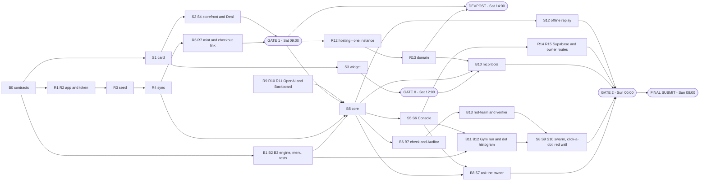

# The Bazaar — The Plan (and the tracker)

**Hack the North 2026 · team of 3 · code window Sat 19 Sep 00:00 → Sun 20 Sep 08:00 EDT (32 h)**

## STATUS BOARD

**Last updated:** `<time>` by `<name>`

| Gate | Time (EDT) | Done when | Status |
|---|---|---|---|
| **Gate 1** | Sat 09:00 | Storefront: offer → fixed counter card → **Deal** → real code → **real Shopify Checkout at that price** | ☐ |
| **Gate 0** | Sat 12:00 | A hello-world tool of ours shows a custom card in ChatGPT — or a clear "no", decided and closed | ☐ |
| **Devpost** | Sat 14:00 **hard** | Submitted: team, badge IDs, public repo, **Shopify + Backboard + OpenAI + GoDaddy Registry** selected | ☐ |
| **Gate 2** | Sun 00:00 | Full demo 3× untouched on both surfaces, on the hosted URL; backup video; 30-min attack session | ☐ |
| **Final submit** | Sun 08:00 | Final Devpost edit; code freeze; **deploy freeze** | ☐ |

**Now / Next / Blocked** — overwrite these lines as you go. This block is the handoff.

| Lane | Now | Next | Blocked by |
|---|---|---|---|
| 🧠 Brain | — | B0 | — |
| 🔌 Rails | — | R1 | — |
| 🎭 Stage | — | S1 | — |

### How to use this tracker

There are no tickets. **This file is the tracker.**

- **Tick the box in the same commit as the work.** `- [ ]` → `- [x]`.
- **When you start a task, put your initials after the id:** `**B3 (RM)**`.
- **If a task is cut, strike it through and say why:** `- [ ] ~~**S11** Deal trail~~ — cut Sat 18:00, behind on Console`. **Never delete lines.**
- **Before you sleep, update Now / Next / Blocked** and the "Last updated" line. That block is the handoff.
- When a gate passes, change its ☐ to ☑ on the status board.
- Ids are stable: **B** = Brain, **R** = Rails, **S** = Stage, **E** = Everyone. Don't renumber.

*What and why:* [`PRODUCT.md`](PRODUCT.md) · *How it behaves:* [`SPEC.md`](SPEC.md) · *Diagrams:* [`ARCHITECTURE.md`](ARCHITECTURE.md) · *The demo:* [`DEMO.md`](DEMO.md). If this file disagrees with SPEC.md about behaviour, SPEC.md wins; about **who, when or in what order**, this file wins.

---

## 1. Goals — what winning each prize takes

| Track | What the judges look for | Our win condition | Must be visible in the demo |
|---|---|---|---|
| **Shopify — "Hack Shopping with AI"** (primary, one winner) | Technical Excellence ("sophisticated, *appropriate* use of AI"), Impact Potential, Innovation Factor; "take inspo from SimGym" | The LLM does language and judgement, code does money. Real Admin API costs in → real discount code → **real Shopify Checkout** at the haggled price. A Gym that borrows SimGym's *method*: personas, seed, A vs B, a counterfactual metric, a synthetic label. | The real checkout · the owner's Approve card · the swarm settling into the dot histogram · the headline card flipping red → teal |
| **Backboard** | Ambition; how much of the stack is used | Assistants + threads, documents/RAG, memory with citations, model routing (an OpenAI model through Backboard), `cost_usd`; stretch: tool calling, voice, Gym voices | Feed row: recalled memory + citation, the document behind "gaiters for mud", model, ms, cost |
| **OpenAI** | "What you built with the OpenAI API" + "how Codex helped"; **one concrete Codex example in the demo** | Structured-Outputs *understand* step · the haggle as an app inside ChatGPT · [`codex-log.md`](codex-log.md) from hour 0 | The structured output for a messy sentence · the card inside ChatGPT · one log entry read aloud |
| **HTN finalist** | A demo judges can touch | "Try to make it lose money" → they can't → real checkout | Hand over the keyboard early |
| **GoDaddy Registry (MLH)** | A registered domain in use | Domain registered through the MLH offer, pointing at the hosted app, storefront at the root | The URL bar |

**Track selection locks at Devpost, Sat 14:00.** Prizes added later "will not be counted".

---

## 2. Team — three lanes

| Lane | Owner (fill in) | Owns |
|---|---|---|
| 🧠 **Brain** | ______________ | `contracts`, engine + property tests, core functions, the check, the Auditor, offers / approvals / PAUSE, `/mcp` tools, Gym run, red-team + verifier, the functional dot histogram |
| 🔌 **Rails** | ______________ | Shopify app, token + refresh, seed, sync, mint, checkout link, store settings, Backboard client, OpenAI client, server shell, `db.ts`, Supabase + auth middleware, SSE, hosting, the domain |
| 🎭 **Stage** | ______________ | The offer card, storefront + chat, the ChatGPT widget (gate 0), Console UI, swarm animation + styling, trail, faces, sparkles, demo script, offline replay, Devpost page, video |

**Rule zero — shared contracts first.** The first 30 minutes, all three together, write `packages/contracts` (SPEC Appendix C) and merge it. After that every lane codes against those types and nobody changes them without saying so out loud. The split that matters most: `ChatEvent` carries public data only; `ConsoleEvent` may carry everything (SPEC rule 11).

---

## 3. Stack and repo layout

**Stack:** Node 22 · pnpm workspaces · TypeScript · Hono · Supabase (Postgres + Auth, `@supabase/supabase-js`) · Vite + React · Tailwind + shadcn/ui · Canvas 2D or SVG for the Gym dots (no chart library) · `@modelcontextprotocol/sdk` (+ its Hono adapter) · `backboard-sdk` · OpenAI SDK · vitest + fast-check · Shopify CLI (`shopify app init`) · **hosting: one long-lived Node instance** (Railway, Render non-sleeping plan, or Fly.io with exactly one machine — never serverless, never autoscaled) · a GoDaddy Registry domain · ngrok or Cloudflare Tunnel for the laptop fallback only.

```
bazaar/
├── README.md · AGENTS.md · CLAUDE.md
├── docs/        PRODUCT · USE-CASES · SPEC · ARCHITECTURE · PLAN · DEMO · codex-log
├── packages/    contracts · engine · gym · shopify · llm (backboard.ts, openai.ts) · card (the React offer card)
├── apps/        server (Hono: core, /api, /mcp, sync; serves the web build)
│                web (Vite: "/" storefront, "/console")
│                widget (card → single HTML file for ChatGPT)
├── infra/       seed (products.json, store-notes.md, sizing-guide.md, policy.md) · schema.sql · redteam-result.json
└── research/ · reference/ · mockups/ · archive/
```

**Dev loop:** run the server locally against the same Shopify dev store and Supabase project; push to `main` deploys to the host. Secrets live in the host's settings and in a git-ignored `.env` — never in the repo, never in a browser bundle (the web build gets only `SUPABASE_URL` and the anon key). **Deploys freeze at Sun 08:00** — a deploy is a restart and a restart drops in-flight haggles.

---

## 4. The tracker — work breakdown

Estimates are focused hours. **Done when** is the acceptance check — if you can't show it, it isn't done. SPEC section in square brackets.

### 🧠 Brain

**Before gate 1 (Sat 00:00 → 09:00)** — the engine is *not* on the gate-1 path; build it in parallel.

- [ ] **B0** `packages/contracts` — all shared types [App. C] · _needs nothing · all three together_ · ~0.5 h · **Done when:** merged; all three lanes import from it; a `ChatEvent` cannot hold an `Option` (type error)
- [ ] **B1** Engine formulas: cost, floor, urgency, target, ask [§6] · _needs B0_ · ~1.5 h · **Done when:** `target = list − urgency × (list − floor)`, `ask(4) = target`, and unit tests reproduce the worked example in ARCHITECTURE §6 (TR3 target = $169; TR2 target ≈ $120)
- [ ] **B2** Menu builder — held, bundles (add-on at cost + ½ margin; shoe at `ask(r+1)` if profit holds), something else (`x < target(p)` or `r ≥ 3`; priced `max(target, min(ask, budget))`), ranking, final label [§6] · _needs B1_ · ~3 h · **Done when:** "$120 on the TR3, round 1" returns a TR2 option at $120 and a TR2 + gaiters option, and every option ≥ `floor(cart)`
- [ ] **B3** Property tests (fast-check) [§6.2] · _needs B2_ · ~1.5 h · **Done when:** every property in SPEC §6.2 passes on 1,000 runs and the suite runs live for a judge in under 10 s
- [ ] **B4** Offers: ids, 15-min expiry, supersede, single use [rule 7] · _needs B0_ · ~1 h · **Done when:** accept rejects unknown / expired / used / superseded ids (four tests)

**Gate 1 → Devpost (Sat 09:00 → 14:00)**

- [ ] **B5** Core: `findProducts · makeOffer · acceptOffer` over `db.ts` [§5] · _needs B2, B4, R5_ · ~3 h · **Done when:** both adapters call only these three, and a full turn works end to end with the LLM stubbed
- [ ] **B6** The check [§5.1 step 5] · _needs B5_ · ~1.5 h · **Done when:** an invented option id, an invented `$`, a reason with no fact, and a cost/floor word each produce option A + template + a `blocked: check` row
- [ ] **B7** The Auditor, incl. the Shopify-unreachable rule [§5.1] · _needs B5, R4_ · ~1.5 h · **Done when:** stale cost, paused store and below-floor-without-approval all block, and no code is minted on any block
- [ ] **B9** PAUSE [rule 8] · _needs B5_ · ~0.5 h · **Done when:** the next message on either surface returns the paused line and accept is blocked
- [ ] **B14** Event bus: `ChatEvent` to the surface, `ConsoleEvent` to the Console, reasoning composed in code [§4.4] · _needs B5_ · ~1 h · **Done when:** a feed row shows offer, floor, menu, pick, memory, model, ms, cost — and a test proves none of it appears in `/api/chat` output

**Devpost → gate 2 (Sat 14:00 → Sun 00:00)**

- [ ] **B8** Approvals: `pending_owner`, 45 s timer, Approve / Decline / timeout, once, storefront only; a decline **restates the final offer** [§6.1] · _needs B5_ · ~2 h · **Done when:** decline and timeout both produce "My best stays $…" at the final ask (never the floor), and a second ask in the same negotiation is refused
- [ ] **B11** Gym run: personas, seeded, per-shopper records, A vs B, deals missed, would-ask-owner, profit vs banner [§9.1] · _needs B2_ · ~2.5 h · **Done when:** 300 shoppers run in < 50 ms in the browser, the same seed gives an identical `GymResult`, and `profitVsBanner` goes negative at some floor
- [ ] **B12** Functional static dot histogram + metric cards [§9.2] · _needs B11, S6_ · ~2 h · **Done when:** one dot per shopper coloured by persona, grey outline for policy A, reference lines, shaded cost → floor band, and the headline card turns red when haggling loses
- [ ] **B13** Red-team script (20 attacks, dry-run minter, in-memory deals) + separate verifier [§7] · _needs B6, B7_ · ~2.5 h · **Done when:** `infra/redteam-result.json` is committed and the verifier recounts **0 breaches** from the deal rows alone
- [ ] **B10** `/mcp` — three tools wired to the core, empty `content`, annotations, subject → shopper id [§4.3] · _needs B5, S3 passed, R13_ · ~2 h · **Done when:** from ChatGPT: find → offer → card → Deal → checkout, the feed row is tagged `chatgpt`, and ask-the-owner never fires

**After gate 2 — stretch (Sun 00:00 → 06:00)**

- [ ] **B15** *(stretch 2)* Quantity haggle · _needs gate 2_ · ~3 h · **Done when:** "ten for $50 each?" returns two quantity options, both above the bulk floor
- [ ] **B16** *(stretch 4)* Deal Meter from the Gym distribution · _needs B11_ · ~1 h · **Done when:** the card shows "better than N% of deals today" from the real run
- [ ] **B17** *(stretch 5)* Backboard tool calling for choose + say · _needs R11_ · ~1.5 h · **Done when:** the pick arrives as a `present_offer` call and still passes the check

### 🔌 Rails

**Before gate 1 (Sat 00:00 → 09:00)** — this lane *is* the gate-1 critical path.

- [ ] **R1** Shopify app via **`shopify app init`**; six scopes incl. `write_products`; install on the dev store [§10] · _needs nothing_ · ~1 h · **Done when:** client id + secret are in `.env` and the app is installed. **20-minute rule:** if the CLI fights back, make a plain Dev Dashboard app and tick this anyway
- [ ] **R2** Token: client-credentials fetch on startup, re-fetch on any 401, one wrapper for every call [§10] · _needs R1_ · ~1 h · **Done when:** corrupting the token in memory makes the next call self-heal
- [ ] **R3** Seed ~8 products with **cost per item**, size variants, `bazaar.stocked_at` metafield [§10, App. A] · _needs R2_ · ~1.5 h · **Done when:** products show in admin with costs; TR3 stocked 12 d ago, TR2 94 d ago
- [ ] **R4** Sync every 60 s → in-memory mirror; flag missing cost [§10] · _needs R3_ · ~1.5 h · **Done when:** the mirror has price, unitCost, inventory, type, image, stockedAt — and we know whether `read_inventory` alone reads `unitCost`
- [ ] **R5** Server shell: Hono, routes, `db.ts` (memory `Map`s), SSE with a 15 s heartbeat [§5] · _needs B0_ · ~1.5 h · **Done when:** `/api/products` returns public cards and an SSE stream stays open 5 minutes
- [ ] **R6** Mint: `discountCodeBasicCreate` — amount off, `usageLimit 1`, 15 min, exact variants, **minimum subtotal = list total**, no combining; re-mint once; deactivate on expiry [§10] · _needs R2_ · ~2 h · **Done when:** a code exists in admin with every constraint set
- [ ] **R7** Checkout permalink + store settings: **tax off, free shipping rate** [§10] · _needs R6_ · ~0.5 h · **Done when:** the checkout page total equals the agreed total to the cent

**Gate 1 → Devpost (Sat 09:00 → 14:00)**

- [ ] **R9** OpenAI *understand*: Responses API + Structured Outputs, 2.5 s timeout, regex fallback [§11] · _needs R5_ · ~1.5 h · **Done when:** "uhh i could maybe do like 115 if socks are in?" → `{ kind, amount: 115, wants: socks }` in < 1 s, and the fallback fires on a forced timeout
- [ ] **R10** Backboard: assistant per shopper, thread per negotiation, documents uploaded and `indexed` **first**, memory seeded for the demo shopper [§8] · _needs R5_ · ~2 h · **Done when:** "do these run small?" is answered from the sizing guide and the chat opens with "still a size 10?"
- [ ] **R11** Backboard choose + say: an OpenAI model routed through Backboard, `OPTION: X` + line, buffered, 4 s timeout, `run_failed` handling, `cost_usd` [§8] · _needs R10, B2_ · ~2 h · **Done when:** **latency is measured and written into §9 of this file**, and the fallback fires on a forced timeout
- [ ] **R12** **Hosting: one long-lived instance** — secrets in the host, push-to-deploy, health check, instance count pinned to 1, no sleep [§5] · _needs R5, gate 1_ · ~1.5 h · **Done when:** the storefront loads from the host, SSE survives 5 minutes, and two browsers see the same PAUSE state
- [ ] **R13** **GoDaddy Registry domain** via the MLH offer → pointed at the host; storefront at the root [§10] · _needs R12_ · ~0.5 h · **Done when:** `https://<domain>/` serves the storefront with a valid certificate — before 13:00, so it's on the Devpost page

**Devpost → gate 2 (Sat 14:00 → Sun 00:00)**

- [ ] **R14** Thin Supabase: `schema.sql` (3 tables, RLS on, no public policies), owner user, auth middleware, policy cache, one `deals` write per settlement [§5.2] · _needs R5, gate 1 · **start by 16:00**_ · ~1.5 h · **Done when:** a shopper route can't read owner data, Adopt inserts a row, and a restart reloads the policy
- [ ] **R15** `GET /api/console/state` + owner routes (`policy`, `approvals/:id`, `pause`, `stream`) [§5.3] · _needs R5, B8_ · ~1 h · **Done when:** the Console loads policy + products with costs + pending approvals + red-team result in one call, and every owner route returns 401 without a token
- [ ] **R8** Draft-order backup settlement [§10] · _needs R2_ · ~1 h · **Done when:** an invoice URL opens at the agreed price in the demo browser (behind the store password)
- [ ] **R16** Verify the minimum-subtotal code on a real bundle [§10] · _needs R6, B2_ · ~0.5 h · **Done when:** removing one bundle item at checkout drops the code, and the amount spreads across the cart rather than per item

**After gate 2 — stretch (Sun 00:00 → 06:00)**

- [ ] **R17** *(stretch 1)* Shopify Function: refuse any checkout line at or below `bazaar.min_price` · _needs gate 2 · **time-box 3 h, drop without regret**_ · **Done when:** Shopify's own checkout refuses a below-cost line with our app switched off
- [ ] **R18** *(stretch 3)* The same `/mcp` as a custom connector in Claude · _needs B10_ · ~1 h · **Done when:** an offer made in Claude shows up in the Console feed
- [ ] **R19** *(stretch 10)* `orders/create` webhook → a ledger row · _needs R14_ · ~1 h · **Done when:** a test order produces a row

### 🎭 Stage

**Before gate 1 (Sat 00:00 → 09:00)**

- [ ] **S1** The offer card — a pure component from `OfferCard`; all seven states; countdown; honesty footer [§4.1] · _needs B0_ · ~3 h · **Done when:** one page shows every state side by side and it reads in light and dark
- [ ] **S2** Storefront: grid, product page, sticker, chat panel, `localStorage` shopper id, `?shopper=demo`, typing effect from checked text [§4.2] · _needs S1, R5_ · ~3 h · **Done when:** opening the TR3 page greets by product and a card appears in the chat
- [ ] **S4** Deal flow on the storefront: accept → checkout opens; sparkles [§4.1] · _needs S1, R6, R7_ · ~1 h · **Done when:** **gate 1 passes**

**Gate 1 → Devpost (Sat 09:00 → 14:00)**

- [ ] **S3** **Gate 0:** widget → single HTML file; a hello-world tool of ours renders a custom card in ChatGPT [§4.1] · _needs S1 · **time-box 90 min**_ · **Done when:** the card is visible in ChatGPT developer mode — or a clear "no" is written on the status board and the discussion is closed
- [ ] **S5** Console shell: login, top bar + PAUSE, live feed with red blocked rows, SSE over `fetch` [§4.4] · _needs R5 (R15 for real data)_ · ~2.5 h · **Done when:** a haggle on the left produces feed rows on the right in < 1 s
- [ ] **S6** Console policy panel: floor slider, ask-me switch, missing-cost list, **Adopt** [§4.4] · _needs S5_ · ~1.5 h · **Done when:** Adopt changes the floor used by the very next shopper turn
- [ ] **S13** Devpost page, screenshots, ≤ 2-min video [DEMO §10] · _needs gate 1_ · ~2 h · **Done when:** submitted by Sat 14:00 with all four sponsor tracks selected

**Devpost → gate 2 (Sat 14:00 → Sun 00:00)**

- [ ] **S7** Approve / Decline card with profit $ and %, 45 s bar [§4.4] · _needs S5, B8_ · ~1 h · **Done when:** both buttons and the timeout each resolve the shopper's pending card
- [ ] **S8** Swarm round animation R1 → R4 (~3 s): ask line stepping down, settle-and-drop, walked pile / deals missed, yellow thin-margin dots, scrubber + Replay; **no animation while dragging** [§9.2] · _needs B12_ · ~3 h · **Done when:** pressing Run settles into exactly the static histogram from B12
- [ ] **S9** Click-a-dot mini-transcript + persona legend as a filter [§9.2] · _needs B12_ · ~1.5 h · **Done when:** any dot shows persona, willingness, offers and asks per round, the trade, the outcome
- [ ] **S10** Red-dot wall animation + "20 attacks · 0 breaches" card [§9.2] · _needs B13_ · ~1.5 h · **Done when:** each dot bounces off the labelled layer that blocked it and the card matches the JSON
- [ ] **S11** Deal trail, five faces, cream-paper styling [§12] · _needs S1_ · ~2 h · **Done when:** the trail forks when another product is recommended and never shows the floor
- [ ] **S12** Offline replay: `DEMO_OFFLINE=1`, recorded event stream, pre-minted link [DEMO §7] · _needs B14_ · ~1.5 h · **Done when:** with Wi-Fi off the whole demo still runs

**After gate 2 (Sun 00:00 → 08:00)**

- [ ] **S14** Demo script with real numbers; rehearse 5× [DEMO] · _needs gate 2_ · ~1.5 h · **Done when:** three clean runs in a row
- [ ] **S15** *(stretch 6)* Gym voices — ~20 LLM-driven shoppers as larger dots with speech bubbles · _needs S8, R11_ · ~2 h · **Done when:** they are visibly labelled as a different kind of shopper
- [ ] **S-opt** *(optional · deferred — **planned, not being built now**)* **UI prototype / design reference:** update `../mockups/index.html` to the final engine formulas and add the swarm Gym view · _needs nothing_ · ~2–3 h · **Done when:** its numbers match SPEC §6

> **About `mockups/index.html`:** it is a **visual reference only**. It was built against the earlier engine formulas, its update was stopped part-way, and **its numbers are not authoritative** — take look and layout from it; take every formula and figure from SPEC §6. The swarm Gym view itself **is** in the product plan: it is built in the real app (B11–B12, S8–S10), not in the mockup.

### 👥 Everyone

- [ ] **E1** [`codex-log.md`](codex-log.md) from hour 0 · _needs nothing_ · ongoing · **Done when:** ≥ 3 concrete entries exist and one is chosen for the demo sentence
- [ ] **E2** 30-minute attack session on our own build · _needs gate 2_ · ~0.5 h · **Done when:** every breach found is fixed or has a failing test
- [ ] **E3** Latency and numbers pass: replace every illustrative figure in DEMO.md · _needs B11, R11_ · ~0.5 h · **Done when:** no "illustrative" marker remains on a number we say out loud

---

## 5. Schedule (EDT)

| When | What must be true |
|---|---|
| Sat 00:00–00:30 | B0 merged — all three |
| Sat 00:30–09:00 | Rails: R1 → R2 → R3 → R4 → R6 → R7 (R5 alongside). Stage: S1 → S2 → S4. Brain: B1 → B2 → B3 → B4 |
| **Sat 09:00 — GATE 1** | Real checkout from the storefront. **If not, all three stop and fix only this.** |
| Sat 09:00–12:00 | Brain: B5 → B6. Rails: R9 → R10 → **R11 (measure latency)** → R12. Stage: **S3 gate 0**, then S5 |
| **Sat 12:00 — GATE 0** | ChatGPT card test. *One person, 90 min, blocks nobody.* Needs a paid ChatGPT plan with Developer mode (Settings → Apps & Connectors → Advanced). Pass → wire B10 in the evening. Card won't render → text-only finale. No developer mode → one "what's next" sentence. **Decide here and stop discussing it.** |
| Sat 12:00–14:00 | Rails: **R13 domain**. Brain: B7, B9, B14. Stage: S5, S6, S13 |
| **Sat 14:00 — DEVPOST, hard** | Team, badge IDs, public repo, Shopify + Backboard + OpenAI + GoDaddy Registry selected |
| Sat 14:00–18:00 | Brain: B8, B11. Rails: **R14 (start by 16:00)**, R15, R8. Stage: S7, S11 |
| **Sat 18:00 — checkpoint** | Behind? Apply the cut order (§7) **now**. Supabase not working → env-var password + policy in memory |
| Sat 18:00–24:00 | Brain: B12, B13, B10. Rails: R16, memory beat, host pinned. Stage: S8, S9, S10, S12. Then the Saturday-night checklist |
| **Sun 00:00 — GATE 2** | Full demo ×3 on both surfaces, hosted URL. Backup video. Attack session. ~20 offer phrasings rehearsed in ChatGPT |
| Sun 00:00–06:00 | Stretch (§8), strictly in order |
| Sun 06:00–08:00 | Final Devpost edit, README, real numbers, rehearse 5×, Sunday-morning checklist |
| **Sun 08:00 — FINAL SUBMIT** | Code freeze. **Deploy freeze.** |
| **Sun 09:45–11:45** | Sponsor judging |
| Sun after | HTN round 1 (5 min, top 2 per room) → round 2 at 12:00 (4 min + 1 min Q&A) |

**Sleep rotation:** one 4-hour block each between Sat 14:00 and Sun 04:00, **never two asleep at once.** Suggested: Stage 14:30–18:30 (after Devpost) · Rails 19:00–23:00 · Brain 00:30–04:30 (after gate 2). Before you sleep: update Now / Next / Blocked.

### Gate checklists

**Gate 1 — Sat 09:00**
- [ ] A shopper types an offer on the storefront and gets a (fixed) counter card
- [ ] **Deal** mints a real code visible in Shopify admin
- [ ] The cart permalink opens a real Shopify Checkout
- [ ] The checkout total equals the agreed total to the cent (tax off, free shipping)
- [ ] The token was fetched by code, not pasted

**Gate 0 — Sat 12:00**
- [ ] A tool of ours is callable from ChatGPT developer mode
- [ ] Its result renders **our** HTML card inline (both `_meta.ui.resourceUri` and `openai/outputTemplate` set)
- [ ] The card reads in light and dark; fonts and images inlined
- [ ] Outcome written on the status board: **card** / **text-only** / **what's-next sentence**

**Devpost — Sat 14:00**
- [ ] Team members and badge IDs
- [ ] Public repo link
- [ ] Shopify · Backboard · OpenAI · GoDaddy Registry selected
- [ ] The domain is live, or the host's URL is listed and the domain follows

**Gate 2 — Sun 00:00**
- [ ] Full storefront demo, untouched, 3× in a row on the hosted URL
- [ ] ChatGPT finale, 3× in a row (or the agreed fallback)
- [ ] Ask-the-owner: Approve, Decline and timeout all seen working
- [ ] PAUSE stops both surfaces on the next message
- [ ] The Gym: Run → swarm → histogram; drag → red ↔ teal; Adopt governs the next turn
- [ ] Red-team: 0 breaches, recounted by the verifier
- [ ] Backup video recorded; offline replay works with Wi-Fi off

**Final submit — Sun 08:00**
- [ ] Devpost final edit saved
- [ ] README and docs match what was built
- [ ] Deploys frozen; host restarted once deliberately and left alone

---

## 6. Critical path



The path to gate 1 is **Rails (token → seed → sync → mint) joined with Stage (card → storefront)**; the engine runs in parallel and is not on it. After gate 1 everything funnels through the core. Gate 0 needs only the card and the widget, so it blocks nobody.

---

## 7. Cut order

**If behind at the Sat 18:00 checkpoint, cut in this order** (strike the task through in §4 and say why):

1. **Supabase** (R14) → one env-var password on the Console, policy in memory. Say: "in production, installing the Shopify app is the login."
2. **The live Approve card** (B8, S7) → the slider already goes down to cost.
3. **The swarm round animation** (S8) → keep the static dot histogram and click-a-dot. Then the red-dot wall animation (S10) → keep the card.
4. **The deal trail** (S11).
5. **The memory greeting.**
6. **The storefront product grid** → keep one product page.

**Never cut:** the menu · the check · the real checkout · the Gym dot histogram · PAUSE.

---

## 8. Stretch — strictly in order, only after gate 2

1. **Shopify itself enforces the one unbreakable rule** (R17). A Shopify Function (cart & checkout validation) that refuses any checkout where a line's discounted price is at or below a `bazaar.min_price` variant metafield our sync writes (= cost; needs `write_products`, already requested). Because the app was scaffolded with `shopify app init`, it is an add-on to the same app. **Time-box 3 h, drop it without regret.** Unverified: that a dev store can run a custom-app Function.
2. **Quantity haggle** (B15) — *"Ten for $50 each?"* → *"Ten at $92, or twelve at $88."*
3. **The same shopkeeper inside Claude** (R18).
4. **Deal Meter** (B16).
5. **Backboard tool calling** for choose + say (B17).
6. **Gym voices** (S15).
7. **Free shipping** as another thing to throw in.
8. **"Still deciding?" nudge.**
9. **Voice** via Backboard.
10. **`orders/create` webhook → a ledger row** (R19).
11. **Per-product lowest price as a Shopify metafield** edited in Shopify admin.

**Not building:** multiple stores · a buyer's AI agent · UCP extension · Shopify admin extension / embedded app · cross-platform memory · persona picker · Console tabs · multi-merchant onboarding (one seeded merchant only) · negotiations shared across surfaces · ask-the-owner inside ChatGPT · an issue tracker · Sentry / Vultr / ElevenLabs / Huawei / Rox.

---

## 9. Risk register

| Risk | Level | Mitigation |
|---|---|---|
| Token expires mid-judging (24 h) | **H** | Refresh on startup and on any 401 — tested Saturday night |
| LLM latency makes the haggle feel dead | H | Thinking face at once; 4 s cap → option A + template; warm threads. **Measured choose + say latency: ______ ms (R11 fills this in)** |
| Stage lane overloaded — the swarm adds ~6 h | H | Card built once; Brain builds the functional dot histogram; the animation is cut #3 |
| Host restarts, sleeps, or scales to two instances | M | One pinned instance, non-sleeping plan, deploy freeze Sun 08:00, health check; laptop + tunnel fallback |
| Host proxy drops SSE | M | 15 s heartbeat comment; clients auto-reconnect |
| Code doesn't apply / total doesn't match / minimum subtotal misbehaves | M | Tax off + free shipping; assert the total; re-mint once; draft-order backup; pre-minted link; R16 |
| `shopify app init` eats the morning | M | 20-minute rule → plain Dev Dashboard app |
| ChatGPT narrates prices around the card | M | Empty `content`, tool descriptions, the binding line; the break-it beat runs on the storefront |
| Looks like "a chatbot" | M | Screen time goes to the checkout, the Approve card, the swarm |
| Gym looks made up | M | Personas + seed on screen, synthetic label, A/B against her own saved policy, **the headline card is allowed to go red** |
| Haggling loses to the banner at the demo floor | M | That *is* the beat — find the floor where it wins on Saturday night and script the drag from red to teal |
| ChatGPT card won't render / no developer mode | L | It's the finale, not the foundation. Gate 0; failure costs 25 seconds |
| Supabase slow or unreachable | L | Off the hot path: cached policy, one write per deal; offline replay needs no database |
| Domain DNS not propagated by Devpost | L | Register by Sat 13:00; the host's default URL works meanwhile |
| Wi-Fi | — | Offline replay, pre-minted link, backup video, phone hotspot |

---

## 10. Checklists

### First hour

**🧠 Brain**
- [ ] `contracts` merged (with everyone)
- [ ] Repo, pnpm workspaces, vitest + fast-check running
- [ ] Engine formulas started, with the worked example as the first test
- [ ] First Codex prompt logged in `codex-log.md`

**🔌 Rails**
- [ ] `shopify app init` (20-minute rule)
- [ ] Six scopes, installed, the token curl works
- [ ] Backboard + OpenAI keys in `.env`; **store documents uploaded now** so they're `indexed` by morning
- [ ] Supabase project and host account created (not wired yet)
- [ ] MLH GoDaddy offer claimed

**🎭 Stage**
- [ ] Vite + Tailwind + shadcn up
- [ ] The card rendering from a hard-coded `OfferCard`
- [ ] Palette, fonts, the five faces as SVG
- [ ] Someone has a paid ChatGPT plan with Developer mode for gate 0

### Saturday night (before gate 2)

- [ ] **Every illustrative number in `DEMO.md` replaced** with real engine and Gym output (E3)
- [ ] The floor where the headline card flips red → teal found, and that drag scripted
- [ ] **Token refresh tested** (corrupt it in memory)
- [ ] Minimum-subtotal code verified: remove a bundle item at checkout → the code drops (R16)
- [ ] Checkout total equals the agreed total to the cent
- [ ] Red-team run → `infra/redteam-result.json` committed → verifier says 0
- [ ] 30-minute attack session, two people (E2)
- [ ] Host pinned to one instance, non-sleeping; SSE survives 10 minutes
- [ ] ChatGPT connector registered against the **domain**
- [ ] ~20 phrasings of an offer rehearsed in ChatGPT
- [ ] Offline replay recorded; pre-minted link made
- [ ] Backup video recorded
- [ ] Codex entry chosen for the demo sentence

### Sunday morning (06:00 → 09:30)

- [ ] Final Devpost edit by 08:00
- [ ] **Deploy freeze**; host restarted once, deliberately, then left alone
- [ ] **Backboard threads warmed**
- [ ] **Store password typed into the demo browser**
- [ ] Owner already signed in to the Console
- [ ] Tabs in order: storefront TR3 page · Console · ChatGPT · Shopify admin (discounts) · `codex-log.md`
- [ ] PAUSE is off; the saved policy is the one the script expects
- [ ] **Offline toggle** within reach; the laptop fallback server started and idle
- [ ] A fresh pre-minted backup link (mint one with a long expiry for this purpose only)
- [ ] Phone hotspot ready
- [ ] Rehearsed 5×
